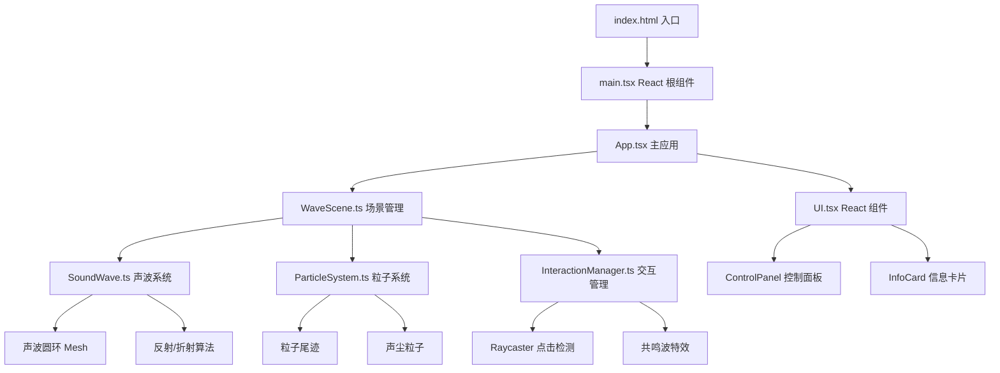

# 音浪幻境 - 技术架构文档

## 1. 架构设计
纯前端项目，无后端服务。基于 React + Three.js + Vite 构建。



## 2. 技术说明
- **前端框架**：React 18 + TypeScript
- **3D 引擎**：Three.js + @types/three
- **构建工具**：Vite + @vitejs/plugin-react
- **状态管理**：Zustand（管理滑块参数和障碍物状态）
- **样式方案**：CSS Modules / 内联样式（毛玻璃效果需要 backdrop-filter）
- **初始化工具**：vite-init (react-ts 模板)
- **后端**：无
- **数据库**：无

## 3. 路由定义
| 路由 | 用途 |
|------|------|
| / | 3D 可视化主场景（单页应用） |

## 4. 文件结构
```
项目根目录/
├── index.html              # 入口 HTML
├── package.json            # 依赖配置
├── tsconfig.json           # TypeScript 配置
├── vite.config.ts          # Vite 配置
├── src/
│   ├── main.tsx            # React 入口
│   ├── App.tsx             # 主应用组件
│   ├── App.css             # 全局样式
│   ├── WaveScene.ts        # 场景初始化、主渲染循环、相机和灯光控制
│   ├── SoundWave.ts        # 声波生成、传播、反射/折射算法
│   ├── ParticleSystem.ts   # 粒子尾迹和声尘的生成与动画
│   ├── InteractionManager.ts # 处理交互、物体震动和共鸣波特效
│   ├── UI.tsx              # React 组件：控制面板和信息卡片
│   └── store.ts            # Zustand 状态管理
```

## 5. 核心模块技术设计

### 5.1 WaveScene.ts - 场景管理
- 初始化 Three.js Scene、PerspectiveCamera、WebGLRenderer
- 配置 OrbitControls 实现鼠标拖拽旋转和滚轮缩放
- 设置灯光：中心 PointLight + 微弱 AmbientLight
- 主渲染循环 requestAnimationFrame，保持 60fps
- 集成 EffectComposer + UnrealBloomPass 后处理实现霓虹辉光
- 背景渐变：深灰到暗蓝，通过场景背景色或 ShaderMaterial 实现
- 管理 SoundWave、ParticleSystem、InteractionManager 的生命周期

### 5.2 SoundWave.ts - 声波系统
- 中心声源持续发射声波圆环（TorusGeometry 或 RingGeometry + MeshBasicMaterial）
- 声波以半透明发光材质渲染，霓虹色渐变（粉→蓝→紫循环）
- 声波向外扩散动画：每帧增加圆环半径，透明度随距离衰减
- 声波粒子尾迹：在圆环边缘生成粒子，跟随扩散
- 反射算法：声波圆环与障碍物碰撞检测，碰撞后在反射方向生成新的声波圆环
- 折射算法：声波穿过半透明障碍物时，方向偏移并减弱
- 衍射算法：声波绕过障碍物边缘时产生弯曲效果
- 每个障碍物记录反射次数

### 5.3 ParticleSystem.ts - 粒子系统
- 使用 InstancedMesh 或 Points + BufferGeometry 高效渲染大量粒子
- 声尘粒子：场景中漂浮的微小光点，缓慢飘动
- 声波尾迹粒子：沿声波圆环外缘分布，随声波扩散移动
- 共鸣波粒子：共鸣波触发时从障碍物向外爆发的彩色粒子
- 粒子颜色在粉/蓝/紫之间渐变
- 粒子透明度随生命周期衰减
- 使用对象池模式复用粒子，避免 GC 压力

### 5.4 InteractionManager.ts - 交互管理
- Raycaster 实现点击检测，识别被点击的障碍物
- 障碍物震动：声波碰撞时轻微位移抖动 + 颜色渐变
- 共鸣波特效：
  - 障碍物急速膨胀动画（scale 1→1.8→1）
  - 从障碍物位置发射彩色冲击波圆环
  - 周围粒子被冲击波排开（径向力）
- 点击障碍物时触发 React 状态更新，显示信息卡片
- 信息卡片数据：频率（Hz）、波长（m）、反射次数

### 5.5 UI.tsx - React 组件
- **控制面板**：
  - 固定定位右下角，毛玻璃效果（backdrop-filter: blur + 半透明背景）
  - 三个滑块：声波速度(0.1-3.0)、粒子密度(100-5000)、反射强度(0-1.0)
  - 滑块样式：霓虹色轨道，自定义滑块手柄
  - 弹性缓动动画：滑块值变化时使用 spring 动画平滑过渡
  - 数值实时显示
- **信息卡片**：
  - 半透明毛玻璃背景，霓虹边框
  - 显示：频率、波长、反射次数
  - 弹出动画（scale + fade）
  - 点击其他区域关闭

### 5.6 store.ts - 状态管理
- Zustand store 管理：
  - waveSpeed: number (声波速度)
  - particleDensity: number (粒子密度)
  - reflectionIntensity: number (反射强度)
  - selectedObstacle: ObstacleInfo | null (当前选中的障碍物)
  - obstacles: ObstacleInfo[] (所有障碍物状态)
