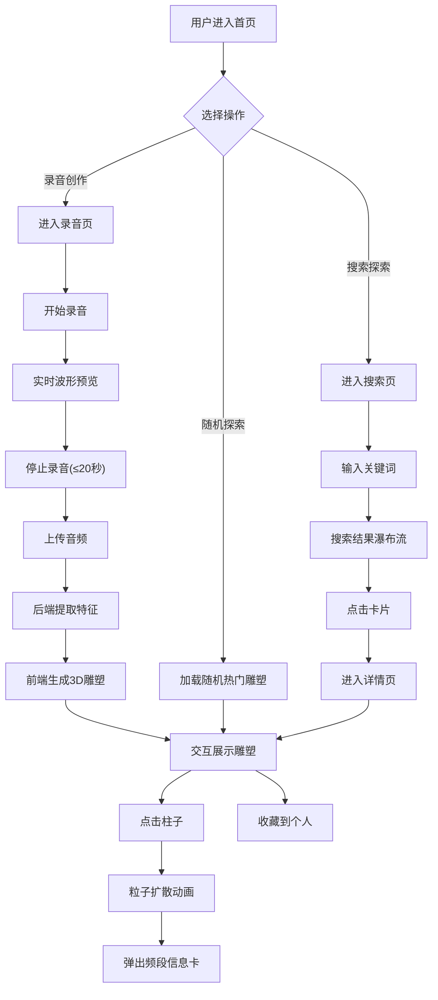

## 1. 产品概述

「声纹回廊」是一个在线声音记录与3D可视化平台，用户可录制环境音并生成动态3D声音雕塑，探索声音的视觉维度。
- 目标用户：声音艺术家、音乐爱好者、创意工作者及对声音可视化感兴趣的普通用户
- 核心价值：将转瞬即逝的声音转化为可交互、可分享的3D艺术作品，打造声音与视觉的跨界体验

## 2. 核心功能

### 2.1 用户角色

| 角色 | 注册方式 | 核心权限 |
|------|----------|----------|
| 访客 | 无需注册 | 浏览和探索公共声音雕塑 |
| 注册用户 | 邮箱注册 | 录音、创建雕塑、保存收藏、搜索分享 |

### 2.2 功能模块

1. **首页**：随机探索按钮、热门声音雕塑展示、导航入口
2. **录音创作页**：录音控制、波形预览、上传生成3D雕塑
3. **雕塑详情页**：3D交互展示、频段信息卡、收藏操作
4. **探索搜索页**：关键词搜索、瀑布流卡片展示

### 2.3 页面详情

| 页面名称 | 模块名称 | 功能描述 |
|----------|----------|----------|
| 首页 | 随机探索按钮 | 点击随机展示一个热门声音雕塑，带缓动动画 |
| 首页 | 热门雕塑轮播 | 展示热门声音雕塑缩略图，点击进入详情 |
| 首页 | 导航工具栏 | 毛玻璃风格，包含录音、探索、收藏入口 |
| 录音创作页 | 录音控制 | 开始/停止录音，最长20秒，实时波形预览 |
| 录音创作页 | 上传生成 | 录音完成后上传，系统提取特征并生成3D雕塑 |
| 录音创作页 | 雕塑预览 | 生成后直接展示3D雕塑，支持交互 |
| 雕塑详情页 | 3D雕塑展示 | 旋转柱状结构，颜色随频率变化，鼠标拖拽旋转/滚轮缩放 |
| 雕塑详情页 | 频段信息卡 | 点击柱子触发粒子扩散动画，弹出毛玻璃卡片显示能量值和情感标签 |
| 雕塑详情页 | 收藏操作 | 保存到个人收藏 |
| 探索搜索页 | 搜索栏 | 关键词搜索其他用户分享的声音雕塑 |
| 探索搜索页 | 瀑布流卡片 | 搜索结果以瀑布流卡片展示，悬停缓动上浮 |
| 探索搜索页 | 详情跳转 | 点击卡片进入对应雕塑详情页 |

## 3. 核心流程

**录音创作流程**：用户进入录音页 → 点击录音 → 实时波形预览 → 停止录音(≤20秒) → 上传音频 → 后端提取特征 → 前端生成3D雕塑 → 展示交互式雕塑

**探索分享流程**：用户进入探索页 → 输入关键词 → 搜索结果瀑布流展示 → 点击卡片 → 进入详情页 → 可收藏

**随机探索流程**：用户点击首页随机按钮 → 后端返回随机热门雕塑 → 前端加载3D场景 → 用户交互探索

## 4. 用户界面设计

### 4.1 设计风格

- **主色调**：深灰蓝渐变背景 (#0a0e1a → #1a1f3a)，科技感冷色调
- **辅助色**：频谱映射色（低频红橙 #ff6b35、中频青绿 #00d4aa、高频紫蓝 #7b68ee）
- **卡片风格**：毛玻璃效果（backdrop-filter: blur），半透明白色背景 rgba(255,255,255,0.08)
- **圆角**：统一使用 12-16px 圆角，柔和自然
- **边缘光效**：微光边缘（box-shadow: 0 0 20px rgba(120,140,255,0.15)）
- **字体**：标题使用 Outfit，正文使用 Noto Sans SC
- **布局**：全屏沉浸式3D场景 + 浮动毛玻璃工具栏/卡片
- **动画**：卡片悬停缓动上浮（transform: translateY(-8px) transition 0.4s），页面淡入缓动（opacity + translateY 0.6s ease），60fps 流畅交互

### 4.2 页面设计概述

| 页面名称 | 模块名称 | UI元素 |
|----------|----------|--------|
| 首页 | 随机探索按钮 | 居中大按钮，渐变边框光效，点击涟漪动画，深灰蓝背景 |
| 首页 | 热门雕塑网格 | 2列卡片网格，毛玻璃卡片，缩略图+标题，悬停上浮 |
| 首页 | 导航工具栏 | 顶部固定，毛玻璃背景，图标+文字按钮 |
| 录音创作页 | 录音按钮 | 圆形脉冲动画按钮，录音中红色呼吸灯 |
| 录音创作页 | 波形预览 | Canvas实时波形，青绿色线条 |
| 录音创作页 | 3D预览区 | 全屏Three.js画布，深色背景 |
| 雕塑详情页 | 3D场景 | 全屏柱状旋转结构，频谱颜色映射，轨道控制器 |
| 雕塑详情页 | 信息卡 | 毛玻璃浮动卡片，频段能量+情感标签，淡入动画 |
| 雕塑详情页 | 收藏按钮 | 右上角心形图标，点击填充动画 |
| 探索搜索页 | 搜索栏 | 毛玻璃输入框，聚焦发光边框 |
| 探索搜索页 | 瀑布流 | 多列不等高卡片，懒加载滚动，悬停上浮 |

### 4.3 响应式适配

- **桌面端(≥1024px)**：3D场景全屏展示，侧边工具栏，3列瀑布流
- **平板端(768-1023px)**：3D场景适配，底部工具栏，2列瀑布流
- 所有交互元素最小触摸区域44px，3D场景支持触摸手势

### 4.4 3D场景设计

- **环境氛围**：深色空间背景，微弱环境光，营造沉浸感
- **灯光设置**：1个方向光(偏冷白) + 1个半球光(冷蓝渐变) + 点光源随频率脉冲
- **摄像机**：透视摄像机，FOV 60°，初始位置俯视45°，轨道控制器支持拖拽旋转和滚轮缩放
- **核心构图**：中心旋转柱状结构，32根柱子环形排列，高度映射频谱能量
- **交互**：射线检测点击柱子 → 粒子扩散动画 → 信息卡弹出
- **动画**：柱子持续缓慢旋转，高度随音频脉动微幅变化
- **后处理**：辉光效果(Bloom)，环境散射
- **性能预算**：柱子32根 + 粒子每次点击200个，目标60fps
