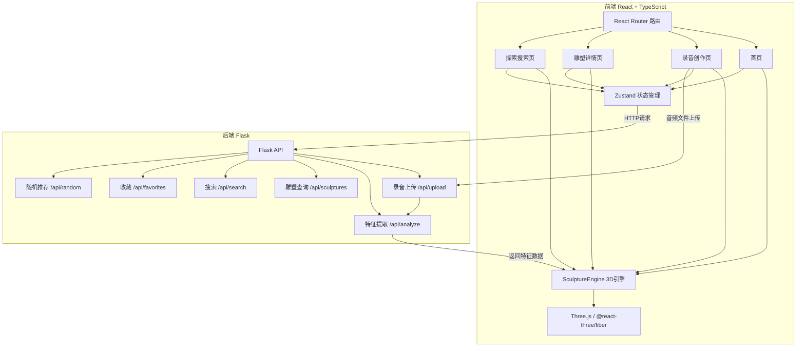
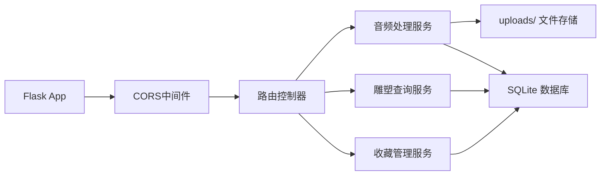

## 1. 架构设计



## 2. 技术说明

- **前端**：React@18 + TypeScript + Vite + Tailwind CSS + Zustand
- **3D渲染**：Three.js + @react-three/fiber + @react-three/drei + @react-three/postprocessing
- **动画**：framer-motion（页面切换和UI动画）
- **音频处理（前端辅助）**：Web Audio API（录音和波形预览）
- **后端**：Flask + Flask-CORS
- **数据库**：SQLite（轻量级，开发阶段足够）
- **文件存储**：本地文件系统 uploads/ 目录
- **初始化工具**：vite-init (react-ts模板)

## 3. 路由定义

| 路由 | 用途 |
|------|------|
| `/` | 首页，随机探索入口和热门展示 |
| `/record` | 录音创作页，录音和生成3D雕塑 |
| `/sculpture/:id` | 雕塑详情页，3D交互展示 |
| `/explore` | 探索搜索页，关键词搜索和瀑布流 |

## 4. API定义

### 4.1 TypeScript类型定义

```typescript
interface AudioFeature {
  frequencyBands: FrequencyBand[];
  rhythmPeaks: number[];
  duration: number;
}

interface FrequencyBand {
  centerFreq: number;
  energy: number;
  emotionTag: string;
  color: string;
}

interface Sculpture {
  id: string;
  name: string;
  userId: string;
  audioUrl: string;
  features: AudioFeature;
  thumbnailUrl: string;
  createdAt: string;
  tags: string[];
}

interface SculptureCard {
  id: string;
  name: string;
  thumbnailUrl: string;
  tags: string[];
  createdAt: string;
}
```

### 4.2 请求/响应模式

| 端点 | 方法 | 请求 | 响应 |
|------|------|------|------|
| `/api/upload` | POST | multipart/form-data: audio file + name | `{ sculptureId, features: AudioFeature }` |
| `/api/analyze/:id` | GET | - | `{ features: AudioFeature }` |
| `/api/sculptures/:id` | GET | - | `Sculpture` |
| `/api/sculptures` | GET | `?page=1&limit=20` | `{ items: SculptureCard[], total: number }` |
| `/api/search` | GET | `?q=keyword&page=1&limit=20` | `{ items: SculptureCard[], total: number }` |
| `/api/random` | GET | - | `SculptureCard` |
| `/api/favorites` | GET | `?userId=xxx` | `{ items: SculptureCard[] }` |
| `/api/favorites` | POST | `{ userId, sculptureId }` | `{ success: boolean }` |
| `/api/favorites/:sculptureId` | DELETE | `?userId=xxx` | `{ success: boolean }` |

## 5. 服务器架构图



## 6. 数据模型

### 6.1 数据模型定义

```mermaid
erdiag
    "User" {
        string id PK
        string email
        string name
        datetime created_at
    }
    "Sculpture" {
        string id PK
        string name
        string user_id FK
        string audio_path
        string thumbnail_path
        text features_json
        text tags_json
        datetime created_at
    }
    "Favorite" {
        string id PK
        string user_id FK
        string sculpture_id FK
        datetime created_at
    }
    "User" ||--o{ "Sculpture" : "creates"
    "User" ||--o{ "Favorite" : "has"
    "Sculpture" ||--o{ "Favorite" : "receives"
```

### 6.2 数据定义语言

```sql
CREATE TABLE users (
    id TEXT PRIMARY KEY,
    email TEXT UNIQUE NOT NULL,
    name TEXT NOT NULL,
    created_at TIMESTAMP DEFAULT CURRENT_TIMESTAMP
);

CREATE TABLE sculptures (
    id TEXT PRIMARY KEY,
    name TEXT NOT NULL,
    user_id TEXT NOT NULL REFERENCES users(id),
    audio_path TEXT NOT NULL,
    thumbnail_path TEXT,
    features_json TEXT NOT NULL,
    tags_json TEXT DEFAULT '[]',
    created_at TIMESTAMP DEFAULT CURRENT_TIMESTAMP
);

CREATE TABLE favorites (
    id TEXT PRIMARY KEY,
    user_id TEXT NOT NULL REFERENCES users(id),
    sculpture_id TEXT NOT NULL REFERENCES sculptures(id),
    created_at TIMESTAMP DEFAULT CURRENT_TIMESTAMP,
    UNIQUE(user_id, sculpture_id)
);

CREATE INDEX idx_sculptures_user ON sculptures(user_id);
CREATE INDEX idx_sculptures_created ON sculptures(created_at DESC);
CREATE INDEX idx_favorites_user ON favorites(user_id);

INSERT INTO users (id, email, name) VALUES
    ('demo', 'demo@echo.corridor', '探索者');
```
