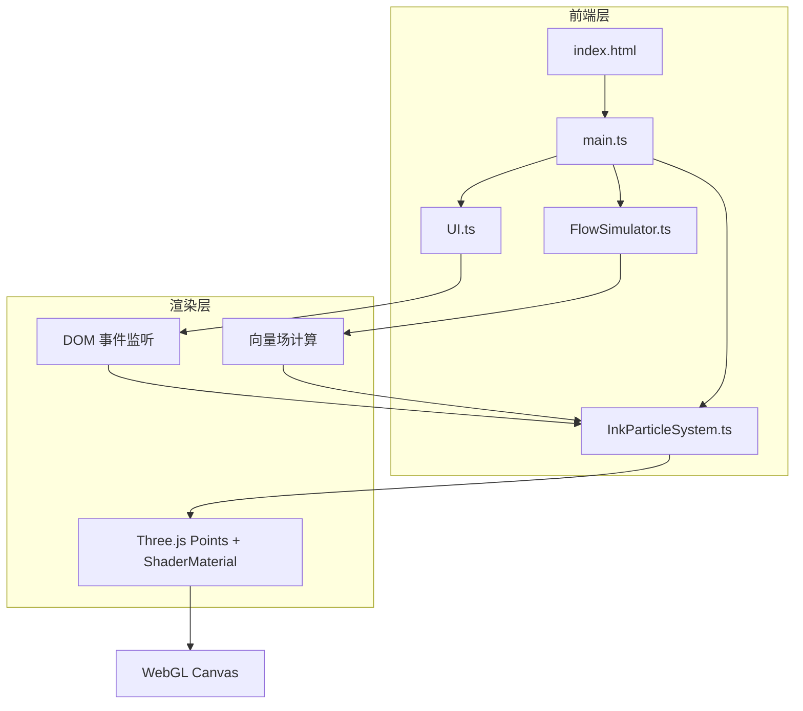

## 1. 架构设计

## 2. 技术说明

- 前端：TypeScript + Three.js + Vite
- 初始化工具：Vite
- 后端：无
- 数据库：无

### 2.1 技术选型理由

| 技术 | 用途 | 选型理由 |
|------|------|----------|
| Three.js | 3D 渲染 | 成熟的 WebGL 库，适合粒子系统 |
| TypeScript | 开发语言 | 类型安全，提升代码质量 |
| Vite | 构建工具 | 快速 HMR，零配置 TypeScript 支持 |
| ShaderMaterial | 粒子渲染 | 自定义着色器实现半透明、发光、拖尾效果 |
| BufferGeometry | 粒子几何 | 高性能粒子管理，支持 5000 粒子 |

## 3. 文件结构

| 文件 | 职责 |
|------|------|
| `src/main.ts` | 入口：初始化场景、相机、渲染器，动画循环 |
| `src/InkParticleSystem.ts` | 粒子系统：管理粒子位置、速度、颜色、生命周期 |
| `src/FlowSimulator.ts` | 水流模拟：向量场生成，涡旋与涌动效果 |
| `src/UI.ts` | 交互层：鼠标事件、控制面板、颜色选择 |
| `index.html` | 入口页面 |
| `package.json` | 依赖与脚本 |
| `vite.config.js` | Vite 配置 |
| `tsconfig.json` | TypeScript 配置 |

## 4. 核心模块设计

### 4.1 FlowSimulator

- 使用 Perlin 噪声生成二维向量场
- 向量场随时间缓慢变化（时间作为噪声第三维输入）
- 叠加多个不同频率和振幅的涡旋中心
- 提供 `getFlowAt(x, y, time)` 方法返回指定位置的水流方向

### 4.2 InkParticleSystem

- 使用 Three.js `BufferGeometry` + `Points` 渲染
- 自定义 `ShaderMaterial`：
  - 顶点着色器：处理粒子大小（随生命周期衰减）
  - 片段着色器：圆形粒子 + 径向渐变（柔和边缘）+ 半透明
- Buffer 属性：position、color、size、life（生命周期）
- 粒子更新逻辑：
  1. 从 FlowSimulator 获取当前水流方向
  2. 叠加扩散力（随生命周期衰减）
  3. 叠加随机布朗运动
  4. 更新位置、速度、生命周期
  5. 生命结束的粒子被回收
- 颜色混合：相邻粒子颜色插值，使用 additive blending 产生自然混合

### 4.3 UI

- 鼠标事件：mousedown/mousemove/mouseup + touch 事件
- 坐标转换：屏幕坐标 → NDC → 世界坐标
- 控制面板：DOM 元素覆盖在画布上
- 颜色选择：三个预设色块，点击切换当前墨色
- 清除按钮：调用粒子系统 clear 方法

### 4.4 main.ts

- 初始化 Three.js 场景、正交相机、WebGLRenderer
- 创建 FlowSimulator、InkParticleSystem、UI 实例
- 动画循环：requestAnimationFrame
- 每帧：更新 FlowSimulator → 更新 InkParticleSystem → 渲染
- resize 监听：更新相机和渲染器尺寸
