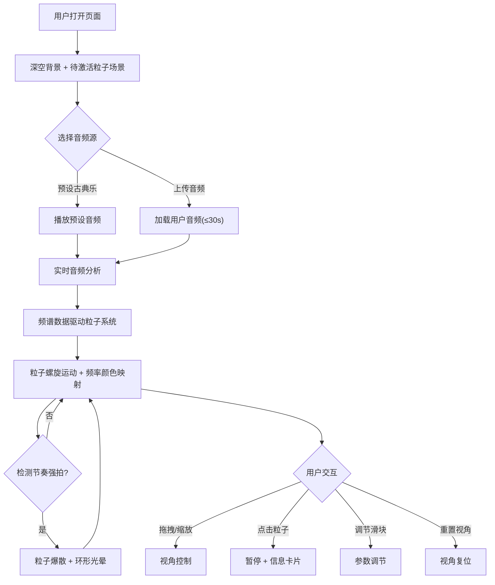

## 1. 产品概述

「光音织梦」是一个3D交互式音乐可视化项目，将音频频谱实时转化为三维空间中由发光粒子组成的动态结构。用户可通过鼠标拖拽旋转视角、滚轮缩放，沉浸式观察音频在三维空间中的动态演化。支持预设古典乐片段或用户上传短音频（最长30秒）。

- 目标用户：音乐爱好者、视觉艺术创作者、交互体验探索者
- 核心价值：将听觉体验转化为可交互的三维视觉艺术，提供沉浸式音频可视化体验

## 2. 核心功能

### 2.1 用户角色

| 角色 | 访问方式 | 核心权限 |
|------|----------|----------|
| 访客 | 直接访问 | 使用所有可视化功能 |

### 2.2 功能模块

1. **主场景页**：3D粒子可视化核心场景、音频控制、视角控制、信息卡片

### 2.3 页面详情

| 页面名称 | 模块名称 | 功能描述 |
|----------|----------|----------|
| 主场景页 | 音频源选择 | 支持预设古典乐片段播放或用户上传音频文件（最长30秒） |
| 主场景页 | 3D粒子可视化 | 根据音频频谱实时生成发光粒子，粒子沿螺旋轨道运动，颜色随频率变化 |
| 主场景页 | 节奏响应爆散 | 检测节奏强拍时粒子向外爆散，并扩散出环形光晕 |
| 主场景页 | 视角控制 | 鼠标拖拽旋转、滚轮缩放3D场景 |
| 主场景页 | 交互信息卡片 | 点击粒子群暂停并显示半透明毛玻璃信息卡片，包含频谱分析图和情感标签 |
| 主场景页 | 控制面板 | 右下角毛玻璃面板，含粒子速度/光晕强度/灵敏度三个滑块及重置视角按钮 |
| 主场景页 | 背景星空 | 缓慢飘浮的细小星点，纯黑到深蓝紫渐变背景 |

## 3. 核心流程

用户打开页面后，看到深空背景和待激活的粒子场景。选择预设古典乐或上传音频后，系统开始实时分析音频，粒子随频谱动态演化。用户可拖拽旋转观察3D结构，点击粒子群查看频谱详情，通过控制面板调节参数。

## 4. 用户界面设计

### 4.1 设计风格

- **主色调**：纯黑（#000000）到深蓝紫（#1a0a2e）渐变背景
- **强调色**：低音红紫（#9b30ff）、中音青绿（#00e5a0）、高音金黄（#ffd700）
- **按钮风格**：毛玻璃半透明，圆角8px，微发光边缘
- **字体**：标题使用 Orbitron（科技感显示字体），正文使用 Noto Sans SC
- **布局风格**：全屏3D画布 + 覆盖层UI（毛玻璃控制面板、信息卡片）
- **图标风格**：简约线条图标，带微发光效果

### 4.2 页面设计概览

| 页面名称 | 模块名称 | UI元素 |
|----------|----------|--------|
| 主场景页 | 3D画布 | 全屏Three.js渲染，深空渐变背景，星空粒子层 |
| 主场景页 | 音频控制栏 | 顶部居中毛玻璃面板，预设选择按钮 + 上传按钮，Orbitron字体标题 |
| 主场景页 | 控制面板 | 右下角毛玻璃面板，三个自定义滑块 + 重置按钮，柔和圆角 |
| 主场景页 | 信息卡片 | 居中弹出毛玻璃卡片，频谱Canvas图 + 情感标签，缓动淡入动画 |

### 4.3 响应式

- 桌面优先设计，全屏3D画布自适应窗口尺寸
- 控制面板在小屏幕上缩至底部
- 触屏设备支持触摸拖拽和双指缩放

### 4.4 3D场景指引

- **环境**：深空氛围，纯黑到深蓝紫径向渐变，缓慢飘浮星点背景层
- **灯光**：无传统光源，粒子自发光（AdditiveBlending），中心微弱PointLight营造深度
- **相机**：PerspectiveCamera，初始距离15，FOV 60°，OrbitControls交互
- **构图**：粒子螺旋结构居中，爆散粒子向外扩散，星点背景营造纵深感
- **交互**：OrbitControls拖拽旋转/滚轮缩放，Raycaster点击粒子检测
- **后期处理**：可选Bloom后处理增强发光效果，粒子AdditiveBlending
- **性能预算**：主粒子数量≤8000，星空背景粒子≤2000，目标60fps

## 5. 频率-颜色映射规则

| 频率范围 | 颜色 | RGB值 |
|----------|------|-------|
| 低频（20-250Hz） | 红紫 | #9b30ff (155, 48, 255) |
| 中低频（250-1000Hz） | 蓝紫 | #6a5acd (106, 90, 205) |
| 中频（1000-4000Hz） | 青绿 | #00e5a0 (0, 229, 160) |
| 中高频（4000-8000Hz） | 青蓝 | #00bfff (0, 191, 255) |
| 高频（8000-20000Hz） | 金黄 | #ffd700 (255, 215, 0) |

## 6. 情感标签规则

| 频谱特征 | 情感标签 |
|----------|----------|
| 低频主导 + 高音量 | 激昂 / 雄浑 |
| 高频主导 + 快节奏 | 明快 / 轻盈 |
| 中频主导 + 平稳 | 温暖 / 宁静 |
| 全频段均衡 | 丰富 / 和谐 |
| 低音量 + 慢节奏 | 柔和 / 悠远 |
