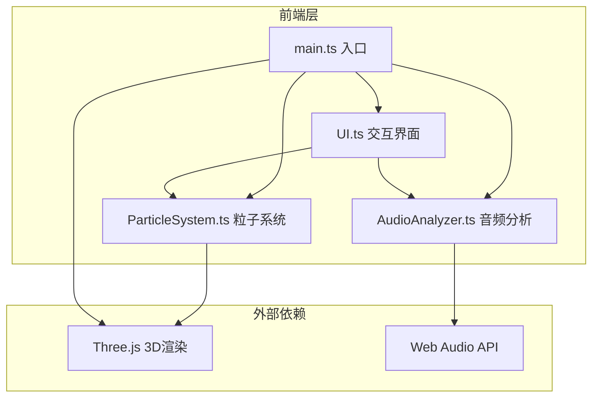

## 1. 架构设计



## 2. 技术说明

- **前端**：TypeScript + Three.js + Vite
- **构建工具**：Vite（开发服务器 + 生产构建）
- **3D渲染**：Three.js（场景管理、粒子系统、相机控制）
- **音频处理**：Web Audio API（AnalyserNode实时频谱分析）
- **相机控制**：Three.js OrbitControls（拖拽旋转、滚轮缩放）
- **样式**：内联CSS（毛玻璃效果、自定义滑块）
- **后端**：无（纯前端项目）

## 3. 路由定义

| 路由 | 用途 |
|------|------|
| / | 主场景页，3D可视化核心页面 |

## 4. 文件结构

```
├── index.html              # 入口HTML
├── package.json            # 依赖与脚本
├── tsconfig.json           # TypeScript配置
├── vite.config.js          # Vite配置
├── public/
│   └── audio/              # 预设音频文件目录
└── src/
    ├── main.ts             # 入口：初始化场景、相机、渲染器、动画循环
    ├── AudioAnalyzer.ts    # 音频加载与实时频谱分析
    ├── ParticleSystem.ts   # 粒子生成、螺旋运动、颜色映射、爆散特效
    └── UI.ts               # 控制面板、信息卡片交互逻辑
```

## 5. 模块职责

### 5.1 main.ts
- 初始化Three.js场景（Scene）、相机（PerspectiveCamera）、WebGL渲染器
- 创建OrbitControls实现视角控制
- 实例化AudioAnalyzer、ParticleSystem、UI模块
- 管理动画循环（requestAnimationFrame），协调各模块更新
- 监听窗口resize事件，自适应画布尺寸
- 创建星空背景粒子层

### 5.2 AudioAnalyzer.ts
- 加载预设音频文件（fetch + decodeAudioData）
- 处理用户上传音频（FileReader + decodeAudioData），限制30秒
- 创建AudioContext、AnalyserNode、数据源节点
- 提供实时频谱数据接口（getFrequencyData、getTimeDomainData）
- 计算节奏强拍检测（基于音量突变）
- 计算音量RMS、频率质心等特征

### 5.3 ParticleSystem.ts
- 管理粒子几何体（BufferGeometry + Points）
- 粒子沿螺旋轨道运动（参数化螺旋方程）
- 频率-颜色映射（低音红紫、中音青绿、高音金黄）
- 节奏强拍爆散效果（粒子位置偏移 + 环形光晕生成）
- 光晕效果（额外环形Mesh，AdditiveBlending）
- 支持外部参数调节（速度、光晕强度、灵敏度）
- Raycaster点击检测支持

### 5.4 UI.ts
- 右下角毛玻璃控制面板（粒子速度/光晕强度/灵敏度滑块）
- 顶部音频控制栏（预设选择 + 上传按钮）
- 半透明信息卡片（频谱Canvas图 + 情感标签）
- 自定义滑块样式
- 重置视角按钮
- 页面切换缓动淡入动画

## 6. 性能优化策略

- **粒子渲染**：使用BufferGeometry + Points，避免逐粒子创建Mesh
- **材质优化**：PointsMaterial with AdditiveBlending，无需深度写入
- **星空背景**：独立静态粒子层，仅创建一次不更新
- **频谱采样**：fftSize=2048，每帧仅提取必要数据
- **爆散粒子池**：预分配爆散粒子，避免运行时GC
- **RAF调度**：使用requestAnimationFrame，确保与屏幕刷新同步
- **Canvas尺寸**：限制devicePixelRatio最大为2，避免超高DPI设备性能瓶颈

## 7. 依赖清单

| 包名 | 版本 | 用途 |
|------|------|------|
| three | ^0.170.0 | 3D渲染引擎 |
| vite | ^6.0.0 | 构建工具与开发服务器 |
| typescript | ^5.7.0 | 类型安全 |
| @types/three | ^0.170.0 | Three.js类型定义 |
