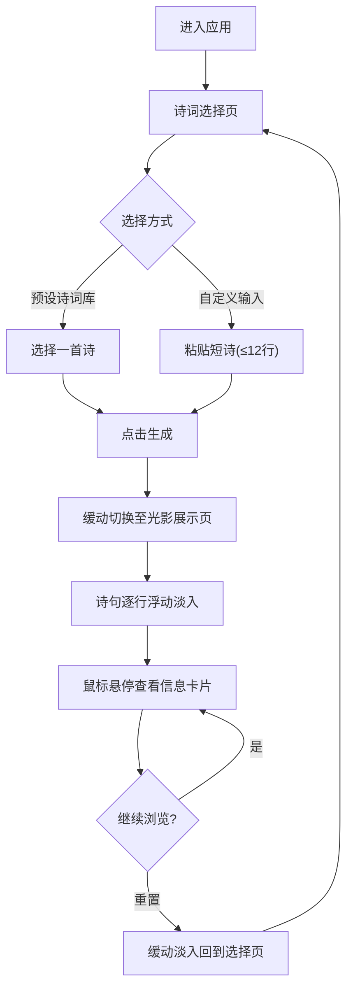

## 1. 产品概述

「光影诗笺」是一款交互式诗歌光影生成器，将中国古风诗词与动态光影效果融合，为用户带来沉浸式的诗意视觉体验。
- 面向诗词爱好者与文化体验用户，通过情感识别将文字转化为可视化的光影动画
- 以水墨淡彩的东方美学为设计基调，打造差异化的诗词互动产品

## 2. 核心功能

### 2.1 用户角色

无角色区分，所有用户享有完整功能。

### 2.2 功能模块

1. **诗词选择页**：预设古风诗词库选择 + 自定义短诗粘贴入口
2. **光影展示页**：瀑布流逐行展示诗词，每行配有情感光影效果和交互动画

### 2.3 页面详情

| 页面名称 | 模块名称 | 功能描述 |
|----------|----------|----------|
| 诗词选择页 | 预设诗词库 | 提供至少5首经典古风诗词供用户选择，卡片式展示诗名和首句 |
| 诗词选择页 | 自定义输入 | 支持粘贴自定义短诗（最多12行），实时显示行数统计 |
| 诗词选择页 | 深灰毛玻璃工具栏 | 包含项目标题和重置按钮 |
| 光影展示页 | 瀑布流动画 | 诗句逐行从底部向上浮动淡入，每行配有对应情感颜色的光影效果 |
| 光影展示页 | 悬停交互 | 鼠标悬停该行放大，显示毛玻璃信息卡片（情感浓度、意象标签、推荐配乐） |
| 光影展示页 | 墨点粒子背景 | 缓慢飘浮的细小墨点粒子，鼠标移动时产生微弱跟随效果 |
| 光影展示页 | 重置按钮 | 清空当前显示，缓动淡入回到选择界面 |

## 3. 核心流程

用户进入应用 → 在选择页从预设诗词库选择一首诗或粘贴自定义短诗 → 点击生成 → 页面缓动切换到光影展示页 → 诗句逐行从底部向上浮动淡入，每行配有情感光影效果 → 鼠标悬停查看毛玻璃信息卡片 → 点击重置按钮回到选择界面。

## 4. 用户界面设计

### 4.1 设计风格

- 主色：米白仿宣纸底色（#F5F0E8），深灰毛玻璃工具栏（rgba(40,40,40,0.6)）
- 辅色：情感色彩映射（悲-靛蓝#4A5899、喜-暖金#D4A843、思-淡紫#9B7EBD、寂-灰绿#7A9E7E、豪-赤红#C25450、愁-青灰#6B8E9B）
- 按钮风格：圆角（8px），深灰半透明底色，白色文字，悬停时微发光
- 字体：Ma Shan Zheng（毛笔字体）用于诗词正文，系统衬线字体用于辅助信息
- 布局：居中单列布局，最大宽度960px，诗词选择卡片网格排列
- 动画：缓动淡入淡出，浮动上升动画，墨点粒子缓动飘浮

### 4.2 页面设计概览

| 页面名称 | 模块名称 | UI元素 |
|----------|----------|--------|
| 诗词选择页 | 预设诗词卡片 | 米白卡片、毛笔字体诗名、悬停微放大、网格布局 |
| 诗词选择页 | 自定义输入区 | 半透明文本框、行数计数器、圆角生成按钮 |
| 诗词选择页 | 毛玻璃工具栏 | 深灰毛玻璃背景、标题文字、重置按钮 |
| 光影展示页 | 诗句行 | 毛笔字体、情感色彩渐变背景、发光文字、浮动动画 |
| 光影展示页 | 悬停信息卡片 | 毛玻璃背景、情感浓度条、意象标签、推荐配乐文字 |
| 光影展示页 | 墨点粒子 | 细小墨点、缓慢飘浮、鼠标跟随微偏移 |

### 4.3 响应式适配

- 桌面端（≥1024px）：最大宽度960px居中，诗词卡片3列网格，粒子密度60
- 平板端（768px-1023px）：全宽内边距40px，诗词卡片2列网格，粒子密度40
- 所有动画保持60fps，使用requestAnimationFrame驱动
- 触控设备适配悬停为长按触发信息卡片

### 4.4 3D场景指引

不适用，本项目为2D Canvas + CSS动画实现。
