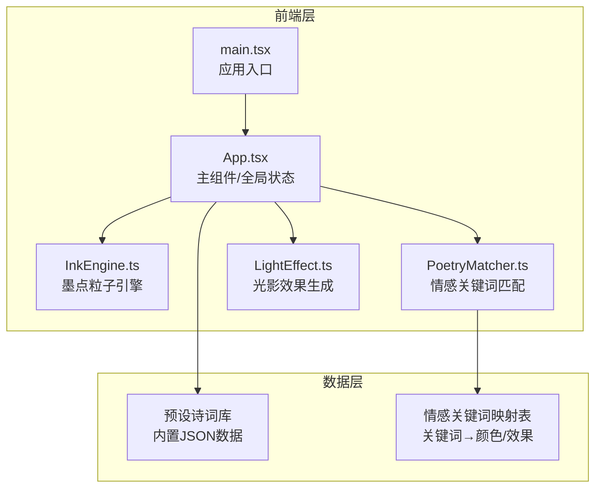
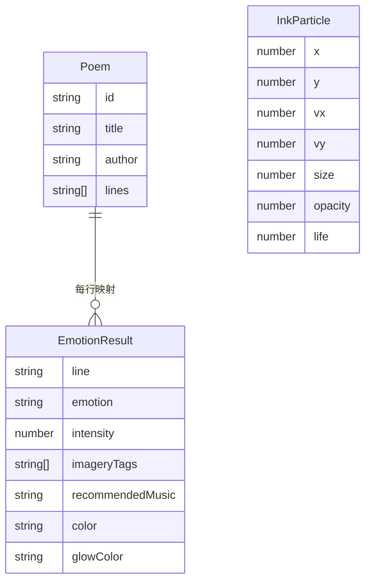

## 1. 架构设计

## 2. 技术说明

- 前端：React@18 + TypeScript + Vite
- 初始化工具：Vite
- 样式方案：CSS-in-JS（内联样式 + CSS变量），不引入额外CSS框架
- 动画引擎：原生requestAnimationFrame + Canvas API
- 后端：无
- 数据库：无，使用内置静态数据

## 3. 路由定义

| 路由 | 用途 |
|------|------|
| / | 单页应用，通过状态切换选择页和展示页 |

## 4. API定义

无后端API，所有数据内置。

## 5. 服务器架构图

不适用，纯前端应用。

## 6. 数据模型

### 6.1 数据模型定义

### 6.2 核心模块职责

| 模块 | 职责 |
|------|------|
| InkEngine.ts | 管理Canvas墨点粒子系统：生成、飘浮动画、鼠标跟随、缓动更新、帧率控制 |
| PoetryMatcher.ts | 情感关键词匹配引擎：逐行分析诗句，输出EmotionResult（情感、浓度、意象、配乐、颜色） |
| LightEffect.ts | 光影效果生成：根据EmotionResult生成CSS渐变背景、文字发光、行级光影样式 |
| App.tsx | React主组件：管理全局状态（当前页面、选中诗词、解析结果）、组合所有模块、UI布局和交互 |
| main.tsx | 应用入口：挂载React应用到DOM |

### 6.3 关键技术决策

1. **粒子系统**：使用Canvas 2D渲染墨点粒子，overlay在React组件下方，通过z-index分层
2. **动画驱动**：所有动画使用requestAnimationFrame，确保60fps流畅性
3. **缓动函数**：使用ease-out-cubic实现淡入浮动效果
4. **情感匹配**：基于关键词字典匹配，每个情感类型预设颜色、发光色、意象标签和配乐推荐
5. **毛玻璃效果**：CSS backdrop-filter: blur() + 半透明背景色
6. **字体加载**：Google Fonts引入Ma Shan Zheng，设置fallback字体链
