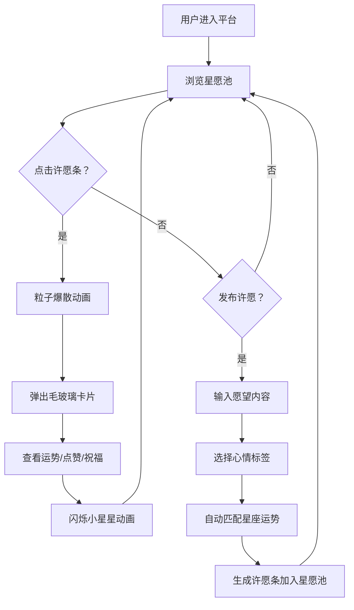

## 1. 产品概述

「星语心愿」是一款在线星座许愿平台，用户可以记录每天的心情和愿望，系统根据日期自动匹配星座运势并生成动态星空许愿条。其他用户可浏览星愿池，点击许愿条触发粒子爆散动画并查看毛玻璃卡片详情，还可以点赞和祝福许愿条。
- 目标用户：喜欢星座文化、追求梦幻交互体验的年轻用户
- 核心价值：将星座运势与许愿社交结合，打造沉浸式星空梦幻交互体验

## 2. 核心功能

### 2.1 用户角色

| 角色 | 注册方式 | 核心权限 |
|------|----------|----------|
| 访客 | 无需注册 | 浏览星愿池、查看许愿详情 |
| 用户 | 匿名使用 | 发布许愿、浏览、点赞、祝福 |

### 2.2 功能模块

1. **星愿池页面**：星空背景、许愿条浮动展示、许愿发布入口
2. **许愿详情卡片**：毛玻璃弹出卡片、星座运势分析、粒子爆散特效

### 2.3 页面详情

| 页面名称 | 模块名称 | 功能描述 |
|----------|----------|----------|
| 星愿池页面 | 顶部导航栏 | 平台名称「星语心愿」、许愿发布按钮 |
| 星愿池页面 | 许愿发布表单 | 输入愿望内容、选择心情标签、提交后自动匹配星座运势 |
| 星愿池页面 | 星空背景 | 深蓝到紫黑渐变背景、缓慢旋转星云、飘浮细小星点 |
| 星愿池页面 | 浮动许愿条 | 按时间倒序展示、从底部向上浮动并淡入、颜色根据星座和心情变化 |
| 星愿池页面 | 许愿条交互 | 点击触发粒子爆散动画（颜色对应星座） |
| 许愿详情卡片 | 毛玻璃卡片 | 居中弹出、背景模糊、显示星座运势分析、许愿内容、心情标签 |
| 许愿详情卡片 | 社交互动 | 点赞和祝福按钮、计数显示、触发闪烁小星星动画 |
| 星愿池页面 | 响应式布局 | 桌面端两列布局、移动端单列、适配触摸操作 |

## 3. 核心流程

用户进入平台后，可浏览星愿池中浮动的许愿条。点击任意许愿条会触发粒子爆散动画并弹出毛玻璃详情卡片，查看运势分析和互动。用户也可以点击发布按钮，输入愿望内容并选择心情标签，系统自动匹配星座运势并生成许愿条加入星愿池。

## 4. 用户界面设计

### 4.1 设计风格

- 主色调：深蓝（#0a0e27）到紫黑（#1a0533）渐变
- 强调色：星座对应色（白羊座-红橙 #ff6b4a、双鱼座-蓝紫 #8b5cf6、快乐-暖黄 #fbbf24、忧伤-淡蓝 #93c5fd）
- 按钮风格：圆角毛玻璃按钮，半透明背景，柔和阴影
- 字体：标题使用「Cinzel」展示字体，正文使用「Noto Sans SC」
- 布局风格：顶部导航 + 居中内容区，卡片式许愿条浮动排列
- 图标风格：星座符号图标 + lucide-react功能性图标

### 4.2 页面设计概述

| 页面名称 | 模块名称 | UI元素 |
|----------|----------|--------|
| 星愿池页面 | 星空背景 | 深蓝紫黑渐变、CSS动画星云旋转、Canvas绘制飘浮星点 |
| 星愿池页面 | 浮动许愿条 | 毛玻璃圆角卡片、星座颜色渐变边框、缓动浮动动画（CSS translate + opacity） |
| 星愿池页面 | 粒子爆散 | Canvas绘制粒子、颜色匹配星座、从中心向四周扩散并淡出 |
| 许愿详情卡片 | 毛玻璃卡片 | backdrop-filter blur、半透明白色背景、圆角16px、柔和阴影 |
| 许愿详情卡片 | 闪烁星星 | DOM元素、随机位置和大小、CSS animation闪烁、1.5s后淡出 |
| 许愿发布表单 | 输入区域 | 毛玻璃模态框、文本输入、心情标签选择器、提交按钮 |

### 4.3 响应式设计

- 桌面优先设计（≥768px：两列许愿条布局，详情卡片居中）
- 移动端适配（<768px：单列布局，卡片全宽，触摸优化按钮尺寸≥44px）
- 所有动画和粒子系统在移动端保持60fps，粒子数量根据设备性能动态调整

### 4.4 动画与性能

- 星云背景：CSS transform rotate动画，60s一周
- 许愿条浮动：CSS animation translateY + opacity，缓动函数ease-out
- 粒子爆散：requestAnimationFrame + Canvas2D，单次爆散50-80个粒子
- 星星闪烁：CSS animation scale + opacity，随机延迟
- 页面切换：CSS transition opacity + transform，300ms缓动
- 帧率目标：60fps，通过requestAnimationFrame和CSS will-change优化
