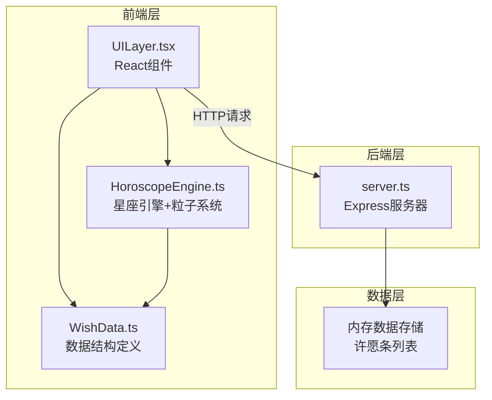
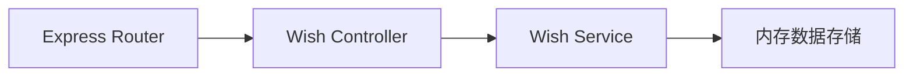
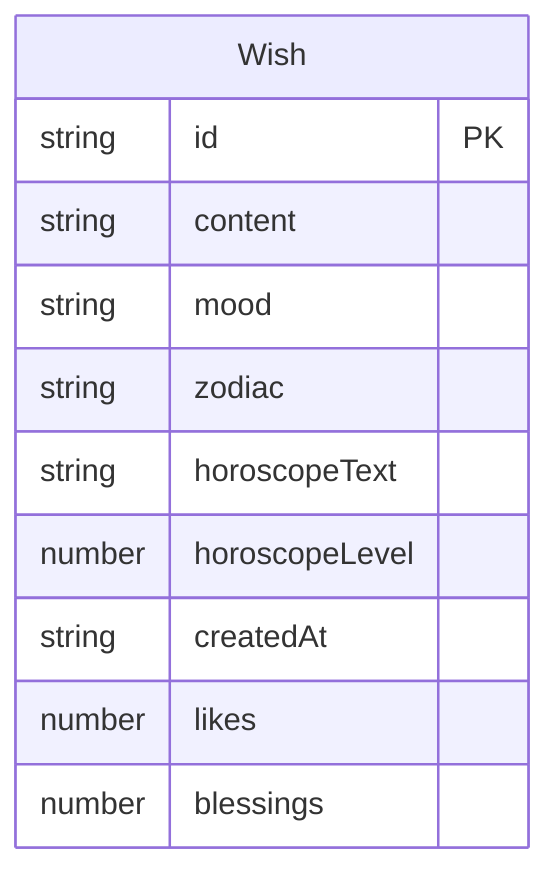

## 1. 架构设计



## 2. 技术说明

- 前端：React@18 + TypeScript + Tailwind CSS + Vite
- 初始化工具：vite-init（react-express-ts模板）
- 后端：Express@4 + TypeScript
- 数据库：内存数据存储（Mock数据），使用数组存储许愿条
- 动画：CSS Animation + Canvas2D（粒子系统）+ requestAnimationFrame

## 3. 路由定义

| 路由 | 用途 |
|------|------|
| / | 星愿池主页面，展示所有浮动许愿条 |

## 4. API定义

### 4.1 数据类型

```typescript
interface Wish {
  id: string;
  content: string;
  mood: MoodType;
  zodiac: ZodiacSign;
  horoscopeText: string;
  horoscopeLevel: number;
  createdAt: string;
  likes: number;
  blessings: number;
}

type MoodType = 'happy' | 'calm' | 'sad' | 'excited' | 'hopeful';

type ZodiacSign = 'aries' | 'taurus' | 'gemini' | 'cancer' | 'leo' | 'virgo'
  | 'libra' | 'scorpio' | 'sagittarius' | 'capricorn' | 'aquarius' | 'pisces';
```

### 4.2 API端点

| 方法 | 路径 | 请求体 | 响应 | 说明 |
|------|------|--------|------|------|
| GET | /api/wishes | - | Wish[] | 获取所有许愿条（时间倒序） |
| POST | /api/wishes | { content, mood } | Wish | 创建新许愿条 |
| POST | /api/wishes/:id/like | - | { likes: number } | 点赞许愿条 |
| POST | /api/wishes/:id/bless | - | { blessings: number } | 祝福许愿条 |

## 5. 服务器架构



## 6. 数据模型

### 6.1 数据模型定义



### 6.2 初始化数据

启动时预填充8-12条示例许愿条，覆盖不同星座和心情，确保星愿池有初始内容展示。

## 7. 文件结构

```
src/
  HoroscopeEngine.ts    # 星座匹配引擎、运势生成、粒子系统
  WishData.ts           # 许愿条数据结构、类型定义、颜色映射
  UILayer.tsx           # React主组件（星空背景、星愿池、毛玻璃卡片、动画）
api/
  server.ts             # Express服务器（许愿条CRUD、点赞祝福）
public/
  index.html            # 入口HTML
package.json            # 依赖和脚本
tsconfig.json           # TypeScript配置（strict模式）
vite.config.ts          # Vite配置
```
