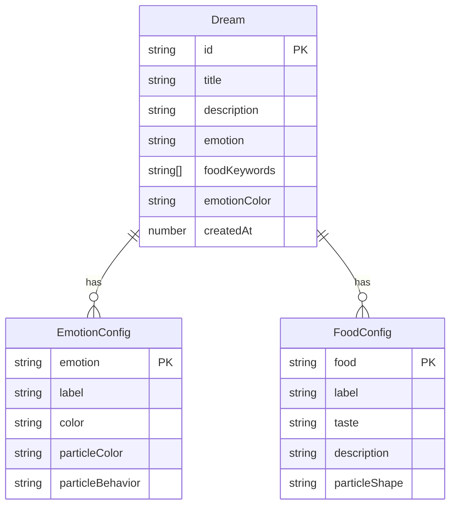

## 1. 架构设计

```mermaid
flowchart TB
    subgraph "前端层"
        "React App" --> "路由层（react-router-dom）"
        "路由层" --> "首页"
        "路由层" --> "创建页"
        "路由层" --> "详情页"
    end
    subgraph "状态管理层"
        "Zustand Store" --> "梦境数据"
        "Zustand Store" --> "搜索状态"
        "Zustand Store" --> "动画配置"
    end
    subgraph "渲染层"
        "Canvas 粒子引擎" --> "食物粒子模拟"
        "Canvas 粒子引擎" --> "鼠标交互"
        "Canvas 粒子引擎" --> "背景粒子"
    end
    subgraph "数据层"
        "本地 Mock 数据" --> "梦境记录 JSON"
    end
    "前端层" --> "状态管理层"
    "状态管理层" --> "渲染层"
    "前端层" --> "数据层"
```

## 2. 技术说明

- 前端：React@18 + TypeScript + Tailwind CSS + Vite
- 初始化工具：vite-init（react-ts 模板）
- 状态管理：Zustand
- 路由：react-router-dom
- 动画：CSS 动画 + Canvas 2D API + requestAnimationFrame
- 后端：无（纯前端）
- 数据：本地 Mock JSON 数据

## 3. 路由定义

| 路由 | 用途 |
|------|------|
| / | 首页，展示梦境瀑布流、搜索栏、创建入口 |
| /create | 创建梦境页，表单提交梦境记录 |
| /dream/:id | 梦境详情页，Canvas 粒子场景和交互 |

## 4. 数据模型

### 4.1 数据模型定义



### 4.2 数据定义

```typescript
interface Dream {
  id: string;
  title: string;
  description: string;
  emotion: string;
  foodKeywords: string[];
  createdAt: number;
}

interface EmotionConfig {
  emotion: string;
  label: string;
  color: string;
  particleColor: string;
  particleBehavior: 'float' | 'bubble' | 'spiral' | 'burst';
}

interface FoodConfig {
  food: string;
  label: string;
  taste: string;
  description: string;
  particleShape: 'glow' | 'bubble' | 'smoke' | 'spark';
}
```

## 5. 粒子引擎设计

### 5.1 核心架构

- **Particle**：单个粒子，包含位置、速度、颜色、大小、生命周期、形态
- **ParticleSystem**：粒子系统管理器，控制粒子生成、更新、渲染、回收
- **InteractionManager**：交互管理器，处理鼠标拖拽旋转、点击检测
- **AnimationLoop**：基于 requestAnimationFrame 的动画循环，保证 60fps

### 5.2 粒子行为映射

| 情绪+食物 | 粒子颜色 | 粒子行为 | 粒子形态 |
|-----------|----------|----------|----------|
| 快乐+甜点 | 暖橙/金色 | 缓慢旋转上升 | 发光圆形 |
| 忧伤+热汤 | 蓝色/青色 | 冒泡上升 | 气泡形 |
| 宁静+咖啡 | 棕色/米色 | 烟雾缭绕 | 烟雾形 |
| 激动+烧烤 | 红橙/火色 | 飞溅扩散 | 火花形 |

### 5.3 交互设计

- **拖拽旋转**：鼠标按住拖拽时，围绕中心点旋转粒子场景视角（3D 透视模拟）
- **点击爆散**：点击食物粒子群中心时，粒子向外爆散，然后显示毛玻璃信息卡片
- **悬停效果**：鼠标靠近粒子群时，粒子轻微向鼠标方向偏移

### 5.4 性能优化

- 粒子池复用，避免 GC 压力
- 移动端降低粒子数量（桌面 200+，移动端 80+）
- 使用 offscreen 缓存静态元素
- requestAnimationFrame 驱动动画循环
- 视口外粒子不渲染
