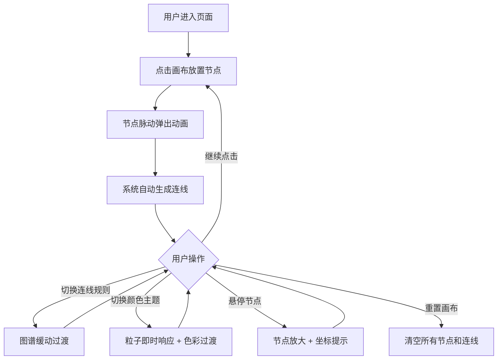

## 1. 产品概述

「符语织机」是一款交互式符文学符号生成器，让用户通过在画布上点击放置符文节点、选择连线规则和颜色主题，自动生成独特的符文图谱，并配有粒子特效与缓动动画。面向创意设计爱好者、游戏美术从业者和对神秘学符号感兴趣的探索者，提供沉浸式的视觉创作体验。

## 2. 核心功能

### 2.1 功能模块

1. **符文画布页**：交互式 Canvas 画布，节点放置、连线渲染、粒子特效、主题切换
2. **控制面板**：节点放置工具、连线规则选择、颜色主题切换、重置画布

### 2.2 页面详情

| 页面名称 | 模块名称 | 功能描述 |
|---------|---------|---------|
| 符文画布页 | Canvas 画布区域 | 点击放置符文节点，自动根据连线规则生成连线；节点脉动弹出动画；鼠标悬停节点放大并显示坐标 |
| 符文画布页 | 连线渲染 | 根据用户选择的规则（直线/曲线/网状）绘制节点间连线，带颜色渐变 |
| 符文画布页 | 粒子特效 | 节点周围光晕、半透明彩色粒子缓慢飘散、缓动动画 |
| 符文画布页 | 主题过渡 | 切换连线规则或颜色主题时，图谱平滑缓动过渡，粒子即时响应 |
| 控制面板 | 节点放置工具 | 点击画布即可放置节点，无需模式切换 |
| 控制面板 | 连线规则选择 | 下拉框选择直线/曲线/网状连线规则 |
| 控制面板 | 颜色主题切换 | 按钮组切换暗夜星辉/熔岩赤焰/深海幽蓝主题 |
| 控制面板 | 重置画布 | 清除所有节点和连线，重置为初始状态 |

## 3. 核心流程

用户进入页面后，看到深色背景的画布和半透明毛玻璃控制面板。点击画布放置符文节点，节点出现时有脉动弹出动画。系统根据所选连线规则自动连接节点，生成符文图谱。用户可通过控制面板切换连线规则（图谱平滑过渡）和颜色主题（粒子即时响应）。鼠标悬停节点时显示坐标和放大效果。点击重置按钮清空画布重新开始。

## 4. 用户界面设计

### 4.1 设计风格

- **主色调**：深黑灰背景（#0a0a0f），符文节点发白光或主题色光
- **强调色**：根据主题动态变化——暗夜星辉（#a78bfa 紫光+银白）、熔岩赤焰（#ef4444 红橙+金黄）、深海幽蓝（#06b6d4 青蓝+幽绿）
- **按钮风格**：圆角胶囊形，半透明毛玻璃质感，微光边框
- **字体**：标题使用 Cinzel Decorative（哥特装饰体），正文使用 Quicksand（圆润现代体）
- **布局**：左侧大画布 + 右侧半透明毛玻璃面板
- **图标**：简约线条图标，带微光效果

### 4.2 页面设计概览

| 页面名称 | 模块名称 | UI 元素 |
|---------|---------|---------|
| 符文画布页 | Canvas 画布 | 占据左侧约 75% 空间，深黑灰背景，节点白光脉动，连线渐变发光，粒子半透明飘散 |
| 符文画布页 | 控制面板 | 右侧约 25% 空间，毛玻璃半透明背景，控件带微光悬浮动画 |
| 符文画布页 | 连线下拉框 | 胶囊形下拉，暗色底+主题色边框光晕 |
| 符文画布页 | 主题按钮组 | 三个胶囊按钮，当前选中带主题色发光边框 |
| 符文画布页 | 重置按钮 | 底部放置，暗红色调，hover 时微光 |

### 4.3 响应式适配

- **桌面端**（≥1024px）：左侧画布 + 右侧面板横排布局
- **平板端**（768px-1023px）：画布全宽 + 底部折叠面板
- **手机端**（<768px）：画布全宽 + 底部紧凑面板，控件横排缩放，触摸优化（节点放置区域不变，控件触控目标≥44px）

### 4.4 动效规范

- 节点放置：缩放从 0→1.2→1.0 的弹性动画（300ms）
- 节点脉动：持续微弱缩放呼吸动画（2s 周期）
- 连线过渡：透明度和路径缓动切换（500ms ease-in-out）
- 粒子飘散：缓慢随机漂移 + 透明度渐变（持续循环）
- 主题切换：颜色插值过渡（400ms）
- 悬停节点：缩放 1.0→1.3（200ms），显示坐标工具提示
- 控件悬浮：hover 时 translateY(-2px) + 微光增强
