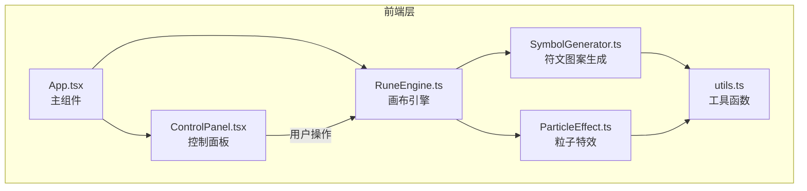

## 1. 架构设计



## 2. 技术说明

- **前端框架**：React 18 + TypeScript + Vite
- **样式方案**：CSS Modules（内联于组件中，配合 CSS 变量实现主题切换）
- **画布渲染**：原生 Canvas 2D API，requestAnimationFrame 驱动 60fps
- **构建工具**：Vite + @vitejs/plugin-react
- **后端**：无（纯前端应用）
- **数据存储**：无持久化，运行时状态管理

## 3. 路由定义

| 路由 | 用途 |
|------|------|
| / | 单页应用，包含画布和控制面板 |

## 4. 核心模块职责

### 4.1 RuneEngine.ts

- 管理 Canvas 元素和 2D 渲染上下文
- 维护符文节点列表（位置、半径、动画状态）
- 每帧执行：清空画布 → 绘制连线 → 绘制粒子 → 绘制节点
- 使用 requestAnimationFrame 保证 60fps
- 处理鼠标事件（点击添加节点、悬停检测）
- 提供重置画布方法

### 4.2 SymbolGenerator.ts

- 根据连线规则（直线/曲线/网状）计算节点间的连线路径
- 根据颜色主题生成渐变色配置
- 直线：两节点间直线路径
- 曲线：二次贝塞尔曲线，控制点偏移
- 网状：每个节点与所有其他节点连线，形成网格
- 主题色彩映射：
  - 暗夜星辉：紫光 #a78bfa → 银白 #e2e8f0
  - 熔岩赤焰：红橙 #ef4444 → 金黄 #f59e0b
  - 深海幽蓝：青蓝 #06b6d4 → 幽绿 #10b981

### 4.3 ParticleEffect.ts

- 管理粒子池（每个节点生成若干粒子）
- 粒子属性：位置、速度、透明度、颜色、生命周期
- 光晕效果：节点周围径向渐变光晕
- 飘散动画：粒子沿随机方向缓慢漂移，透明度渐变
- 缓动：使用 ease-out 曲线控制粒子运动
- 主题切换时立即更新粒子颜色

### 4.4 ControlPanel.tsx

- React 函数组件
- 连线规则下拉框：直线/曲线/网状
- 颜色主题按钮组：暗夜星辉/熔岩赤焰/深海幽蓝
- 重置画布按钮
- 通过回调函数与 RuneEngine 通信

### 4.5 App.tsx

- 整合 Canvas 和 ControlPanel
- 管理 Canvas ref 和 RuneEngine 实例
- 响应式布局：CSS Grid 或 Flexbox
- 传递控制回调给 ControlPanel

### 4.6 utils.ts

- `randomRange(min, max)`：生成范围内随机数
- `lerp(a, b, t)`：线性插值
- `colorLerp(color1, color2, t)`：颜色插值（hex → rgb → 插值 → hex）
- `easeOutCubic(t)`：缓动函数
- `easeInOutQuad(t)`：缓动函数

## 5. 数据模型

### 5.1 核心类型定义

```typescript
interface RuneNode {
  id: string;
  x: number;
  y: number;
  radius: number;
  scale: number;
  targetScale: number;
  pulsePhase: number;
  isHovered: boolean;
  createdAt: number;
}

interface Particle {
  x: number;
  y: number;
  vx: number;
  vy: number;
  alpha: number;
  color: string;
  life: number;
  maxLife: number;
  size: number;
}

type LineRule = "straight" | "curve" | "mesh";
type ColorTheme = "starry" | "lava" | "ocean";

interface ThemeConfig {
  name: string;
  primary: string;
  secondary: string;
  glow: string;
  particleColors: string[];
}
```

## 6. 性能策略

- Canvas 双缓冲：每帧清空重绘，避免残影
- 粒子数量限制：每节点最多 8 个粒子，总粒子数上限 200
- 离屏节点/粒子跳过渲染
- 使用 requestAnimationFrame 而非 setInterval
- 节点碰撞检测使用空间索引（节点数<100 时直接遍历即可）
- 连线计算仅在节点变化时重新执行，非每帧
