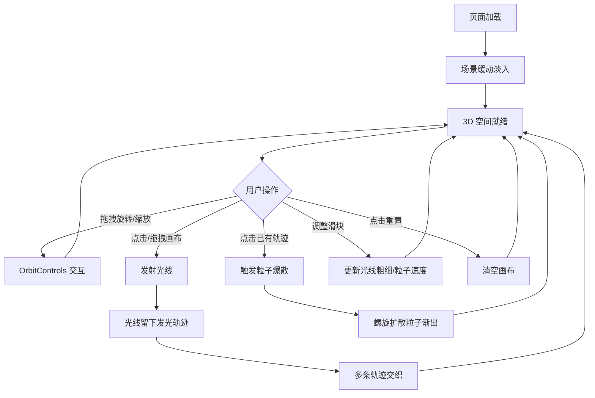

## 1. 产品概述

「流光织诗」是一个基于 Three.js 的 3D 交互可视化项目，模拟用光线在空间中编织出流动的抽象诗句。用户通过鼠标在画布上拖拽发射光线，光线留下半透明发光轨迹并交织成立体结构，点击已有轨迹可触发粒子爆散效果。目标用户为艺术创作者和视觉爱好者，产品价值在于提供沉浸式的光绘交互体验。

## 2. 核心功能

### 2.1 功能模块

1. **3D 光绘画布**：纯黑背景的 Three.js 3D 场景，支持 OrbitControls 旋转/缩放
2. **光线画笔**：鼠标点击/拖拽发射光线，轨迹为渐变发光线条（蓝紫→金橙），带柔和光晕
3. **粒子爆散**：点击已有轨迹片段触发螺旋扩散粒子，颜色跟随光线轨道，逐渐淡出
4. **星点背景**：缓慢飘浮的细小星点粒子营造深空氛围
5. **控制面板**：毛玻璃风格面板，含光线粗细/粒子扩散速度滑块和重置按钮

### 2.2 页面详情

| 页面名称 | 模块名称 | 功能描述 |
|----------|----------|----------|
| 主画布页面 | 3D 场景初始化 | 创建 Three.js 场景、PerspectiveCamera、WebGLRenderer、OrbitControls |
| 主画布页面 | 光线画笔 | Raycaster 检测鼠标位置，生成光线轨迹并渲染为带光晕的渐变线条 |
| 主画布页面 | 粒子爆散 | 点击轨迹时生成螺旋扩散粒子系统，动画渐出 |
| 主画布页面 | 星点背景 | 缓慢飘浮的 Points 粒子系统 |
| 主画布页面 | 控制面板 | DOM 层毛玻璃面板，滑块控制光线粗细/粒子速度，重置按钮清空画布 |

## 3. 核心流程

用户进入页面 → 场景缓动淡入 → 用户旋转/缩放观察空间 → 用户点击/拖拽画布发射光线 → 光线移动留下发光轨迹 → 多条光线交织形成立体结构 → 用户点击已有轨迹 → 轨迹爆散为彩色粒子螺旋扩散 → 粒子渐出消失 → 用户可通过控制面板调整参数或重置画布

## 4. 用户界面设计

### 4.1 设计风格

- **主色调**：纯黑背景（#000000），光线蓝紫（#6366f1）→ 金橙（#f59e0b）渐变
- **光晕效果**：半透明发光，外层柔和扩散
- **粒子颜色**：跟随光线轨道色，螺旋扩散时色彩过渡
- **控制面板**：毛玻璃效果（backdrop-filter: blur），半透明深色背景
- **字体**：极简无衬线体，小字号标注
- **布局**：全屏3D画布，右下角浮动控制面板

### 4.2 页面设计概览

| 页面名称 | 模块名称 | UI 元素 |
|----------|----------|---------|
| 主画布页面 | 3D 画布 | 全屏 WebGL Canvas，纯黑背景 |
| 主画布页面 | 光线轨迹 | 渐变发光线条（蓝紫→金橙），AdditiveBlending 光晕 |
| 主画布页面 | 粒子爆散 | 螺旋扩散粒子，颜色跟随轨迹，渐变透明度淡出 |
| 主画布页面 | 星点背景 | 缓慢飘浮的细小白色/淡蓝色点状粒子 |
| 主画布页面 | 控制面板 | 毛玻璃面板，2个滑块+1个重置按钮，右下角定位 |

### 4.3 响应式

- 桌面端（>1024px）：全屏画布，控制面板右下角
- 平板端（768-1024px）：全屏画布，控制面板缩小，触摸手势支持
- 画布和渲染器随窗口 resize 自适应

### 4.4 3D 场景指导

- **环境**：纯黑背景，无 HDRI，深空感
- **光照**：无环境光，仅依靠发光材质自发光和 AdditiveBlending
- **相机**：PerspectiveCamera，FOV 60°，近裁剪面 0.1，远裁剪面 1000，初始位置 (0, 0, 50)
- **交互**：OrbitControls 旋转/缩放，Raycaster 检测点击
- **后处理**：可选 UnrealBloomPass 增强发光效果
- **性能预算**：60fps，粒子总数控制在 5000 以内
