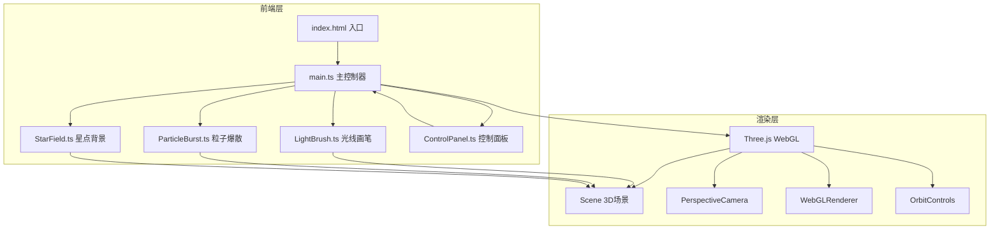

## 1. 架构设计



## 2. 技术说明

- **前端**：TypeScript + Three.js + Vite
- **初始化工具**：Vite
- **后端**：无
- **数据库**：无
- **3D 库**：three + @types/three
- **构建工具**：Vite（vite.config.js）
- **TypeScript**：tsconfig.json 严格模式

## 3. 文件结构

```
├── src/
│   ├── main.ts              # 入口：初始化场景、相机、渲染器、控制器、动画循环
│   ├── index.html            # 入口HTML
│   ├── scene/
│   │   ├── LightBrush.ts     # 光线画笔类
│   │   ├── ParticleBurst.ts  # 粒子爆散类
│   │   └── StarField.ts      # 星点背景类
│   └── UI/
│       └── ControlPanel.ts   # 控制面板UI类
├── package.json
├── tsconfig.json
└── vite.config.js
```

## 4. 核心类设计

### 4.1 main.ts

- 初始化 THREE.Scene、THREE.PerspectiveCamera、THREE.WebGLRenderer
- 配置 OrbitControls（启用阻尼、限制缩放范围）
- 实例化 StarField、LightBrush、ParticleBurst、ControlPanel
- 绑定鼠标/触摸事件（pointerdown/pointermove/pointerup）
- 动画循环：requestAnimationFrame 更新所有模块
- 窗口 resize 自适应

### 4.2 LightBrush

- 管理 Raycaster 将屏幕坐标映射到3D空间
- 每条光线轨迹存储为点序列，渲染为 THREE.Line（LineBasicMaterial + 自定义着色实现渐变）
- 发光光晕：使用 THREE.Mesh + ShaderMaterial 或 AdditiveBlending 的半透明管道
- 碰撞检测：通过 Raycaster 检测点击与轨迹的距离
- 提供 getIntersectedTrail() 方法供 ParticleBurst 调用

### 4.3 ParticleBurst

- 从指定3D坐标生成粒子群（THREE.Points + BufferGeometry）
- 粒子沿螺旋路径扩散：每帧更新位置，角度递增+半径递增
- 颜色跟随光线轨道渐变（蓝紫→金橙）
- 透明度随时间衰减，完全淡出后移除
- 扩散速度由 ControlPanel 控制

### 4.4 StarField

- 生成随机分布的细小粒子（THREE.Points）
- 缓慢飘浮动画：每帧微调位置，循环边界
- 半透明白色/淡蓝色

### 4.5 ControlPanel

- DOM 层创建毛玻璃面板（position: fixed, backdrop-filter: blur）
- 两个 range input 滑块：光线粗细（0.5-5）、粒子扩散速度（0.5-3）
- 重置按钮：清空所有光线轨迹和粒子
- 通过回调函数通知 main.ts 更新参数

## 5. 性能策略

- 粒子总数上限 5000，超出时移除最旧的粒子
- 使用 BufferGeometry 避免每帧创建新几何体
- 光晕效果使用 AdditiveBlending 替代后处理（降低 GPU 开销）
- requestAnimationFrame 驱动，确保 60fps
- 轨迹使用 Line 几何体而非管道几何体（减少面数）
