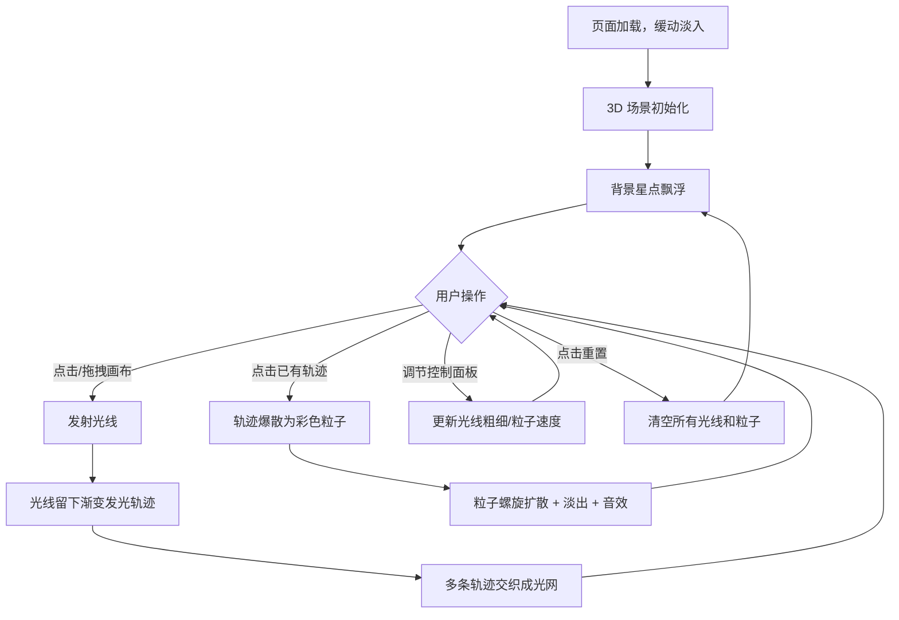

## 1. 产品概述

「光织梦境」是一款基于 Three.js 的 3D 交互可视化项目，在纯黑虚拟空间中用光线编织出流动的抽象梦境场景。用户通过鼠标交互发射光线，光线留下半透明发光轨迹，多条光线交织形成立体光网；点击已有轨迹可触发爆散为彩色粒子的效果，配合轻缓音效，营造沉浸式的极简光绘体验。

- 目标用户：数字艺术爱好者、创意编程从业者、视觉设计师
- 核心价值：提供一种直觉式的 3D 光绘创作工具，让用户通过简单的鼠标操作即可创造复杂的立体光影艺术

## 2. 核心功能

### 2.1 功能模块

1. **3D 场景画布**：纯黑背景 + 缓慢飘浮的细小星点，营造深空银河氛围
2. **光线发射系统**：点击/拖拽画布发射光线，光线留下渐变发光轨迹（蓝紫 → 金橙渐变 + 柔和光晕）
3. **光线交织系统**：多条光线的轨迹在 3D 空间中相互交织，形成立体光网
4. **爆散交互**：点击已有轨迹片段，触发该片段爆散为彩色粒子，粒子呈螺旋扩散并逐渐淡出，同时播放轻缓音效
5. **视角控制**：鼠标拖拽旋转视角、滚轮缩放
6. **控制面板**：右下角半透明毛玻璃面板，包含光线粗细滑块、粒子扩散速度滑块、重置画布按钮

### 2.2 页面详情

| 页面名称 | 模块名称 | 功能描述 |
|----------|----------|----------|
| 主画布 | 3D 场景 | Three.js 渲染的纯黑背景 3D 空间，含飘浮星点 |
| 主画布 | 光线发射 | 鼠标点击/拖拽在 3D 空间中发射光线，轨迹带渐变发光效果 |
| 主画布 | 光线交织 | 多条光线轨迹在空间中交织形成立体光网 |
| 主画布 | 爆散交互 | 点击轨迹触发粒子爆散（螺旋扩散 + 淡出 + 音效） |
| 主画布 | 视角控制 | OrbitControls 拖拽旋转 + 滚轮缩放 |
| 主画布 | 控制面板 | 毛玻璃面板：光线粗细滑块、粒子扩散速度滑块、重置按钮 |

## 3. 核心流程

用户打开页面 → 看到纯黑 3D 空间与飘浮星点（缓动淡入） → 鼠标点击/拖拽发射光线 → 光线留下渐变发光轨迹 → 多条光线交织成光网 → 点击已有轨迹 → 轨迹爆散为彩色粒子（螺旋扩散 + 淡出 + 音效） → 通过控制面板调节参数 → 点击重置清空画布

## 4. 用户界面设计

### 4.1 设计风格

- **主题**：极简光绘风，纯黑背景（#000000）
- **主色调**：蓝紫（#7B68EE）→ 金橙（#FFB347）渐变
- **光线风格**：渐变发光线条 + 柔和光晕（Bloom 后处理）
- **粒子风格**：螺旋扩散，颜色跟随光线轨道渐变
- **字体**：使用 "Noto Sans SC" 作为中文 UI 字体，轻量无衬线
- **布局**：全屏 3D 画布，右下角浮动控制面板

### 4.2 页面设计概览

| 页面名称 | 模块名称 | UI 元素 |
|----------|----------|---------|
| 主画布 | 3D 场景 | 全屏 Three.js 画布，纯黑背景，飘浮星点 |
| 主画布 | 光线轨迹 | 渐变发光线条（蓝紫→金橙），带柔和光晕效果 |
| 主画布 | 爆散粒子 | 螺旋扩散的彩色粒子，逐渐淡出 |
| 主画布 | 控制面板 | 右下角半透明毛玻璃面板，圆角，含两个滑块和重置按钮 |

### 4.3 响应式

- 桌面端（≥1024px）：全屏 3D 画布 + 右下角控制面板
- 平板端（768px~1023px）：全屏 3D 画布 + 右下角控制面板（适当缩小）
- 触摸适配：触摸拖拽旋转、双指缩放、触摸点击发射光线

### 4.4 3D 场景指引

- **环境**：纯黑虚空，无 HDRI，用点光源提供微弱环境光
- **光照**：微弱环境光 + 每条光线自带点光源（发光效果）
- **相机**：透视相机，初始位置 (0, 0, 30)，FOV 60°，OrbitControls 旋转缩放
- **构图**：光线从用户点击位置向空间深处延伸，形成立体光网
- **交互**：鼠标点击/拖拽发射光线，点击轨迹爆散，OrbitControls 旋转缩放
- **后处理**：UnrealBloomPass 实现光晕效果
- **性能**：目标 60fps，光线数量上限约 200 条，粒子数量上限约 5000 个

## 5. 技术约束

- 使用 JavaScript + Three.js 实现（非 React/Vue）
- 使用 Vite 作为构建工具
- 文件结构遵循用户指定：src/main.js、src/SceneSetup.js、src/RayManager.js、src/ParticleSystem.js、src/ControlPanel.js
- 页面切换有缓动淡入动画
- 帧率保持 60fps
