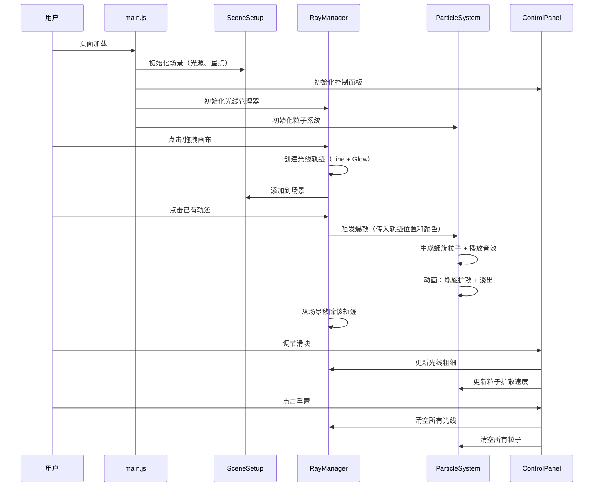

## 1. 架构设计

```mermaid
graph TB
    subgraph "前端层"
        A["index.html"] --> B["src/main.js"]
        B --> C["src/SceneSetup.js"]
        B --> D["src/RayManager.js"]
        B --> E["src/ParticleSystem.js"]
        B --> F["src/ControlPanel.js"]
        D --> E
    end
    subgraph "Three.js 渲染层"
        G["WebGLRenderer"] --> H["Scene"]
        H --> I["Camera + OrbitControls"]
        H --> J["Background Stars"]
        H --> K["Ray Traces (Line + Glow)"]
        H --> L["Particles (Points)"]
        M["EffectComposer"] --> N["RenderPass"]
        M --> O["UnrealBloomPass"]
    end
    B --> G
    C --> H
    D --> K
    D --> L
end
```

## 2. 技术说明

- **前端**：JavaScript（ES Module）+ Three.js + Vite
- **构建工具**：Vite
- **3D 渲染**：Three.js r160+，使用 WebGLRenderer
- **后处理**：Three.js EffectComposer + UnrealBloomPass（光晕效果）
- **相机控制**：Three.js OrbitControls
- **音效**：Web Audio API（生成轻缓的正弦波衰减音效，无需外部音频文件）
- **无后端**：纯前端项目，无需数据库和 API

## 3. 文件结构

| 文件路径 | 职责 |
|----------|------|
| `package.json` | 项目依赖和脚本配置 |
| `vite.config.js` | Vite 构建配置 |
| `index.html` | 入口 HTML |
| `src/main.js` | 项目入口：初始化场景、相机、渲染器、控制面板，启动动画循环 |
| `src/SceneSetup.js` | 场景配置：光源、背景星点、环境设置 |
| `src/RayManager.js` | 光线管理：创建光线、移动轨迹、交织逻辑、爆散触发、与 ParticleSystem 联动 |
| `src/ParticleSystem.js` | 粒子系统：生成爆散粒子、螺旋扩散动画、颜色渐变、淡出销毁 |
| `src/ControlPanel.js` | 控制面板：毛玻璃 UI、光线粗细滑块、粒子扩散速度滑块、重置按钮 |

## 4. 模块交互流程



## 5. 关键技术方案

### 5.1 光线轨迹实现

- 使用 `THREE.Line2`（LineGeometry + LineMaterial）实现可变宽度的渐变发光线条
- 每条光线维护一个点数组，鼠标拖拽时持续追加新点
- 颜色从蓝紫（#7B68EE）渐变到金橙（#FFB347），基于光线长度 t 参数插值
- 每条光线附带一个 `THREE.PointLight` 增强发光感

### 5.2 爆散粒子实现

- 使用 `THREE.Points` + `THREE.BufferGeometry` + 自定义 ShaderMaterial
- 粒子从轨迹位置沿螺旋路径扩散
- 每个粒子存储：初始位置、螺旋角度、扩散速度、颜色、生命值
- 在动画循环中更新粒子位置和透明度，生命值归零后回收

### 5.3 光晕后处理

- `EffectComposer` → `RenderPass` → `UnrealBloomPass`
- Bloom 参数：strength=1.5, radius=0.4, threshold=0.2
- 使光线和粒子呈现柔和的发光效果

### 5.4 音效实现

- 使用 Web Audio API 生成轻缓的合成音效
- 爆散时播放短促的正弦波衰减音（频率 440Hz~880Hz，持续 0.5s）
- 无需加载外部音频文件

### 5.5 性能优化

- 光线数量上限 200 条，超过时移除最早的轨迹
- 粒子使用对象池复用，避免频繁 GC
- 使用 `requestAnimationFrame` 驱动动画循环
- 粒子数量上限 5000 个
- 星点使用 `THREE.Points` 批量渲染

### 5.6 背景星点

- 使用 `THREE.Points` 创建约 1000 个细小星点
- 星点缓慢飘浮（正弦运动）
- 颜色为暗白/暗蓝，模拟远方银河
