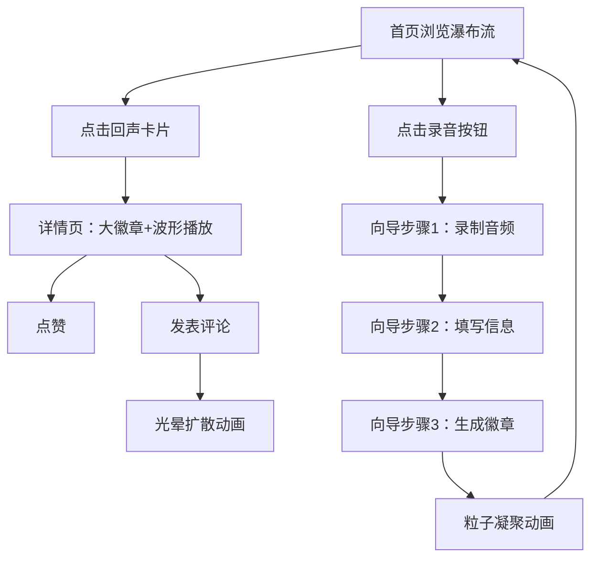

## 1. 产品概述

「回声博物馆」是一个在线声音记忆收藏平台，用户可以录制短音频并配以文字回忆和氛围图片，系统自动生成独一无二的「回声徽章」作为声音的视觉化身。
- 核心价值：将转瞬即逝的声音凝固为可收藏、可分享的视觉记忆徽章，打造怀旧而温暖的声音档案馆
- 目标用户：喜欢记录生活碎片、对声音情感有共鸣的文艺青年和记忆收藏爱好者

## 2. 核心功能

### 2.1 用户角色
| 角色 | 注册方式 | 核心权限 |
|------|----------|----------|
| 访客 | 无需注册 | 浏览首页瀑布流、试听回声 |
| 用户 | 昵称注册 | 录制上传回声、点赞、评论 |

### 2.2 功能模块
1. **首页**：瀑布流展示所有回声卡片、背景尘埃粒子、录音入口
2. **详情页**：大徽章动画、波形可视化播放器、文字回忆、氛围图片、评论时间线
3. **上传向导**：录制→填写→生成三步流程，含粒子凝聚动画

### 2.3 页面详情
| 页面名称 | 模块名称 | 功能描述 |
|----------|----------|----------|
| 首页 | 瀑布流展示 | 交错布局展示回声卡片，每卡含标题、情绪标签、播放按钮 |
| 首页 | 尘埃粒子背景 | 缓慢飘浮的细小尘埃粒子营造老唱片店氛围 |
| 首页 | 录音入口 | 浮动按钮，点击打开上传向导 |
| 详情页 | 回声徽章 | 大尺寸动态旋转徽章，圆盘渐变+发光粒子 |
| 详情页 | 波形播放器 | Canvas 绘制波形可视化，含播放/暂停控制条 |
| 详情页 | 文字回忆 | 展示用户撰写的文字记忆 |
| 详情页 | 氛围图片 | 展示用户上传/选择的氛围配图 |
| 详情页 | 评论时间线 | 时间线排列评论，每条评论触发光晕扩散动画 |
| 详情页 | 点赞 | 支持点赞交互 |
| 上传向导 | 步骤一：录制 | 使用麦克风录制最长30秒音频 |
| 上传向导 | 步骤二：填写 | 填写标题、文字回忆、选择氛围图片 |
| 上传向导 | 步骤三：生成 | 粒子凝聚动画，生成回声徽章 |

## 3. 核心流程

### 录制上传流程
用户点击录音按钮 → 进入上传向导 → 步骤一：录制音频（最长30秒）→ 步骤二：填写标题、文字回忆、选择氛围图片 → 步骤三：系统分析音频频谱和文字情感，生成回声徽章（粒子凝聚动画）→ 回声加入瀑布流

### 浏览交互流程
用户进入首页 → 浏览瀑布流回声卡片 → 点击卡片进入详情页 → 查看大徽章动画和波形可视化 → 阅读文字回忆和氛围图片 → 点赞或发表评论（评论触发光晕动画）

## 4. 用户界面设计

### 4.1 设计风格
- 主色调：深灰绿底色（#2a3a35），古铜色点缀（#b87333）
- 辅助色：暖米色文字（#e8dcc8），柔光金（#d4a843）
- 卡片风格：毛玻璃质感（backdrop-blur），柔和阴影，16px圆角
- 字体：展示字体使用 Playfair Display（标题），正文使用 Noto Serif SC（中文衬线）
- 布局：首页为交错瀑布流，详情页居中纵向排列
- 图标：lucide-react 图标库
- 动画：页面缓动淡入，徽章缓缓旋转，评论光晕扩散，背景尘埃飘浮

### 4.2 页面设计概览
| 页面名称 | 模块名称 | UI 元素 |
|----------|----------|---------|
| 首页 | 瀑布流区域 | 双列交错瀑布流，毛玻璃卡片，标题+情绪标签+播放按钮，悬浮阴影 |
| 首页 | 背景 | 深灰绿底色，缓慢飘浮的尘埃粒子（Canvas绘制） |
| 首页 | 录音入口 | 右下角浮动古铜色圆形按钮，麦克风图标 |
| 详情页 | 徽章区域 | 居中大圆形徽章，渐变圆盘+发光粒子环，CSS旋转动画 |
| 详情页 | 波形控制 | Canvas波形可视化条，古铜色播放/暂停按钮 |
| 详情页 | 文字回忆 | 衬线体，暖米色文字，半透明背景条 |
| 详情页 | 氛围图片 | 大图展示，圆角+柔和阴影 |
| 详情页 | 评论时间线 | 左侧竖线+圆点，评论气泡带光晕动画 |
| 上传向导 | 步骤指示器 | 顶部三步进度条，古铜色已完成/当前步 |
| 上传向导 | 录制界面 | 大圆形录音按钮，波形实时预览，倒计时 |
| 上传向导 | 填写界面 | 标题输入、文本域、图片选择网格 |
| 上传向导 | 生成界面 | 粒子凝聚为徽章的Canvas动画 |

### 4.3 响应式设计
- 桌面优先设计，移动端适配
- 桌面：双列瀑布流，详情页内容宽960px居中
- 平板：双列瀑布流，详情页内容宽720px
- 移动端：单列瀑布流，详情页全宽，底部固定播放控制条

### 4.4 3D 场景指引
- 不涉及3D场景，所有动画通过 CSS 和 Canvas 2D 实现
- 性能目标：保持60fps帧率，使用 requestAnimationFrame 驱动所有动画
