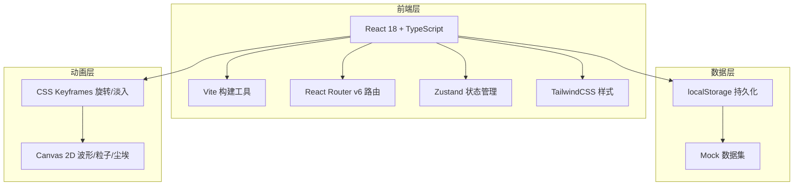
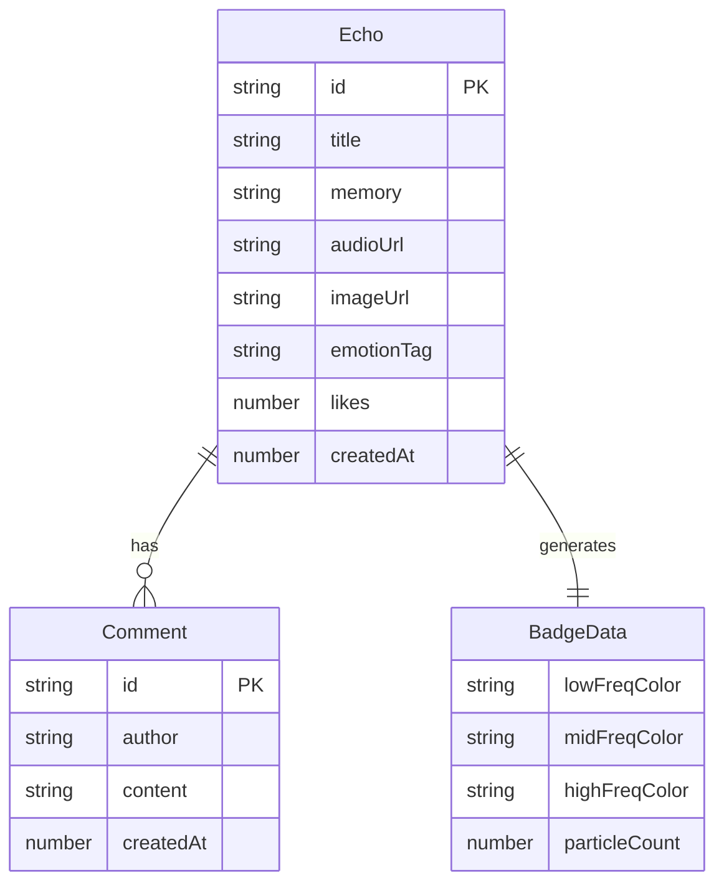

## 1. 架构设计



## 2. 技术说明
- 前端：React@18 + TypeScript + TailwindCSS@3 + Vite
- 初始化工具：vite-init (react-ts 模板)
- 后端：无（纯前端项目，数据使用 localStorage 持久化 + Mock 数据）
- 状态管理：Zustand
- 音频处理：Web Audio API（AudioContext + AnalyserNode）
- 动画：CSS Keyframes + Canvas 2D（requestAnimationFrame）
- 图标：lucide-react

## 3. 路由定义
| 路由 | 用途 |
|------|------|
| / | 首页，瀑布流展示所有回声 |
| /echo/:id | 回声详情页，含大徽章、波形播放、评论 |

## 4. API 定义
无后端API，所有数据通过 Zustand store + localStorage 管理。

### 核心数据类型
```typescript
interface Echo {
  id: string
  title: string
  memory: string
  audioUrl: string
  audioData: ArrayBuffer
  imageUrl: string
  emotionTag: string
  badge: BadgeData
  likes: number
  comments: Comment[]
  createdAt: number
}

interface BadgeData {
  lowFreqColor: string
  midFreqColor: string
  highFreqColor: string
  particleCount: number
  gradientStops: string[]
}

interface Comment {
  id: string
  author: string
  content: string
  createdAt: number
}
```

## 5. 服务器架构图
无后端服务

## 6. 数据模型

### 6.1 数据模型定义


### 6.2 数据存储
使用 localStorage 存储回声列表，音频以 ArrayBuffer 格式存储。初始化时注入5条预置 Mock 数据供演示。
