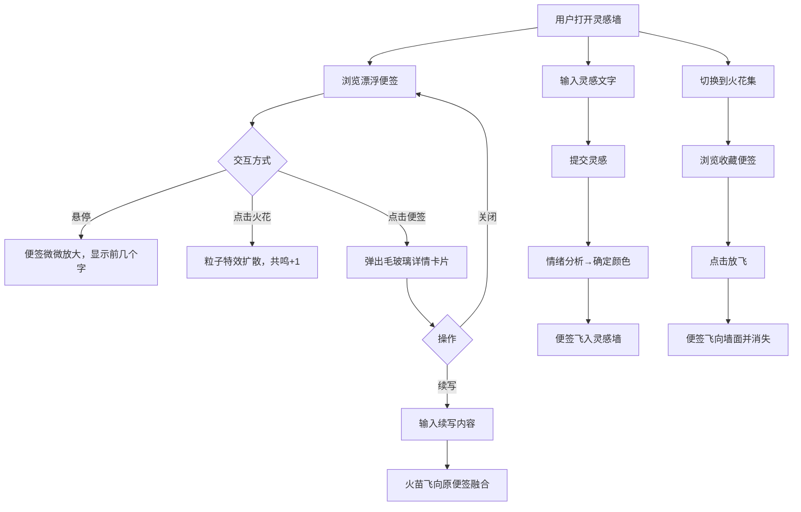

## 1. 产品概述

「流光便笺」是一个匿名灵感火花分享平台，用户可以随手记录一闪而过的灵感（限150字），灵感被封装成发光便签随机嵌入灵感墙，与其他人的灵感交织碰撞。通过情绪色彩、粒子特效和续写融合机制，让每一条灵感都有温度和生命力。

- 目标用户：创意工作者、写作者、设计师及所有喜欢记录灵感碎片的人
- 核心价值：用视觉化、游戏化的方式让灵感分享变得有趣，匿名机制降低表达门槛，续写功能激发灵感碰撞

## 2. 核心功能

### 2.1 用户角色

| 角色 | 注册方式 | 核心权限 |
|------|----------|----------|
| 匿名用户 | 无需注册 | 发布灵感、浏览灵感墙、共鸣、续写、管理火花集 |

### 2.2 功能模块

1. **灵感墙页面**：星空粒子背景、漂浮发光便签、灵感发布、悬停预览、点击详情、共鸣交互、续写功能
2. **火花集页面**：本地存储的共鸣/续写便签瀑布流展示、放飞动画、淡入上浮动效

### 2.3 页面详情

| 页面名称 | 模块名称 | 功能描述 |
|----------|----------|----------|
| 灵感墙 | 灵感发布栏 | 输入框限150字，提交后灵感封装为发光便签飞入墙面 |
| 灵感墙 | 便签漂浮区 | 便签随机分布，缓动悬浮漂移+微弱旋转，情绪色渐变 |
| 灵感墙 | 共鸣交互 | 右下角火花图标，点击扩散粒子特效并记录共鸣数 |
| 灵感墙 | 便签详情 | 点击便签弹出毛玻璃卡片，展示完整灵感、发布时间、共鸣数 |
| 灵感墙 | 续写功能 | 详情卡片底部"续写"按钮，续写内容以火苗动画飞向原便签融合 |
| 火花集 | 瀑布流展示 | 用户共鸣/续写的便签以瀑布流卡片排列 |
| 火花集 | 淡入动画 | 卡片带缓动淡入和上浮动画 |
| 火花集 | 放飞按钮 | 点击"放飞"后便签飞向墙面并从火花集中消失 |

## 3. 核心流程

### 发布灵感流程
用户在灵感墙顶部输入灵感文字 → 点击提交 → 文本经情绪分析确定色彩 → 灵感封装为发光便签 → 便签以飞入动画随机嵌入灵感墙 → 便签开始漂浮漂移

### 共鸣流程
用户浏览灵感墙 → 发现感兴趣的便签 → 点击右下角火花图标 → 粒子特效扩散 → 共鸣数+1 → 便签自动加入火花集（本地存储）

### 续写流程
用户点击便签查看详情 → 点击"续写"按钮 → 进入续写输入模式 → 输入续写内容 → 续写以火苗动画飞向原便签 → 融合形成渐变色双层便签 → 续写便签加入火花集

### 放飞流程
用户进入火花集 → 浏览收藏的便签 → 点击"放飞"按钮 → 便签飞向墙面动画 → 从火花集中移除

## 4. 用户界面设计

### 4.1 设计风格

- **主色调**：深灰背景（#1a1a2e）配霓虹蓝紫渐变点缀（#4a00e0 → #8e2de2）
- **便签风格**：做旧纸张纹理 + 发光边框（box-shadow glow），颜色随情绪渐变
- **字体**：灵感文字使用有温度的手写风格字体（如 ZCOOL XiaoWei），UI 文字使用简洁无衬线字体
- **布局**：灵感墙为全屏沉浸式，便签随机分布；火花集为瀑布流网格
- **图标**：使用 lucide-react 图标库，火花图标自定义 SVG
- **动效**：所有交互采用缓动曲线（cubic-bezier），便签漂浮使用 CSS animation，粒子特效使用 Canvas

### 4.2 页面设计概览

| 页面名称 | 模块名称 | UI 元素 |
|----------|----------|---------|
| 灵感墙 | 星空背景 | Canvas 全屏粒子，微弱闪烁，深色半透明覆盖 |
| 灵感墙 | 发布栏 | 顶部固定，毛玻璃背景，输入框+提交按钮，霓虹渐变按钮 |
| 灵感墙 | 便签 | 做旧纸张纹理背景，发光边框，缓动漂浮旋转，情绪色渐变 |
| 灵感墙 | 详情卡片 | 居中毛玻璃弹窗，半透明模糊背景，淡入缩放动画 |
| 灵感墙 | 续写输入 | 详情卡片内展开，输入框+火焰图标提交按钮 |
| 火花集 | 瀑布流 | 多列卡片网格，卡片淡入上浮动画 |
| 火花集 | 放飞按钮 | 卡片右下角，点击后卡片上浮飞走动画 |

### 4.3 响应式

- 桌面端（>768px）：灵感墙便签大尺寸自由分布，火花集3-4列瀑布流
- 移动端（≤768px）：灵感墙便签缩小且密度增加，火花集1-2列瀑布流，触控优化

### 4.4 3D 场景指引

- 不涉及3D场景，使用2D Canvas实现星空粒子和粒子特效
- 粒子数量控制在100-200个确保性能
- 便签漂浮使用 CSS transform + animation 确保GPU加速
