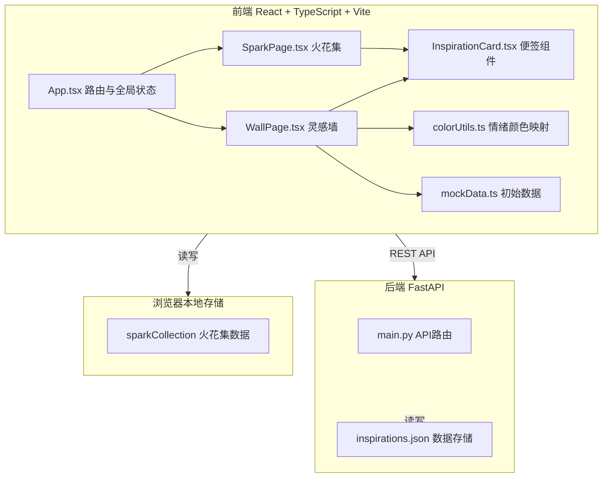
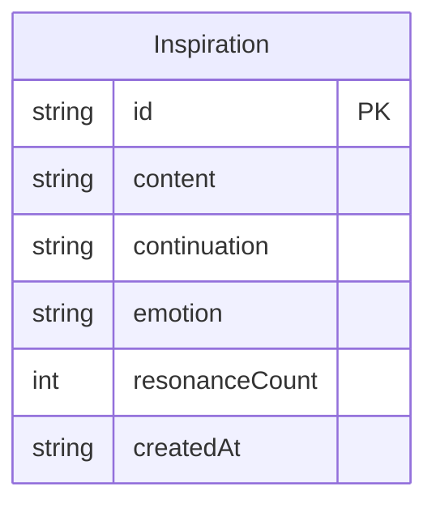

## 1. 架构设计



## 2. 技术说明

- **前端**：React@18 + TypeScript + Vite + TailwindCSS@3 + Zustand（状态管理）+ React Router（路由）
- **初始化工具**：vite-init（react-ts 模板）
- **后端**：FastAPI + Uvicorn（Python）
- **数据库**：JSON 文件存储（inspirations.json），浏览器 localStorage 管理火花集
- **动画方案**：CSS Animation + Canvas（星空粒子、粒子特效）+ Framer Motion（页面过渡、卡片动画）
- **图标**：lucide-react

## 3. 路由定义

| 路由 | 用途 |
|------|------|
| `/` | 灵感墙首页，展示漂浮便签和发布功能 |
| `/sparks` | 火花集页面，展示收藏的便签 |

## 4. API 定义

### 4.1 数据类型

```typescript
interface Inspiration {
  id: string;
  content: string;
  continuation?: string;
  emotion: 'positive' | 'neutral' | 'negative';
  resonanceCount: number;
  createdAt: string;
}

interface CreateInspirationRequest {
  content: string;
}

interface ContinueInspirationRequest {
  id: string;
  continuation: string;
}
```

### 4.2 接口定义

| 方法 | 路径 | 描述 | 请求体 | 响应 |
|------|------|------|--------|------|
| GET | `/api/inspirations` | 获取所有灵感 | - | `Inspiration[]` |
| POST | `/api/inspirations` | 发布新灵感 | `CreateInspirationRequest` | `Inspiration` |
| POST | `/api/inspirations/{id}/resonate` | 共鸣+1 | - | `Inspiration` |
| POST | `/api/inspirations/{id}/continue` | 续写灵感 | `ContinueInspirationRequest` | `Inspiration` |

## 5. 服务端架构图


## 6. 数据模型

### 6.1 数据模型定义



### 6.2 数据定义

```json
{
  "inspirations": [
    {
      "id": "uuid-string",
      "content": "灵感内容，最多150字",
      "continuation": "续写内容，可选",
      "emotion": "positive|neutral|negative",
      "resonanceCount": 0,
      "createdAt": "2026-06-08T00:00:00Z"
    }
  ]
}
```

### 6.3 情绪映射规则

| 情绪类型 | 颜色方案 | 关键词示例 |
|----------|----------|-----------|
| positive（积极） | 暖色渐变：#FF6B35 → #F7C948 | 开心、美好、希望、爱、梦想 |
| neutral（中性） | 冷色渐变：#4ECDC4 → #556270 | 思考、疑问、也许、或者 |
| negative（消极） | 暗色渐变：#2C3E50 → #8E44AD | 难过、孤独、失望、无奈 |
