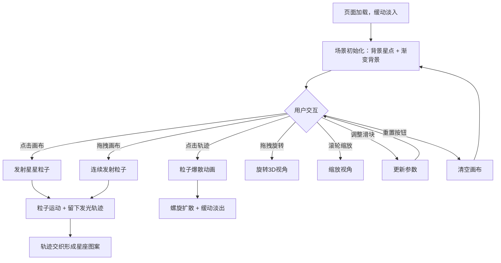

## 1. 产品概述

「星语织梦」是一个基于 Three.js 的 3D 交互可视化项目，模拟在宇宙中通过星星的光线编织出梦幻的星空图案。用户可以在 3D 星空场景中发射星星粒子、编织发光轨迹，并触发绚丽的粒子爆散效果。

- 核心目的：提供沉浸式的星空创作体验，让用户通过简单交互编织出独特的星座图案
- 目标用户：创意工作者、视觉艺术爱好者、3D 交互体验探索者

## 2. 核心功能

### 2.1 功能模块

1. **星空画布页**：3D 星空场景、星星粒子发射与轨迹编织、粒子爆散交互、控制面板

### 2.2 页面详情

| 页面名称 | 模块名称 | 功能描述 |
|---------|---------|---------|
| 星空画布页 | 3D 场景渲染 | 深蓝紫黑渐变背景，背景飘浮星点，透视相机自由探索 |
| 星空画布页 | 粒子发射 | 点击或拖拽画布发射星星粒子，粒子带有银白到暖金渐变发光 |
| 星空画布页 | 轨迹编织 | 粒子移动时留下半透明发光轨迹，多条轨迹可交织形成星座 |
| 星空画布页 | 粒子爆散 | 点击已有轨迹片段，触发螺旋扩散粒子爆散，颜色跟随轨迹，缓动淡出 |
| 星空画布页 | 视角控制 | 鼠标拖拽旋转视角、滚轮缩放、3D 自由探索 |
| 星空画布页 | 控制面板 | 右下角毛玻璃面板，星星大小滑块、粒子扩散速度滑块、重置画布按钮 |
| 星空画布页 | 页面过渡 | 页面加载时缓动淡入动画 |

## 3. 核心流程

1. 用户进入页面，场景淡入加载，背景星空缓缓飘浮
2. 用户点击画布任意位置，发射一颗星星粒子，粒子沿抛物线运动并留下发光轨迹
3. 用户拖拽画布连续发射多颗粒子，轨迹交织形成星座图案
4. 用户点击已有轨迹片段，该轨迹爆散成彩色螺旋粒子并逐渐淡出
5. 用户通过控制面板调整星星大小和粒子扩散速度
6. 用户可通过拖拽旋转和滚轮缩放自由探索 3D 场景
7. 用户点击重置按钮清空画布，重新开始创作

## 4. 用户界面设计

### 4.1 设计风格

- 主色调：深蓝(#0a0a2e)到紫黑(#1a0a2e)渐变背景
- 强调色：银白(#e8e0ff)、暖金(#ffd700)
- 按钮风格：圆角胶囊形，半透明毛玻璃质感
- 字体：Orbitron（标题/数字）+ Quicksand（正文/标签）
- 布局风格：全屏沉浸式画布 + 右下角浮动控制面板
- 图标风格：线性发光图标，与星空主题一致

### 4.2 页面设计概述

| 页面名称 | 模块名称 | UI 元素 |
|---------|---------|---------|
| 星空画布页 | 3D 场景 | 全屏 Three.js Canvas，深蓝紫黑渐变，飘浮细小星点 |
| 星空画布页 | 星星粒子 | 渐变发光点（银白→暖金），柔和光晕，半透明轨迹线 |
| 星空画布页 | 粒子爆散 | 螺旋扩散粒子，颜色跟随轨迹色，缓动淡出 |
| 星空画布页 | 控制面板 | 毛玻璃面板(backdrop-filter: blur)，圆角，自定义滑块，胶囊按钮 |
| 星空画布页 | 页面过渡 | CSS opacity + transform 缓动淡入 |

### 4.3 响应式

- 桌面端(>1024px)：全屏画布，控制面板右下角固定
- 平板端(768-1024px)：全屏画布，控制面板缩小但仍可用，触控支持

### 4.4 3D 场景指引

- 环境/氛围：深空宇宙感，暗色调，微弱星云雾气
- 灯光设置：环境光 + 粒子自发光（AdditiveBlending），无需传统光源
- 相机设置：PerspectiveCamera，FOV 60°，近裁面 0.1，远裁面 1000
- 构图与焦点：粒子轨迹为焦点，背景星点营造深度感
- 交互与动画：OrbitControls 视角控制，粒子运动 + 轨迹渲染 + 爆散动画
- 后处理效果：UnrealBloomPass 泛光效果增强发光质感
- 性能预算：维持 60fps，粒子数量上限 2000，轨迹点上限 10000
