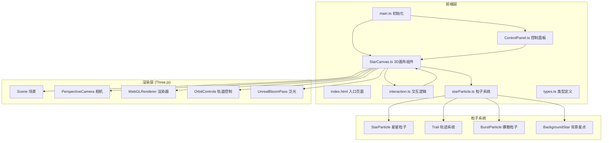
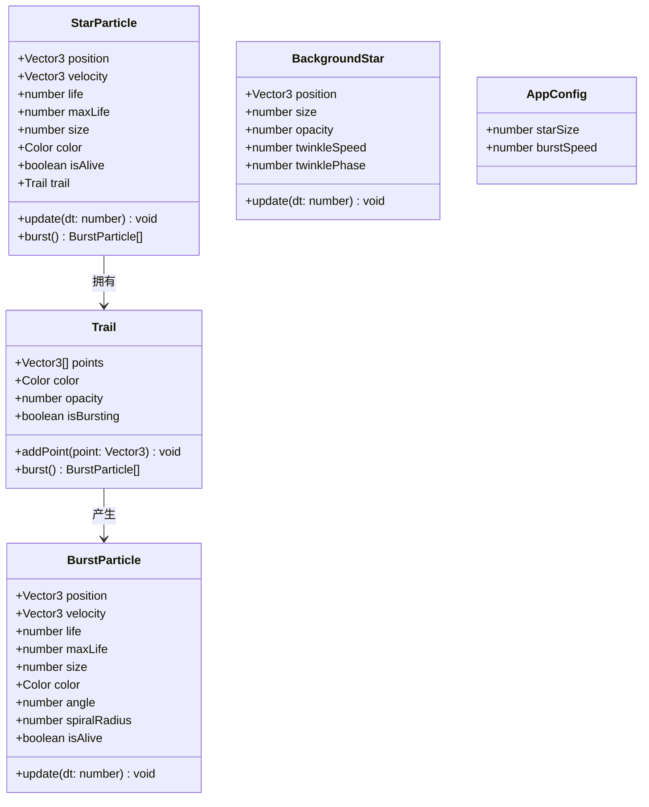

## 1. 架构设计



## 2. 技术说明

- 前端：TypeScript + Three.js + Vite
- 初始化工具：Vite
- 后端：无
- 数据库：无

### 核心依赖

| 依赖 | 版本 | 用途 |
|-----|------|------|
| three | ^0.170.0 | 3D 渲染引擎 |
| @types/three | ^0.170.0 | Three.js 类型定义 |

### 开发依赖

| 依赖 | 版本 | 用途 |
|-----|------|------|
| typescript | ^5.6.0 | TypeScript 编译器 |
| vite | ^6.0.0 | 构建工具 |

## 3. 路由定义

| 路由 | 用途 |
|-----|------|
| / | 星空画布主页（单页应用，无路由） |

## 4. API 定义

无后端 API，纯前端项目。

## 5. 服务器架构图

无后端服务器。

## 6. 数据模型

### 6.1 数据模型定义



### 6.2 文件结构

```
src/
├── main.ts                  # 入口：初始化场景、相机、渲染器
├── components/
│   ├── StarCanvas.ts        # 核心3D画布组件
│   └── ControlPanel.ts      # 控制面板UI组件
├── utils/
│   ├── starParticle.ts      # 星星粒子类
│   └── interaction.ts       # 鼠标交互逻辑
├── types.ts                 # 类型定义
index.html                   # 入口HTML
package.json                 # 依赖和脚本
tsconfig.json                # TypeScript配置
vite.config.js               # 构建配置
```
