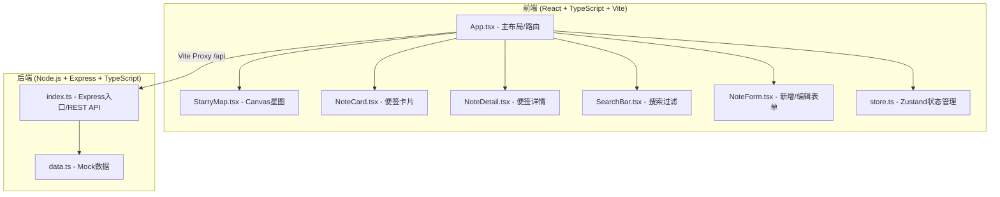
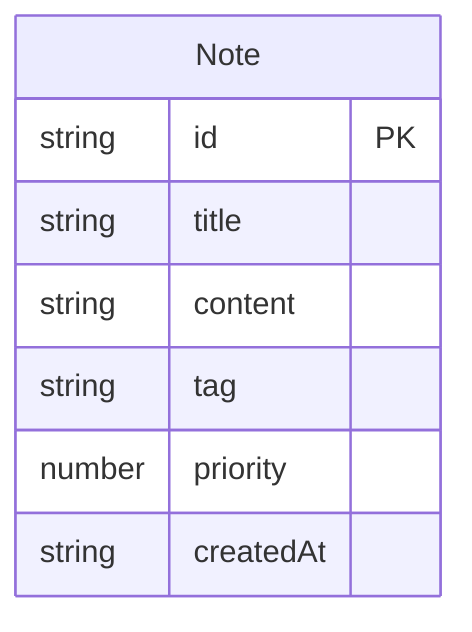

## 1. 架构设计



## 2. 技术说明
- **前端**：React 18 + TypeScript + Tailwind CSS 3 + Vite
- **状态管理**：Zustand
- **路由**：react-router-dom v6
- **图标**：lucide-react
- **初始化工具**：vite-init (react-express-ts 模板)
- **后端**：Express 4 + TypeScript (ESM)
- **数据库**：无，使用内存数组模拟（data.ts）

## 3. 路由定义
| 路由 | 用途 |
|------|------|
| `/` | 首页，瀑布流便签卡片展示 |
| `/starmap` | 灵感星图页，Canvas 动态可视化 |
| `/note/:id` | 便签详情页 |

## 4. API 定义

### 便签数据类型
```typescript
interface Note {
  id: string;
  title: string;
  content: string;
  tag: "tech" | "design" | "life" | "other";
  priority: 1 | 2 | 3 | 4 | 5;
  createdAt: string;
}
```

### REST API
| 方法 | 路径 | 说明 | 请求体 | 响应 |
|------|------|------|--------|------|
| GET | `/api/notes` | 获取所有便签 | - | `Note[]` |
| POST | `/api/notes` | 新增便签 | `Omit<Note, "id" \| "createdAt">` | `Note` |
| PUT | `/api/notes/:id` | 更新便签 | `Partial<Omit<Note, "id" \| "createdAt">>` | `Note` |
| DELETE | `/api/notes/:id` | 删除便签 | - | `{ success: boolean }` |

### 查询参数（GET /api/notes）
| 参数 | 类型 | 说明 |
|------|------|------|
| `keyword` | string | 按标题/内容关键词过滤 |
| `tag` | string | 按标签过滤 |

## 5. 服务端架构图

```mermaid
graph LR
    "Express Router" --> "GET /api/notes"
    "Express Router" --> "POST /api/notes"
    "Express Router" --> "PUT /api/notes/:id"
    "Express Router" --> "DELETE /api/notes/:id"
    "GET /api/notes" --> "data.ts 查询过滤"
    "POST /api/notes" --> "data.ts 添加"
    "PUT /api/notes/:id" --> "data.ts 更新"
    "DELETE /api/notes/:id" --> "data.ts 删除"
```

## 6. 数据模型

### 6.1 数据模型定义


### 6.2 Mock 数据
使用 TypeScript 数组存放初始便签数据，无需数据库。每个便签包含 id（UUID 格式）、标题、内容、标签（tech/design/life/other）、优先级（1-5）、创建时间。初始数据预置 8-10 条涵盖各标签和优先级的便签。

## 7. 项目文件结构

```
auto224/
├── package.json              # 根目录：前后端依赖 + concurrently 启动脚本
├── client/
│   ├── index.html            # 入口 HTML
│   ├── vite.config.ts        # Vite 配置，代理 /api 到后端
│   ├── tsconfig.json         # 前端 TypeScript 配置
│   └── src/
│       ├── main.tsx          # React 入口
│       ├── App.tsx           # 主布局：导航、搜索、路由
│       ├── store.ts          # Zustand 状态管理
│       ├── components/
│       │   ├── StarryMap.tsx # Canvas 动态星图可视化
│       │   ├── NoteCard.tsx  # 便签卡片组件
│       │   ├── NoteDetail.tsx# 便签详情组件
│       │   ├── SearchBar.tsx # 搜索栏组件
│       │   └── NoteForm.tsx  # 新增/编辑便签弹窗
│       └── index.css         # Tailwind 入口样式
└── server/
    ├── tsconfig.json         # 后端 TypeScript 配置
    └── src/
        ├── index.ts          # Express 服务入口，REST API
        └── data.ts           # Mock 便签数据
```
