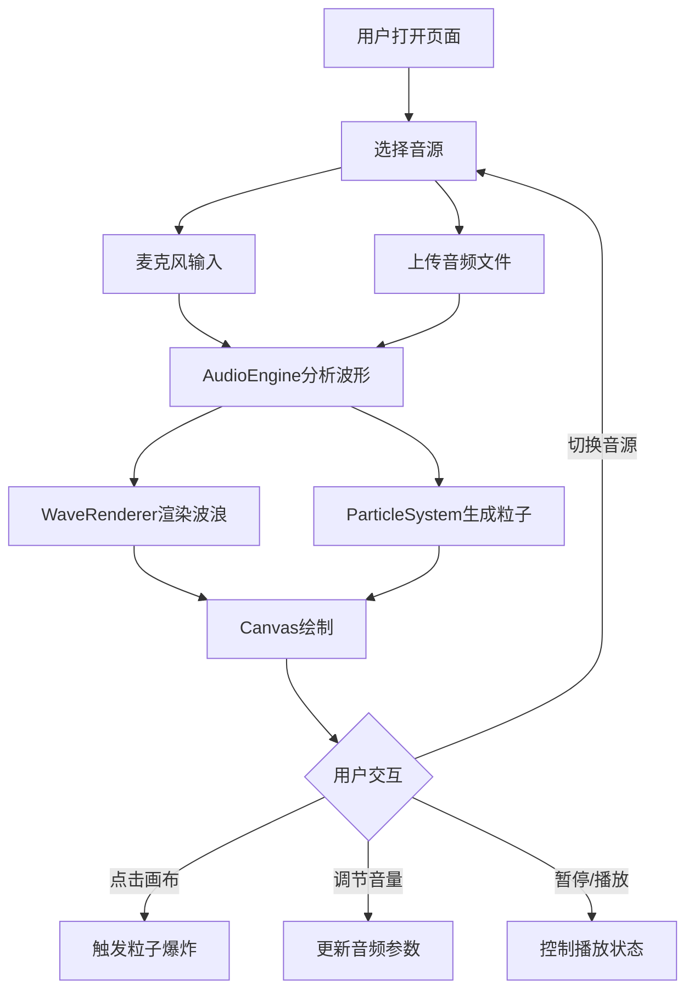

## 1. 产品概述

「霓虹律动」是一款基于浏览器的交互式音乐可视化墙，通过麦克风或音频文件输入，实时生成赛博朋克风格的霓虹波浪和粒子特效。目标用户为音乐爱好者、VJ表演者和视觉艺术创作者，产品核心价值在于将音频数据转化为沉浸式的视觉体验。

## 2. 核心功能

### 2.1 用户角色
| 角色 | 注册方式 | 核心权限 |
|------|----------|----------|
| 访客 | 无需注册 | 使用全部可视化功能 |

### 2.2 功能模块
1. **主可视化页面**：全屏Canvas画布、霓虹波浪渲染、粒子系统、交互特效
2. **音频控制栏**：播放/暂停、音量控制、音源切换（麦克风/文件上传）
3. **状态显示面板**：当前BPM、音量柱状图

### 2.3 页面详情
| 页面名称 | 模块名称 | 功能描述 |
|----------|----------|----------|
| 主可视化页面 | Canvas画布 | 全屏渲染霓虹波浪和粒子，支持点击触发粒子爆炸 |
| 主可视化页面 | 音频控制栏 | 底部悬浮毛玻璃控制栏，播放/暂停、音量滑块、音源选择 |
| 主可视化页面 | 状态显示面板 | 左上角显示当前BPM和音量柱状图 |

## 3. 核心流程

1. 用户打开页面，看到全屏深色Canvas和底部控制栏
2. 用户选择音源：麦克风实时输入或上传MP3/WAV文件
3. 音频引擎开始分析波形和节拍数据
4. Canvas实时渲染霓虹波浪（频率驱动起伏）和粒子特效（节拍驱动爆发）
5. 用户可点击画布任意位置触发粒子爆炸特效
6. 用户可随时切换音源、调节音量、暂停/播放

## 4. 用户界面设计

### 4.1 设计风格
- 主色调：深色背景 #0a0a1a，霓虹色波浪 HSL(280-340°)
- 辅助色：粉红 #ff2d95、电蓝 #00f0ff、紫 #b026ff
- 按钮样式：圆角胶囊形，霓虹发光边框
- 字体：等宽字体用于数据显示（BPM等），现代无衬线字体用于UI标签
- 布局：全屏Canvas，底部悬浮控制栏（毛玻璃效果）
- 粒子样式：从粉到蓝的渐变光点，带发光和拖尾效果

### 4.2 页面设计概览
| 页面名称 | 模块名称 | UI元素 |
|----------|----------|--------|
| 主可视化页面 | Canvas画布 | 全屏深色背景，霓虹波浪曲线（半透明发光），粒子光点 |
| 主可视化页面 | 音频控制栏 | 半透明毛玻璃背景，播放/暂停按钮，音量滑块，音源切换按钮，文件上传 |
| 主可视化页面 | 状态面板 | BPM数值显示，音量柱状图，半透明背景 |

### 4.3 响应式设计
- 桌面优先设计，Canvas自适应窗口尺寸
- 控制栏在移动端紧凑布局，图标替代文字
- 粒子数量根据屏幕尺寸动态调节（500-2000）

### 4.4 动画与交互
- 波浪：基于频率数据的半透明发光曲线，HSL色相280-340°动态变化
- 粒子：随节拍爆发扩散，从粉到蓝渐变，带拖尾效果
- 点击交互：点击任意位置触发粒子爆炸，响应时间<100ms
- 帧率：稳定60fps，粒子数量动态调节
