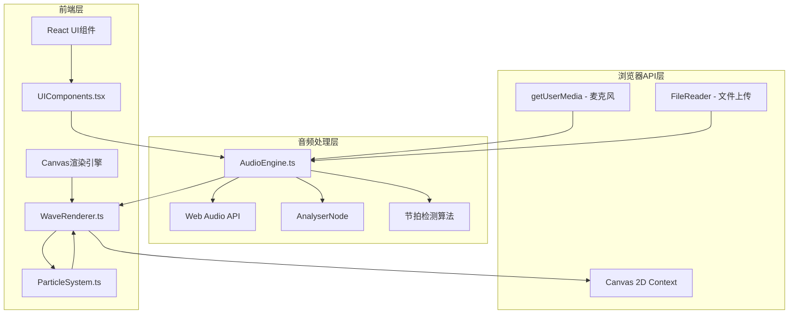

## 1. 架构设计



## 2. 技术说明
- 前端：React@18 + TypeScript + Vite
- 初始化工具：vite-init (react-ts模板)
- 音频处理：Web Audio API (AnalyserNode, AudioContext)
- 渲染：Canvas 2D API + requestAnimationFrame
- 状态管理：React useState/useRef（无需复杂状态管理）
- 样式：CSS Modules + 内联样式（Canvas全屏场景）
- 后端：无
- 数据库：无

## 3. 路由定义
| 路由 | 用途 |
|------|------|
| / | 主可视化页面（单页应用） |

## 4. 文件结构

```
├── index.html                 # Vite入口HTML
├── package.json               # 依赖和脚本
├── vite.config.ts             # Vite配置
├── tsconfig.json              # TypeScript配置
└── src/
    ├── main.tsx               # React入口
    ├── App.tsx                # 主应用组件
    ├── AudioEngine.ts         # 音频输入、波形分析、节拍检测
    ├── WaveRenderer.ts        # Canvas渲染循环、波浪和粒子绘制
    ├── ParticleSystem.ts      # 粒子生成、运动、生命周期
    └── UIComponents.tsx        # React控制栏和状态面板
```

## 5. 核心模块设计

### 5.1 AudioEngine.ts
- `AudioEngine` 类：封装AudioContext和AnalyserNode
- `initMicrophone()`: 请求麦克风权限并连接音频图
- `loadFile(file: File)`: 解码音频文件并创建BufferSource
- `getFrequencyData()`: 返回频率域数据 Uint8Array
- `getTimeDomainData()`: 返回时域数据 Uint8Array
- `detectBeat()`: 基于能量阈值的简单节拍检测算法
- `setVolume(value: number)`: 通过GainNode控制音量
- `play()` / `pause()`: 播放控制

### 5.2 ParticleSystem.ts
- `Particle` 接口：位置、速度、加速度、生命周期、颜色、大小
- `ParticleSystem` 类：管理粒子池
- `emit(x, y, count)`: 在指定位置发射粒子
- `emitBeat(count)`: 节拍驱动的全屏粒子爆发
- `update(dt)`: 更新所有粒子位置和生命状态
- `getParticles()`: 返回活跃粒子数组
- 粒子数量动态调节：根据当前帧率自动调整（500-2000）

### 5.3 WaveRenderer.ts
- `WaveRenderer` 类：管理Canvas渲染循环
- `init(canvas)`: 初始化Canvas和DPI适配
- `start()` / `stop()`: 控制渲染循环
- `render()`: 单帧渲染逻辑
  - 清除画布（半透明覆盖实现拖尾）
  - 绘制霓虹波浪曲线（多层叠加，半透明发光）
  - 绘制粒子（光点+发光效果）
- `handleClick(x, y)`: 点击事件触发粒子爆炸
- 帧率控制：requestAnimationFrame + 帧时间计算

### 5.4 UIComponents.tsx
- `ControlBar` 组件：底部悬浮控制栏
  - 播放/暂停按钮
  - 音量滑块
  - 音源切换（麦克风/文件上传）
  - 文件上传input（accept .mp3,.wav）
- `StatusPanel` 组件：状态显示
  - BPM数值
  - 音量柱状图（多频段）

## 6. 性能优化策略
- Canvas使用设备像素比适配，避免模糊
- 半透明覆盖实现拖尾效果，减少全屏清除开销
- 粒子池复用，避免频繁GC
- 帧时间监控，动态调节粒子数量
- AnalyserNode的fftSize设为2048，平衡精度和性能
- 节拍检测使用滑动窗口能量比较，延迟<50ms
