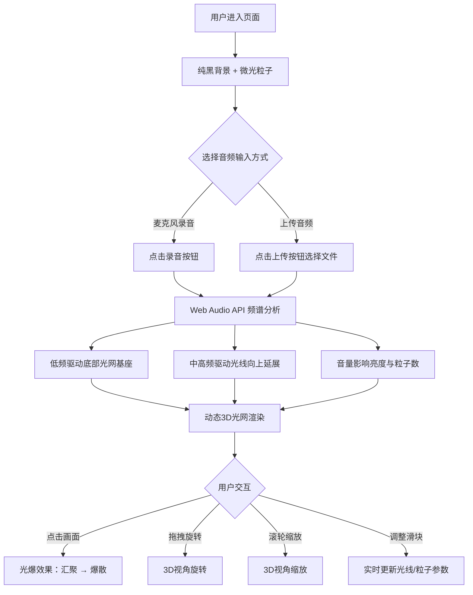

## 1. 产品概述

「声波织境」是一款3D交互可视化应用，将声音频谱和节奏实时转化为动态立体光网。用户通过麦克风录音或上传音频，即可看到声音被「织」成发光的立体网络，点击画面触发光爆效果，带来沉浸式的视听体验。

- 目标用户：音乐爱好者、数字艺术创作者、交互可视化探索者
- 核心价值：将抽象的声音转化为可交互的视觉艺术，实现声音的「看见」与「触摸」

## 2. 核心功能

### 2.1 功能模块

1. **3D声波光网页面**：全屏3D场景，声音驱动的动态光网、粒子效果、交互光爆

### 2.2 页面详情

| 页面名称 | 模块名称 | 功能描述 |
|----------|----------|----------|
| 声波织境主页面 | 3D光网场景 | 基于音频频谱数据实时生成动态3D光网，低频驱动底部密织基座，中高频控制光线向上延展弯曲 |
| 声波织境主页面 | 粒子系统 | 背景微光粒子缓慢飘浮；点击触发光爆，光线汇聚后爆散为彩色粒子螺旋扩散 |
| 声波织境主页面 | 音频输入 | 支持麦克风实时录音和本地音频文件上传，Web Audio API进行频谱分析 |
| 声波织境主页面 | 视角交互 | 鼠标拖拽旋转、滚轮缩放3D视角 |
| 声波织境主页面 | 控制面板 | 半透明毛玻璃面板，含音频上传、录音/停止按钮、光线粗细和粒子密度滑块、重置按钮 |

## 3. 核心流程

1. 用户进入页面，看到纯黑背景上缓慢飘浮的微光粒子
2. 用户点击录音按钮或上传音频文件，音频开始播放/录入
3. Web Audio API 实时分析频谱数据，驱动光网动态变化
4. 低频（20-300Hz）光线在底部密集交织形成基座，颜色为蓝紫渐变
5. 中高频（300Hz-20kHz）光线向上延展和弯曲，颜色为金橙渐变
6. 音量大小实时影响光网亮度和粒子数量
7. 用户点击画面任意位置触发光爆，周围光线汇聚后爆散为彩色粒子螺旋
8. 用户可通过控制面板调整光线粗细、粒子密度等参数
9. 点击重置按钮恢复初始状态

## 4. 用户界面设计

### 4.1 设计风格

- **主色调**：纯黑背景（#000000），低频光网蓝紫渐变（#4A00E0 → #8E2DE2），高频光网金橙渐变（#F7971E → #FFD200）
- **粒子颜色**：光爆粒子随机彩色，带拖尾效果；背景微光粒子为淡蓝白色
- **线条风格**：渐变发光线条，具有辉光效果（Bloom后处理）
- **布局风格**：全屏3D画布，右下角浮动毛玻璃控制面板
- **字体**：控制面板使用简洁的无衬线字体，半透明背景

### 4.2 页面设计概览

| 页面名称 | 模块名称 | UI元素 |
|----------|----------|--------|
| 声波织境主页面 | 3D画布 | 全屏Canvas，纯黑背景，3D光网居中 |
| 声波织境主页面 | 控制面板 | 右下角毛玻璃面板，圆角，半透明模糊背景，包含按钮和滑块 |
| 声波织境主页面 | 光爆效果 | 点击位置产生光球膨胀动画，粒子螺旋扩散 |
| 声波织境主页面 | 页面切换 | 缓动淡入动画（ease-in-out） |

### 4.3 响应式设计

- 桌面端（≥1024px）：全屏3D画布，完整控制面板
- 平板端（768px-1023px）：全屏3D画布，控制面板可折叠
- 触摸设备：支持触摸拖拽旋转、双指缩放、点击触发光爆

### 4.4 3D场景指导

- **环境**：纯黑虚空，无环境光，仅靠自发光线条和粒子照明
- **灯光**：无传统光源，所有视觉效果基于自发光材质和后处理Bloom
- **相机**：透视相机，初始位置(0, 8, 20)，lookAt原点，FOV 60°
- **构图**：光网以原点为中心向四周延展，底部基座为Y=0平面附近
- **交互**：OrbitControls实现拖拽旋转和缩放，Raycaster实现点击检测
- **后处理**：UnrealBloomPass实现辉光效果，增强发光线条的视觉冲击
- **性能预算**：目标60fps，光网线条≤200条，粒子总数≤5000
