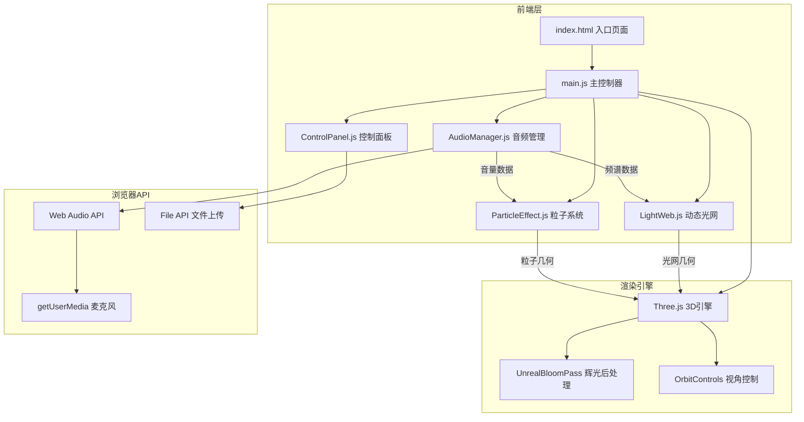
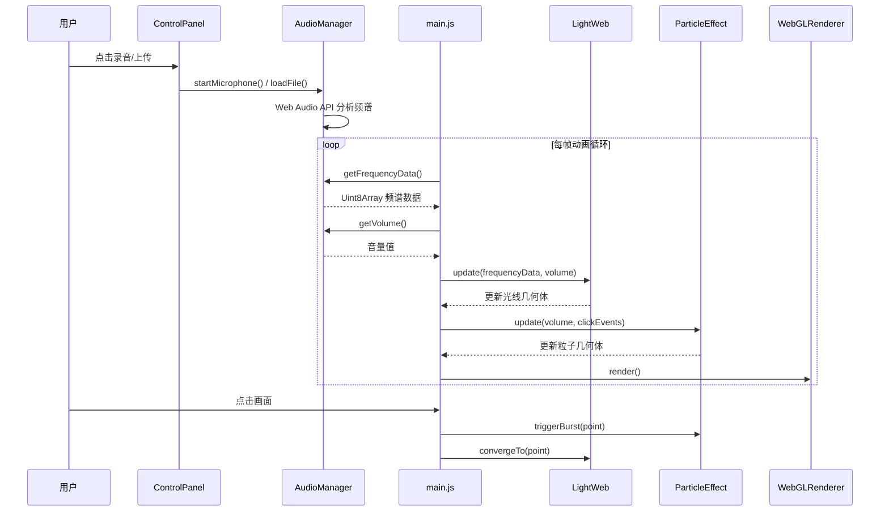

## 1. 架构设计



## 2. 技术说明

- **前端**：Vanilla JavaScript + Three.js + Vite
- **初始化工具**：Vite (vanilla-js template)
- **后端**：无
- **数据库**：无

### 核心依赖

| 依赖 | 版本 | 用途 |
|------|------|------|
| three | ^0.170.0 | 3D渲染引擎 |
| vite | ^6.0.0 | 构建工具与热更新 |

## 3. 文件结构

```
├── index.html              # 入口页面
├── package.json            # 依赖与脚本
├── vite.config.js          # Vite构建配置
└── src/
    ├── main.js             # 场景初始化、动画循环、事件整合
    ├── AudioManager.js     # 音频输入与频谱分析
    ├── LightWeb.js         # 动态光网构建与更新
    ├── ParticleEffect.js   # 粒子爆散与背景微光
    └── ControlPanel.js     # HTML控制面板交互
```

## 4. 模块职责

### 4.1 main.js — 主控制器

- 初始化 Three.js 场景（Scene）、透视相机（PerspectiveCamera）、WebGL渲染器（WebGLRenderer）
- 配置后处理管线（EffectComposer + RenderPass + UnrealBloomPass）
- 配置 OrbitControls（拖拽旋转、滚轮缩放、阻尼）
- 实例化 AudioManager、LightWeb、ParticleEffect、ControlPanel
- 动画循环（requestAnimationFrame）：每帧获取频谱数据 → 更新光网 → 更新粒子 → 渲染
- 监听点击事件，通过 Raycaster 触发光爆
- 监听窗口 resize，更新相机和渲染器

### 4.2 AudioManager.js — 音频管理

- 创建 AudioContext 和 AnalyserNode（fftSize: 2048）
- `startMicrophone()`：调用 getUserMedia 获取麦克风流并连接分析器
- `stopMicrophone()`：停止麦克风流
- `loadFile(file)`：通过 FileReader + AudioBufferSourceNode 加载音频文件
- `getFrequencyData()`：返回 Uint8Array 频谱数据
- `getVolume()`：返回当前音量（RMS）
- 频段划分：低频（0-300Hz）、中频（300-2000Hz）、高频（2000-20000Hz）

### 4.3 LightWeb.js — 动态光网

- 使用 BufferGeometry + LineBasicMaterial / 自定义 ShaderMaterial 绘制光线
- 根据频谱数据动态更新光线顶点位置和颜色
- 低频数据驱动底部光线：密集交织，蓝紫色系
- 中高频数据驱动上部光线：延展弯曲，金橙色系
- 音量影响光线透明度和粗细
- 光爆时附近光线向点击点汇聚动画

### 4.4 ParticleEffect.js — 粒子系统

- 使用 Points + BufferGeometry + PointsMaterial（或ShaderMaterial）
- 背景微光粒子：数百个缓慢飘浮的淡蓝白粒子，持续存在
- 光爆粒子：点击触发生成，向点击点汇聚后爆散，彩色随机，带拖尾
- 粒子生命周期管理：出生、运动、消亡
- 音量影响背景微光粒子数量

### 4.5 ControlPanel.js — 控制面板

- 通过 DOM API 创建控制面板 HTML 元素
- 毛玻璃效果：backdrop-filter: blur() + 半透明背景
- 音频上传按钮：隐藏 `<input type="file">`，自定义样式触发
- 录音/停止按钮：切换录音状态，图标切换
- 光线粗细滑块：range input，映射到光网线条宽度
- 粒子密度滑块：range input，映射到粒子生成数量
- 重置按钮：恢复所有参数默认值，停止音频
- 面板显隐动画：缓动淡入淡出

## 5. 数据流



## 6. 性能优化策略

- 使用 BufferGeometry 避免每帧创建新几何体
- 粒子数量上限控制，光爆粒子有生命周期自动回收
- 使用 ShaderMaterial 替代多层透明材质，减少 draw call
- UnrealBloomPass 分辨率设为半分辨率
- 使用 requestAnimationFrame 保证帧率
- resize 事件做 debounce 处理
