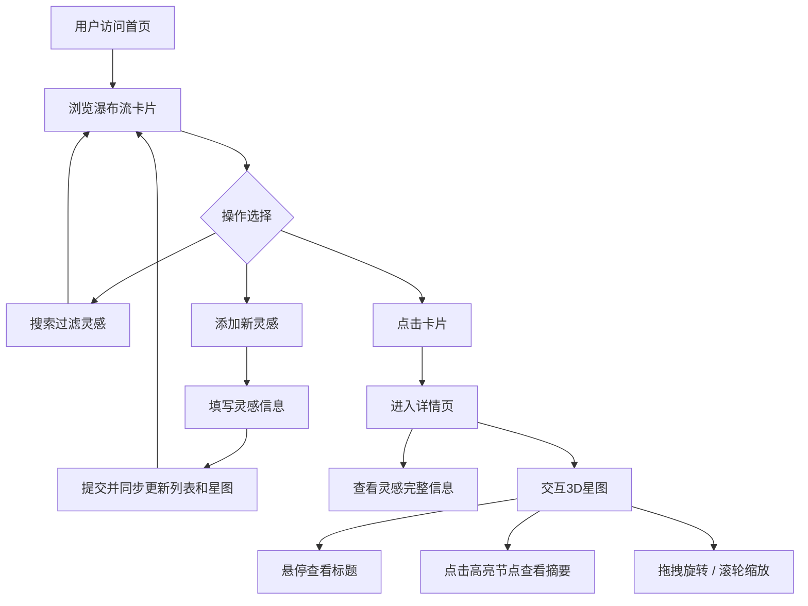

## 1. 产品概述

「灵感星图」是一款灵感记录与可视化平台，帮助用户随手记录零碎灵感（文字、标签、优先级），并通过3D星图直观呈现灵感之间的关系。每个灵感化作一颗发光星点，星点大小代表优先级，颜色按标签分组，在3D空间中缓慢旋转，让灵感的沉淀变得生动而有趣。

- 目标用户：创意工作者、设计师、开发者、学生等需要捕捉碎片灵感的人群
- 核心价值：将零散灵感从"记了就忘"变为"一目了然"，通过星图可视化激发联想与创造力

## 2. 核心功能

### 2.1 用户角色

| 角色 | 注册方式 | 核心权限 |
|------|----------|----------|
| 普通用户 | 无需注册 | 添加、浏览、搜索灵感，查看星图 |

### 2.2 功能模块

1. **首页**：灵感瀑布流卡片列表、搜索过滤、添加灵感入口
2. **详情页**：灵感完整信息、3D星图交互展示

### 2.3 页面详情

| 页面名称 | 模块名称 | 功能描述 |
|----------|----------|----------|
| 首页 | 搜索栏 | 支持按标签和关键词实时过滤灵感 |
| 首页 | 添加灵感弹窗 | 填写标题、内容、标签、优先级后提交 |
| 首页 | 瀑布流卡片列表 | 展示所有灵感卡片，毛玻璃背景、标签色条、优先级星标，悬停上浮动效 |
| 详情页 | 灵感信息面板 | 展示灵感标题、内容、标签、优先级等完整信息 |
| 详情页 | 3D星图 | Three.js渲染所有灵感节点，按标签着色、按优先级定大小，缓慢公转，支持悬停和点击交互 |
| 全局 | 背景星点 | 缓慢飘浮的细小星点装饰，营造深空氛围 |
| 全局 | 页面切换动画 | 页面间缓动淡入过渡 |

## 3. 核心流程

用户打开首页，浏览灵感瀑布流卡片；通过搜索栏按标签或关键词筛选灵感；点击"添加灵感"按钮，填写信息后提交，列表和星图同步更新；点击任意卡片进入详情页，查看完整信息和3D星图；在星图中鼠标悬停显示标题浮窗，点击节点高亮并展示摘要；可拖拽旋转星图视角、滚轮缩放。

## 4. 用户界面设计

### 4.1 设计风格

- **主色调**：深蓝灰渐变背景（#0a0e1a → #1a1f3a），营造深邃宇宙感
- **强调色**：标签分组色（技术-蓝 #4a9eff、设计-紫 #a855f7、生活-绿 #34d399、其他-橙 #fb923c）
- **卡片风格**：毛玻璃质感（backdrop-blur），圆角 16px，半透明白色边框，微发光边缘
- **字体**：标题用 Outfit（几何感、未来感），正文用 Noto Sans SC（中文友好）
- **布局**：卡片瀑布流，3列自适应
- **图标**：Lucide React 图标库
- **动效**：卡片悬停上浮 + 阴影加深，页面切换淡入，星点缓慢飘浮，搜索结果淡入动画

### 4.2 页面设计概览

| 页面名称 | 模块名称 | UI元素 |
|----------|----------|--------|
| 首页 | 搜索栏 | 毛玻璃面板，圆角输入框，搜索图标，标签过滤按钮组 |
| 首页 | 添加灵感弹窗 | 毛玻璃背景遮罩，居中弹窗，表单字段含标签选择器和优先级星级 |
| 首页 | 瀑布流卡片 | 毛玻璃卡片，左上标签色条，右上优先级星标（1-5颗），标题+摘要文字，悬停上浮4px+阴影加深 |
| 详情页 | 信息面板 | 毛玻璃面板，标题大字，内容段落，标签色块，优先级星级 |
| 详情页 | 3D星图 | 全宽Canvas，深色背景，发光星点节点，悬停浮窗，拖拽/缩放控制 |
| 全局 | 背景星点 | Canvas层，200+细小白色半透明圆点，缓慢随机漂移 |

### 4.3 响应式适配

- 桌面（≥1024px）：3列卡片，星图全屏宽
- 平板（768px-1023px）：2列卡片
- 手机（<768px）：1列卡片，星图高度适配

### 4.4 3D场景指引

- **环境**：深蓝黑色空旷3D空间，无地面，纯宇宙感
- **灯光**：环境光（柔和白色）+ 每个节点自带点光源（对应标签色，强度随优先级变化）
- **相机**：透视相机，初始视角略俯视，自动缓慢公转
- **节点**：球形几何体，表面发光材质（MeshStandardMaterial + emissive），大小=优先级×10（最小20px单位）
- **交互**：OrbitControls拖拽旋转+缩放，Raycaster实现悬停检测和点击选中
- **动画**：节点绕中心点缓慢公转（不同轨道半径和速度），选中节点高亮脉冲
- **性能**：限制节点数≤100时保持60fps，使用InstancedMesh优化渲染
