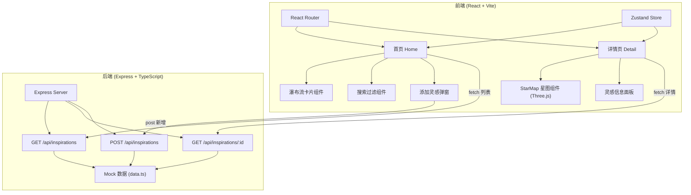
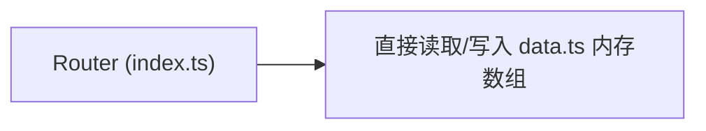
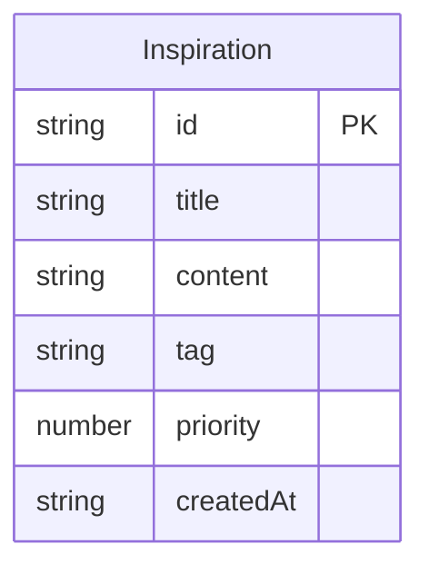

## 1. 架构设计



## 2. 技术说明

- **前端**：React 18 + TypeScript + Tailwind CSS + Vite + Three.js + @react-three/fiber + @react-three/drei
- **初始化工具**：vite-init（react-express-ts 模板）
- **后端**：Express 4 + TypeScript（ESM 模式）
- **数据库**：无，使用 Mock 数据（内存数组，支持动态新增）
- **状态管理**：Zustand
- **路由**：react-router-dom
- **3D渲染**：Three.js + @react-three/fiber + @react-three/drei（OrbitControls）
- **图标**：lucide-react

## 3. 路由定义

| 路由 | 用途 |
|------|------|
| `/` | 首页，灵感瀑布流列表 + 搜索 + 添加入口 |
| `/detail/:id` | 灵感详情页，含完整信息 + 3D星图 |

## 4. API 定义

### 4.1 TypeScript 类型定义

```typescript
type Tag = "技术" | "设计" | "生活" | "其他"

interface Inspiration {
  id: string
  title: string
  content: string
  tag: Tag
  priority: 1 | 2 | 3 | 4 | 5
  createdAt: string
}
```

### 4.2 请求/响应

| 方法 | 路径 | 请求体 | 响应 |
|------|------|--------|------|
| GET | `/api/inspirations` | - | `{ data: Inspiration[] }` |
| GET | `/api/inspirations/:id` | - | `{ data: Inspiration }` |
| POST | `/api/inspirations` | `Omit<Inspiration, "id" | "createdAt">` | `{ data: Inspiration }` |

## 5. 服务端架构图



由于是 Mock 数据，无数据库层，Router 直接操作内存数组。

## 6. 数据模型

### 6.1 数据模型定义



### 6.2 标签-颜色映射

| 标签 | 颜色 | 色值 |
|------|------|------|
| 技术 | 蓝 | #4a9eff |
| 设计 | 紫 | #a855f7 |
| 生活 | 绿 | #34d399 |
| 其他 | 橙 | #fb923c |

### 6.3 Mock 初始数据

预置 8-10 条灵感数据，覆盖所有标签和不同优先级，用于展示效果。
