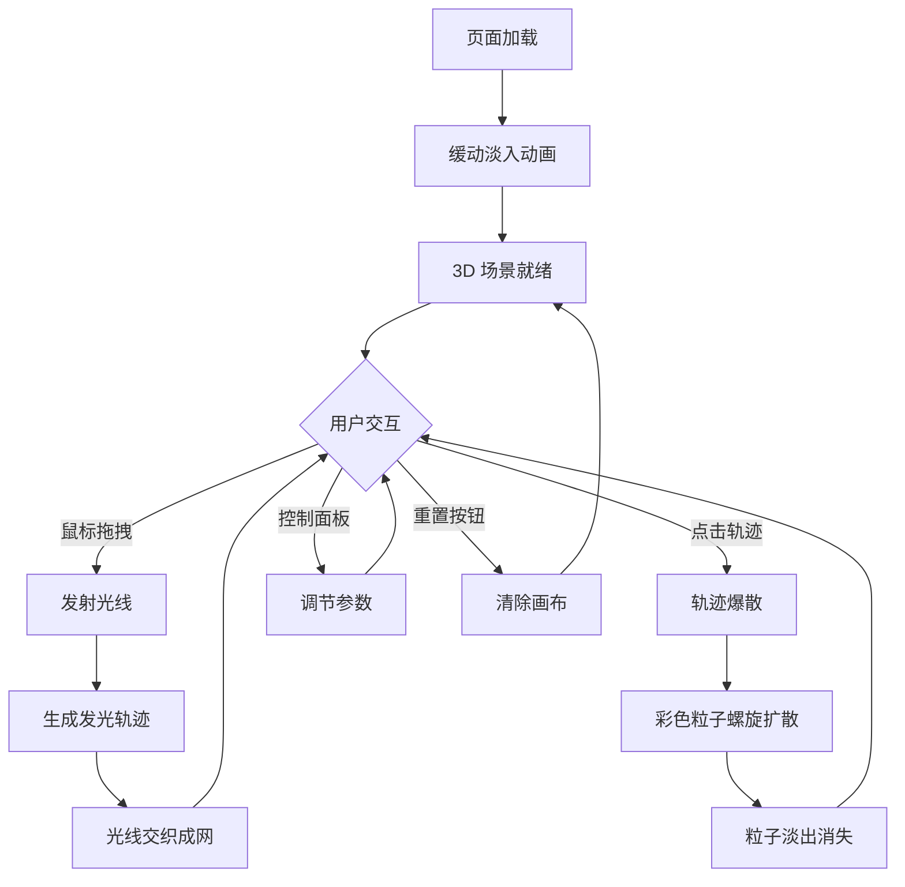

## 1. 产品概述

「流光织梦」是一个 3D 交互可视化项目，模拟在虚拟空间中用光线编织出不断变幻的抽象立体光网。用户通过鼠标在画布上发射光线，光线留下半透明发光轨迹并交织成网，点击轨迹片段可触发粒子爆散效果。
- 目标用户：创意设计师、数字艺术爱好者、交互体验探索者
- 核心价值：提供一种沉浸式的光影创作体验，让用户在三维空间中以直觉化的交互方式创造独特的视觉艺术

## 2. 核心功能

### 2.1 功能模块

1. **3D 光网画布**：Three.js 场景，用户可拖拽旋转视角、滚轮缩放、点击/拖拽发射光线
2. **光线轨迹系统**：光线移动留下渐变发光轨迹，多条光线交织形成复杂光网
3. **粒子爆散系统**：点击轨迹片段触发爆散成彩色粒子，螺旋扩散并淡出
4. **背景星点系统**：缓慢飘浮的细小星点营造深空氛围
5. **控制面板**：光线粗细滑块、粒子扩散速度滑块、重置画布按钮

### 2.2 页面详情

| 页面名称 | 模块名称 | 功能描述 |
|----------|----------|----------|
| 主画布 | 3D 场景 | Three.js 渲染的纯黑背景 3D 空间，支持鼠标旋转/缩放/光线发射 |
| 主画布 | 光线发射 | 鼠标按下拖拽发射光线，释放结束，光线带渐变色和光晕 |
| 主画布 | 轨迹交互 | 点击已有轨迹片段触发粒子爆散，粒子螺旋扩散淡出 |
| 主画布 | 背景星点 | 细小星点缓慢飘浮，营造深空氛围 |
| 控制面板 | 光线粗细 | 滑块控制光线的粗细程度 |
| 控制面板 | 粒子扩散速度 | 滑块控制粒子爆散的扩散速度 |
| 控制面板 | 重置画布 | 按钮清除所有光线和粒子，恢复初始状态 |

## 3. 核心流程

1. 用户打开页面 → 页面缓动淡入 → 纯黑背景 + 飘浮星点呈现
2. 用户在画布上按下鼠标并拖拽 → 从鼠标位置向 3D 空间发射光线 → 光线移动留下半透明渐变发光轨迹
3. 多次发射光线 → 轨迹交织形成复杂光网
4. 用户点击已有轨迹 → 轨迹片段爆散成彩色粒子 → 粒子螺旋扩散并逐渐淡出消失
5. 用户可通过控制面板调节光线粗细和粒子扩散速度，或点击重置清除画布

## 4. 用户界面设计

### 4.1 设计风格

- **主色调**：纯黑背景 (#000000)，光线从蓝紫 (#6366f1 → #a855f7) 到金橙 (#f59e0b → #f97316) 渐变
- **光晕效果**：柔和高斯光晕，发光线条带外发光
- **粒子颜色**：跟随光线轨道的蓝紫到金橙渐变色系
- **布局风格**：全屏沉浸式画布，右下角浮动半透明毛玻璃控制面板
- **字体**：控制面板使用细腻的无衬线字体，低对比度白色文字
- **交互反馈**：鼠标光标变化、光线发射时的视觉反馈、粒子爆散的动态效果

### 4.2 页面设计概览

| 页面名称 | 模块名称 | UI 元素 |
|----------|----------|---------|
| 主画布 | 3D 场景 | 全屏黑色背景，Three.js WebGL 画布，渐变发光光线，飘浮星点 |
| 控制面板 | 面板容器 | 右下角固定定位，半透明毛玻璃效果 (backdrop-filter: blur)，圆角 12px，内边距 20px |
| 控制面板 | 光线粗细滑块 | 标签 + range input，值范围 1-10，默认 3 |
| 控制面板 | 粒子扩散速度滑块 | 标签 + range input，值范围 0.1-3.0，默认 1.0 |
| 控制面板 | 重置按钮 | 圆角按钮，hover 高亮效果 |

### 4.3 响应式适配

- 桌面端（≥1024px）：全屏画布，控制面板右下角固定
- 平板端（768px-1023px）：全屏画布，控制面板适当缩小，触摸交互适配
- 触摸优化：支持触摸拖拽发射光线，触摸旋转和缩放

### 4.4 3D 场景指引

- **环境**：纯黑深空环境，无环境光或极弱环境光
- **光照**：无传统光照，光线和粒子自发光（MeshBasicMaterial + 发光后处理）
- **相机**：PerspectiveCamera，FOV 60°，初始距离 30，OrbitControls 旋转/缩放
- **构图**：光线在三维空间中自由分布，无固定焦点，用户创造焦点
- **交互**：OrbitControls 旋转缩放 + Raycaster 光线发射和轨迹点击检测
- **后处理**：UnrealBloomPass 产生柔和发光效果
- **性能预算**：60fps，光线轨迹点上限 ~5000，粒子上限 ~2000，星点数量 ~300
