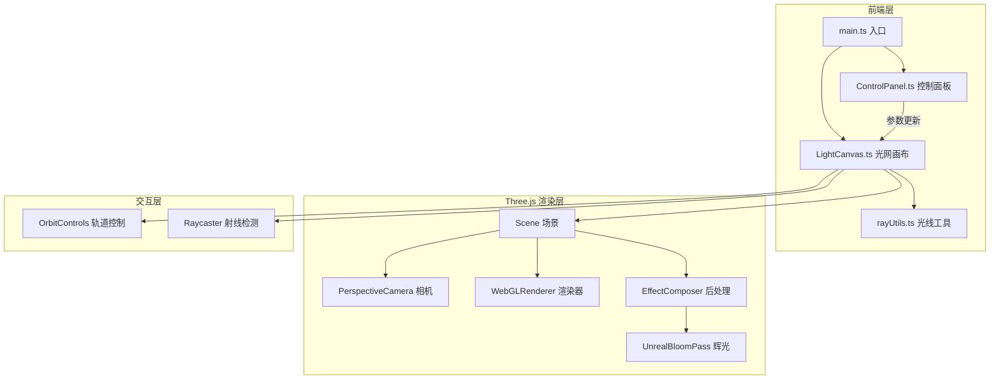

## 1. 架构设计



## 2. 技术说明

- **前端框架**：纯 TypeScript + Three.js（无 React/Vue，用户明确指定）
- **构建工具**：Vite
- **3D 引擎**：Three.js + OrbitControls + EffectComposer + UnrealBloomPass + RenderPass
- **样式**：原生 CSS（全局样式 + 毛玻璃控制面板）
- **无后端**：纯前端项目

## 3. 文件结构

| 文件路径 | 职责 |
|----------|------|
| src/main.ts | 入口文件，初始化场景、相机、渲染器、后处理，启动动画循环 |
| src/components/LightCanvas.ts | 核心画布组件，管理光线生成、轨迹系统、粒子系统、交互事件 |
| src/components/ControlPanel.ts | 控制面板 UI，滑块和按钮事件绑定，参数传递 |
| src/utils/rayUtils.ts | 光线数学工具，轨迹计算、渐变色插值、碰撞检测 |
| src/styles/main.css | 全局样式，字体、布局、毛玻璃面板样式 |
| package.json | 项目依赖和脚本 |
| tsconfig.json | TypeScript 配置 |

## 4. 核心数据结构

### 4.1 光线轨迹 (LightTrail)

```typescript
interface LightTrail {
  id: number;
  points: THREE.Vector3[];
  colorStart: THREE.Color;
  colorEnd: THREE.Color;
  lineWidth: number;
  mesh: THREE.Line;
  glowMesh: THREE.Line;
  createdAt: number;
}
```

### 4.2 粒子 (Particle)

```typescript
interface Particle {
  position: THREE.Vector3;
  velocity: THREE.Vector3;
  color: THREE.Color;
  life: number;
  maxLife: number;
  size: number;
  angle: number;
  radius: number;
  angularSpeed: number;
}
```

### 4.3 控制参数 (ControlParams)

```typescript
interface ControlParams {
  lineWidth: number;
  particleSpreadSpeed: number;
}
```

## 5. 渲染管线

1. RenderPass → 渲染场景到缓冲区
2. UnrealBloomPass → 辉光后处理（强度 1.5，半径 0.4，阈值 0.1）
3. 输出到屏幕

## 6. 交互机制

| 交互方式 | 触发条件 | 行为 |
|----------|----------|------|
| 鼠标按下 + 拖拽 | 画布上 mousedown + mousemove | 发射光线，生成轨迹点 |
| 鼠标释放 | mouseup | 结束当前光线 |
| 点击轨迹 | mousedown（无拖拽）+ Raycaster 命中轨迹 | 触发粒子爆散 |
| 鼠标右键拖拽 | contextmenu + 拖拽 | OrbitControls 旋转视角 |
| 滚轮 | wheel | OrbitControls 缩放 |
| 触摸单指拖拽 | touchstart + touchmove | 发射光线 |
| 触摸双指 | pinch | OrbitControls 缩放/旋转 |

## 7. 性能优化策略

- 轨迹点去重：移动距离小于阈值时不添加新点
- 粒子池：预分配粒子对象，避免 GC
- 轨迹上限：超过 5000 个点时自动移除最旧的轨迹
- 粒子上限：同时存在不超过 2000 个粒子
- requestAnimationFrame 驱动动画循环
- BufferGeometry 动态更新而非重建
