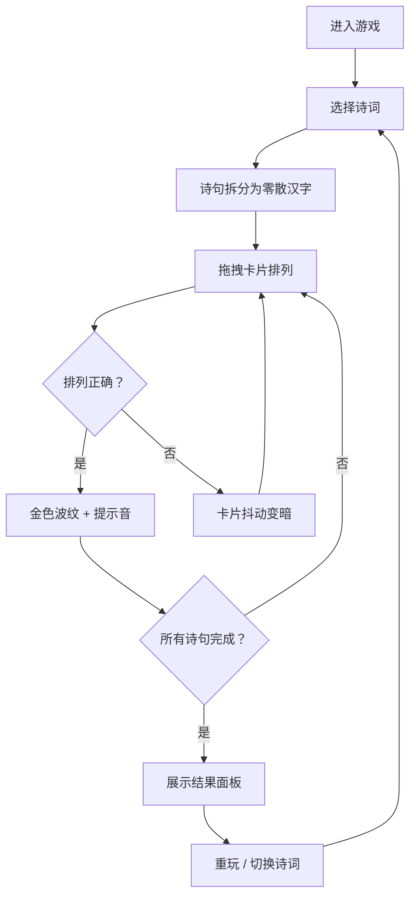

## 1. 产品概述

「词海触礁」是一款交互式古诗词拼图游戏，用户通过拖拽零散的汉字卡片拼出完整的诗句，在趣味互动中感受古诗词之美。
- 目标用户：古诗词爱好者、中文学习者、休闲游戏玩家
- 核心价值：将传统文化与现代交互设计结合，通过游戏化方式提升诗词学习体验

## 2. 核心功能

### 2.1 用户角色
无需区分角色，所有用户功能一致。

### 2.2 功能模块
1. **游戏主页面**：诗词选择、拼图交互区、状态信息展示
2. **结果展示面板**：全诗展示、用时统计、准确率统计、重玩功能

### 2.3 页面详情
| 页面名称 | 模块名称 | 功能描述 |
|---------|---------|---------|
| 游戏主页面 | 诗词选择栏 | 展示可选诗词列表，点击切换当前拼图 |
| 游戏主页面 | 拼图区域 | 零散汉字卡片拖拽区，支持碰撞检测和自动吸附 |
| 游戏主页面 | 状态栏 | 显示当前诗词标题、作者、计时器、已拼对数 |
| 游戏主页面 | 汉字卡片 | 单张毛玻璃圆角卡片，支持拖拽、双击翻转、选中浮起 |
| 游戏主页面 | 正确反馈 | 淡金色波纹扩散动画 + 轻提示音 |
| 游戏主页面 | 错误反馈 | 卡片轻微抖动 + 变暗效果 |
| 结果展示面板 | 全诗展示 | 展示完整诗词全文，高亮已拼对的句子 |
| 结果展示面板 | 统计信息 | 显示总用时、拼图准确率 |
| 结果展示面板 | 重玩按钮 | 重新打乱当前诗词或切换到下一首 |

## 3. 核心流程

用户进入游戏 → 选择一首诗词 → 诗句被拆分为零散汉字卡片并随机排列 → 用户拖拽卡片排列成诗句 → 系统实时检测排列是否正确 → 正确时触发金色波纹+提示音 → 错误时卡片抖动变暗 → 所有诗句拼对完成 → 展示结果面板（全诗、用时、准确率）→ 可选择重玩或切换诗词

## 4. 用户界面设计

### 4.1 设计风格
- **主色调**：米白色（#F5F0E8）作为背景，墨黑色（#2C2C2C）作为文字，淡金色（#D4A847）作为强调色
- **辅助色**：浅灰（#E8E0D0）作为卡片底色，深墨色（#1A1A1A）作为选中态
- **按钮风格**：圆角矩形，毛玻璃质感，选中时微上浮阴影
- **字体**：毛笔风格字体（Ma Shan Zheng / ZCOOL KuaiLe）用于卡片汉字，衬线体用于诗词展示
- **布局风格**：居中卡片式布局，顶部信息栏 + 中央拼图区 + 底部操作栏
- **纹理**：背景带有隐约宣纸纹理（CSS 生成 noise 效果）

### 4.2 页面设计概览
| 页面名称 | 模块名称 | UI元素 |
|---------|---------|--------|
| 游戏主页面 | 诗词选择栏 | 水平滚动列表，圆角标签样式，选中态淡金色背景 |
| 游戏主页面 | 拼图区域 | 宣纸纹理背景，汉字卡片散落其中，目标位置用虚线框提示 |
| 游戏主页面 | 汉字卡片 | 毛玻璃圆角方块，hover时上浮+阴影，拖拽时放大1.05倍 |
| 游戏主页面 | 正确反馈 | 从卡片中心扩散的淡金色同心圆波纹，持续0.8s |
| 游戏主页面 | 错误反馈 | 卡片左右抖动4次 + 透明度降至0.6，持续0.5s |
| 结果展示面板 | 全诗展示 | 居中竖排或横排展示，毛笔字体，逐行淡入 |
| 结果展示面板 | 统计信息 | 简洁卡片式展示，图标+数字组合 |
| 结果展示面板 | 重玩按钮 | 圆角主按钮，淡金色背景，hover时加深 |

### 4.3 响应式设计
- **桌面端优先**：拼图区域宽度最大800px，卡片尺寸60x60px
- **平板适配**：拼图区域宽度自适应，卡片尺寸50x50px
- **移动端适配**：卡片尺寸44x44px，触控拖拽优化，增加触控热区
- **触摸优化**：拖拽时防止页面滚动，长按激活拖拽，双击翻转

### 4.4 动效设计
- 卡片拖拽：跟随手指/鼠标移动，requestAnimationFrame 驱动保证60fps
- 吸附效果：卡片接近目标位置20px内自动吸附，带0.2s缓动
- 波纹动画：CSS @keyframes 实现，从中心扩散3层同心圆
- 抖动动画：CSS transform translateX 左右偏移 ±4px
- 翻转效果：CSS 3D transform rotateY 180度翻转
- 结果面板：从底部滑入，backdrop-filter 模糊背景
