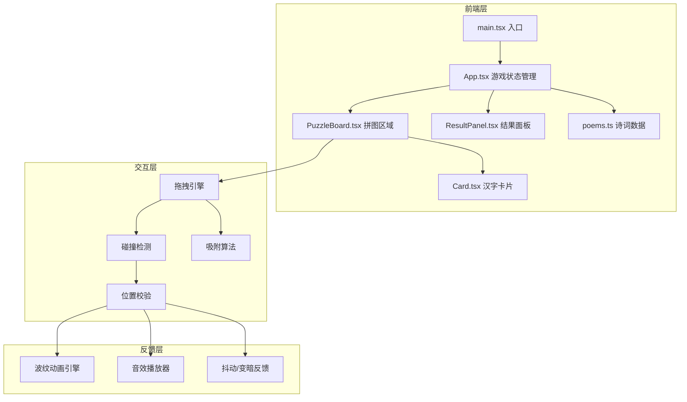

## 1. 架构设计



## 2. 技术说明
- **前端框架**：React 18 + TypeScript
- **构建工具**：Vite + @vitejs/plugin-react
- **状态管理**：React useState/useReducer（项目规模小，无需引入外部状态库）
- **样式方案**：CSS Modules + CSS变量（主题色/间距统一管理）
- **动画方案**：CSS @keyframes + requestAnimationFrame（拖拽跟随）
- **音效方案**：Web Audio API 生成简单提示音（无需外部音频文件）
- **后端**：无（纯前端应用，数据内置）
- **数据库**：无（诗词数据硬编码在 poems.ts 中）

## 3. 路由定义
| 路由 | 用途 |
|------|------|
| / | 游戏主页面（唯一页面，结果面板以覆盖层形式展示） |

## 4. API定义
无后端API，所有数据前端内置。

## 5. 数据模型

### 5.1 核心数据类型

```typescript
interface Poem {
  id: string;
  title: string;
  author: string;
  dynasty: string;
  lines: string[];
}

interface CardState {
  id: string;
  char: string;
  x: number;
  y: number;
  targetSlotIndex: number;
  currentSlotIndex: number | null;
  isDragging: boolean;
  isCorrect: boolean;
  isFlipped: boolean;
  isShaking: boolean;
}

interface GameState {
  currentPoem: Poem | null;
  cards: CardState[];
  slots: SlotState[];
  startTime: number | null;
  endTime: number | null;
  correctCount: number;
  totalAttempts: number;
  isCompleted: boolean;
}

interface SlotState {
  id: number;
  lineIndex: number;
  positionInLine: number;
  expectedChar: string;
  filledCardId: string | null;
}
```

### 5.2 诗词数据
内置8-10首经典古诗词，涵盖唐诗宋词，每首4-8句，每句5或7字。

## 6. 关键算法

### 6.1 拖拽与碰撞检测
- 使用 pointer events（兼容鼠标和触控）
- 实时计算卡片中心与目标槽位距离
- 距离小于吸附阈值（20px）时触发吸附

### 6.2 吸附对齐
- 卡片释放时检测最近空槽位
- 若距离在阈值内，执行0.2s缓动动画吸附到位
- 吸附后校验该槽位期望字符是否匹配

### 6.3 性能优化
- 拖拽使用 transform 而非 top/left（触发GPU加速）
- 波纹动画使用 CSS will-change 提示
- 卡片状态更新使用 React.memo 避免不必要的重渲染
- requestAnimationFrame 驱动拖拽位置更新
