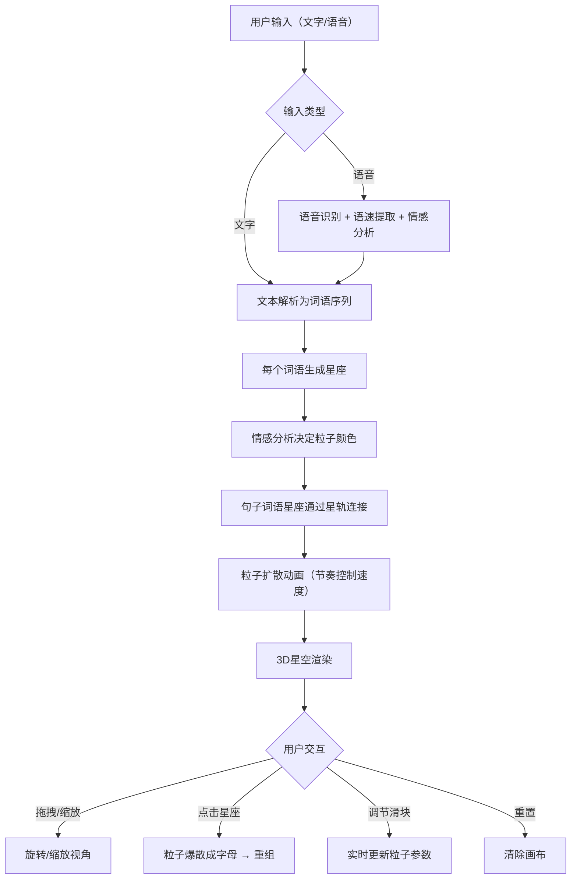

## 1. 产品概述

「星语织梦」是一个沉浸式3D交互可视化项目，将用户输入的文字和语音实时转化为动态星空粒子图案。每个词语对应一个星座，句子连成星轨，情感分析影响粒子颜色，输入节奏控制粒子扩散速度。
- 目标用户：创意工作者、视觉艺术爱好者、追求沉浸式交互体验的用户
- 核心价值：将语言情感与宇宙美学融合，创造独一无二的可视化表达体验

## 2. 核心功能

### 2.1 功能模块

1. **星空主画布页面**：3D星空渲染、星座生成、星轨连接、粒子动画、鼠标交互
2. **控制面板**：文本输入、语音输入、粒子密度调节、扩散速度调节、重置画布

### 2.2 页面详情

| 页面名称 | 模块名称 | 功能描述 |
|----------|----------|----------|
| 星空主画布 | 3D星空场景 | 纯黑到靛蓝渐变背景，半透明发光星座线条，带光晕的粒子光点 |
| 星空主画布 | 文字输入转星座 | 用户输入文本，每个词语生成对应星座，句子连接成星轨 |
| 星空主画布 | 语音输入处理 | 麦克风采集语音，提取语速和情感，实时生成粒子 |
| 星空主画布 | 情感颜色映射 | 正面情感→暖色（金色/橙色），负面情感→冷色（蓝色/紫色） |
| 星空主画布 | 星座点击交互 | 点击星座触发粒子爆散成字母形状，缓慢重组回星座 |
| 星空主画布 | 鼠标视角控制 | 拖拽旋转视角，滚轮缩放，OrbitControls |
| 控制面板 | 文本输入框 | 支持中英文输入，实时解析生成星座 |
| 控制面板 | 语音输入按钮 | 麦克风录音，提取语速与情感 |
| 控制面板 | 粒子密度滑块 | 调节每个星座的粒子数量 |
| 控制面板 | 扩散速度滑块 | 调节粒子扩散与运动速度 |
| 控制面板 | 重置画布按钮 | 清除所有星座，恢复初始星空状态 |

## 3. 核心流程

用户通过文本或语音输入内容 → 文本被解析为词语序列 → 每个词语生成一个星座（随机星点+连线）→ 句子中的词语星座通过星轨连接 → 情感分析判断整体色调（暖色/冷色）→ 语速或打字节奏控制粒子扩散速度 → 用户可拖拽旋转视角、滚轮缩放、点击星座触发爆散重组

## 4. 用户界面设计

### 4.1 设计风格

- **主色调**：纯黑（#000000）到靛蓝（#1a1a4e）渐变背景
- **星座线条**：半透明发光线条，颜色由情感决定（暖色 #FFD700/#FF8C00，冷色 #4169E1/#9370DB）
- **粒子风格**：细小光点，带有柔和光晕（glow），运动有缓动阻尼
- **字体**：控制面板使用优雅的细体字体，输入框使用清晰等宽字体
- **布局风格**：全屏3D画布 + 右下角悬浮毛玻璃控制面板
- **动画**：页面缓动淡入，星轨缓慢旋转，粒子扩散有缓动曲线

### 4.2 页面设计概览

| 页面名称 | 模块名称 | UI元素 |
|----------|----------|--------|
| 星空主画布 | 3D场景 | 全屏Three.js画布，深色渐变背景，发光粒子，星座连线 |
| 星空主画布 | 控制面板 | 毛玻璃半透明面板，圆角，模糊背景，右侧偏下悬浮 |

### 4.3 响应式适配

- **桌面端**：全屏3D画布，控制面板右下角悬浮，鼠标交互
- **平板端**：全屏3D画布，控制面板底部展开，触摸交互

### 4.4 3D场景指引

- **环境与氛围**：深邃星空，纯黑到靛蓝渐变，营造宇宙沉浸感
- **光照设置**：无方向光，使用自发光粒子（emissive）和点光源营造氛围
- **相机设置**：透视相机，OrbitControls，阻尼旋转，初始俯视角30度
- **构图与焦点**：星座分布在天球面，星轨连接成网络
- **交互与动画**：星座生成缓动展开，点击爆散重组，星轨持续缓慢旋转
- **后处理效果**：辉光效果（UnrealBloomPass），粒子光晕增强
- **性能预算**：目标60fps，粒子总数上限50000，使用InstancedMesh优化渲染
