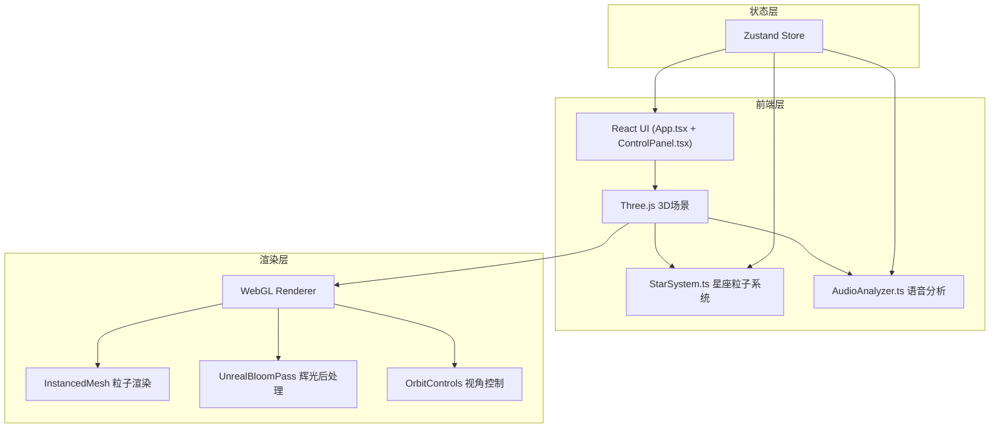

## 1. 架构设计



## 2. 技术说明

- **前端框架**：React 18 + TypeScript + Vite
- **3D引擎**：Three.js + @react-three/fiber + @react-three/drei + @react-three/postprocessing
- **状态管理**：Zustand
- **样式方案**：Tailwind CSS + CSS Modules（毛玻璃控制面板）
- **构建工具**：Vite
- **后端**：无（纯前端项目）
- **数据库**：无

## 3. 路由定义

| 路由 | 用途 |
|------|------|
| / | 星空主画布页面（单页应用，无额外路由） |

## 4. 文件结构

```
├── index.html                    # 入口HTML
├── package.json                  # 依赖与脚本
├── tsconfig.json                 # TypeScript配置
├── vite.config.ts                # Vite配置
├── src/
│   ├── main.tsx                  # 入口：初始化React和Three场景
│   ├── App.tsx                   # React主组件：管理UI状态和Three场景挂载
│   ├── store.ts                  # Zustand全局状态管理
│   ├── components/
│   │   ├── StarSystem.ts         # 核心星座粒子系统
│   │   ├── ControlPanel.tsx      # 毛玻璃控制面板
│   │   ├── AudioAnalyzer.ts      # 语音输入处理
│   │   ├── StarField.tsx         # R3F场景组件（Canvas + 后处理）
│   │   └── Constellation.tsx     # 单个星座组件
│   └── utils/
│       ├── textParser.ts         # 文本解析（分词、情感分析）
│       ├── emotionColors.ts      # 情感-颜色映射
│       └── geometryHelpers.ts    # 几何计算工具
```

## 5. 核心模块设计

### 5.1 StarSystem.ts - 星座粒子系统

- **职责**：管理所有星座和粒子的生命周期
- **核心逻辑**：
  - 文本分词 → 每个词生成一组随机星点（5-12个）→ 连线构成星座
  - 句子中连续词语的星座通过弧线星轨连接
  - 情感分析结果映射为粒子颜色（正面暖色，负面冷色）
  - 粒子使用 InstancedMesh 渲染，支持数万粒子保持60fps
  - 点击星座时粒子爆散成字母形状，缓动重组

### 5.2 AudioAnalyzer.ts - 语音分析

- **职责**：处理麦克风输入，提取语速和情感
- **核心逻辑**：
  - 使用 Web Audio API 采集麦克风音频
  - 音量包络分析计算语速（音节间隔）
  - 基频分析推断情感倾向（高频→正面/兴奋，低频→负面/低沉）
  - 输出：{ speed: number, emotion: 'positive' | 'negative' | 'neutral', text: string }
  - 使用 Web Speech API 进行语音转文字

### 5.3 ControlPanel.tsx - 控制面板

- **职责**：提供用户交互控件
- **UI组成**：
  - 文本输入框（实时提交）
  - 语音输入按钮（按住录音）
  - 粒子密度滑块（范围 50-500/星座）
  - 扩散速度滑块（范围 0.1-3.0）
  - 重置画布按钮

### 5.4 状态管理 (Zustand Store)

```typescript
interface AppState {
  constellations: ConstellationData[]
  particleDensity: number
  spreadSpeed: number
  emotion: 'positive' | 'negative' | 'neutral'
  isListening: boolean
  addConstellation: (text: string) => void
  setParticleDensity: (value: number) => void
  setSpreadSpeed: (value: number) => void
  resetCanvas: () => void
}
```
