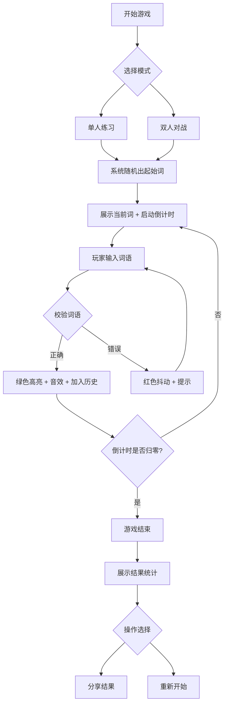

## 1. 产品概述

「词链工坊」是一款交互式词语接龙游戏，支持单人练习和双人对战模式。系统随机给出起始词，玩家需在限定时间内输入以上一词最后一个字开头的新词语，考验词汇量和反应速度。
- 目标用户：中文词汇爱好者、学生、休闲游戏玩家
- 核心价值：寓教于乐，通过游戏化的接龙机制锻炼中文词汇能力，同时提供社交分享功能增强趣味性

## 2. 核心功能

### 2.1 用户角色
无需注册，玩家直接选择模式即可开始游戏。

### 2.2 功能模块
1. **首页**：游戏模式选择（单人练习/双人对战）、游戏规则说明
2. **游戏界面**：词语输入、倒计时环形进度条、当前词展示、历史接龙链条
3. **结果界面**：接龙历史、总词数统计、平均用时、分享结果

### 2.3 页面详情
| 页面名称 | 模块名称 | 功能描述 |
|----------|----------|----------|
| 首页 | 模式选择 | 提供"单人练习"和"双人对战"两个入口按钮，附带简短规则说明 |
| 首页 | 游戏规则 | 展示接龙规则说明卡片：以上一词末字开头、20秒限时、正确/错误反馈 |
| 游戏界面 | 当前词展示 | 醒目展示当前待接龙的词语和需接的字（高亮末字） |
| 游戏界面 | 输入框 | 带焦点脉冲光效的输入框，支持回车提交，正确时绿色高亮，错误时红色抖动 |
| 游戏界面 | 倒计时 | 环形进度条展示20秒倒计时，时间不足时变色警示 |
| 游戏界面 | 接龙历史 | 垂直滚动的词语卡片链，每张卡片展示词语、用时、序号 |
| 游戏界面 | 音效反馈 | 正确时播放轻快音效，错误时播放提示音效 |
| 结果界面 | 统计数据 | 展示总词数、平均用时、最长接龙等统计信息 |
| 结果界面 | 接龙历史 | 完整的接龙链条回顾，支持滚动查看 |
| 结果界面 | 分享按钮 | 生成分享文本，支持复制到剪贴板 |

## 3. 核心流程

### 3.1 单人练习流程
1. 玩家选择"单人练习"模式
2. 系统随机从词库中选取起始词
3. 玩家在输入框中输入以起始词末字开头的新词语
4. 系统校验：词语是否以正确字开头、是否为有效中文词语、是否已被使用
5. 正确：绿色高亮动画 + 轻快音效，词语卡片加入历史链，重置倒计时
6. 错误：红色抖动动画 + 错误提示，倒计时继续
7. 倒计时归零：游戏结束，进入结果界面
8. 结果界面展示统计数据，玩家可分享或重新开始

### 3.2 双人对战流程
1. 玩家选择"双人对战"模式
2. 系统随机选取起始词
3. 两名玩家交替输入，各自独立倒计时
4. 任一方超时或三次输入错误则该方失败
5. 游戏结束展示双方战绩对比

### 3.3 流程图

## 4. 用户界面设计

### 4.1 设计风格
- **主色调**：浅橙(#FF9A56)到米白(#FFF5E6)渐变，温暖明快
- **辅助色**：成功绿(#4ADE80)、错误红(#F87171)、深棕文字(#5D4037)
- **卡片风格**：毛玻璃圆角方块(backdrop-blur + 半透明白底 + 圆角20px)
- **字体**：标题使用"ZCOOL KuaiLe"(站酷快乐体)卡通风字体，正文使用"Noto Sans SC"
- **按钮风格**：圆角胶囊按钮，带悬浮上浮阴影效果
- **图标风格**：圆润可爱的线条图标(lucide-react)
- **动画**：缓动入场(ease-out)、微上浮阴影、脉冲光效、抖动反馈

### 4.2 页面设计概览
| 页面名称 | 模块名称 | UI元素 |
|----------|----------|--------|
| 首页 | 模式选择 | 居中大标题"词链工坊"带弹跳入场动画，两个大圆角按钮上下排列，带微上浮阴影 |
| 首页 | 游戏规则 | 半透明规则卡片，带问号图标，点击展开/收起 |
| 游戏界面 | 当前词展示 | 顶部大号毛玻璃卡片，末字橙色高亮放大，带缓慢呼吸光效 |
| 游戏界面 | 输入框 | 居中胶囊输入框，聚焦时橙色脉冲光圈，正确/错误状态变色 |
| 游戏界面 | 倒计时 | 左上角环形SVG进度条，橙→红渐变，中间数字倒计时 |
| 游戏界面 | 接龙历史 | 底部垂直滚动区，词语卡片从下方滑入，正确绿色边框/错误红色边框 |
| 结果界面 | 统计数据 | 顶部三列统计卡片(总词数/平均用时/最长接龙)，带数字滚动动画 |
| 结果界面 | 接龙历史 | 中间可滚动区域，完整词语链，每张小卡片带序号 |
| 结果界面 | 分享按钮 | 底部两个胶囊按钮：复制分享文本 + 再来一局 |

### 4.3 响应式设计
- **桌面端优先**：最大宽度640px居中布局，适合游戏类窄屏体验
- **移动端适配**：全宽布局，输入框适配触屏键盘弹出，卡片尺寸适当放大
- **触屏优化**：按钮最小点击区域44px，输入框自动聚焦弹出软键盘

### 4.4 动画性能
- 所有动画使用CSS transform和opacity，确保GPU加速
- requestAnimationFrame驱动倒计时环形进度条
- will-change属性预声明动画元素
- 目标帧率：60fps
