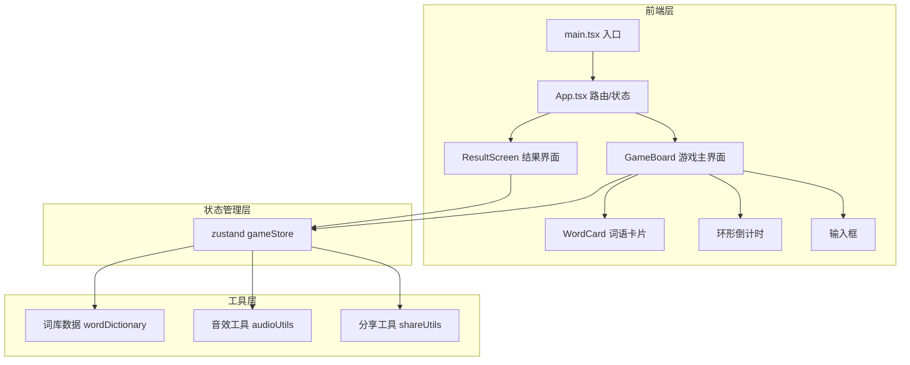
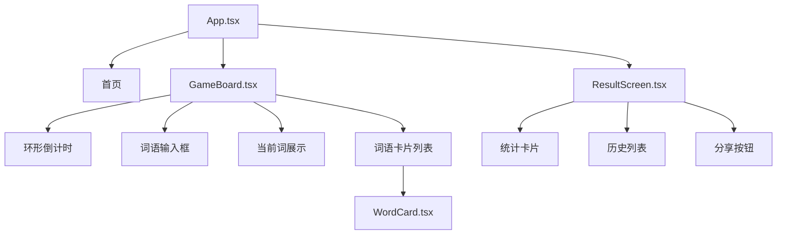

## 1. 架构设计



## 2. 技术说明
- **前端框架**：React 18 + TypeScript + Vite
- **样式方案**：Tailwind CSS 3 + CSS Modules（动画关键帧）
- **状态管理**：zustand
- **路由**：react-router-dom（首页/游戏/结果三个路由）
- **图标库**：lucide-react
- **音效**：Web Audio API（轻量级，无需外部音频文件）
- **构建工具**：Vite
- **初始化工具**：vite-init（react-ts 模板）
- **后端**：无（纯前端，词库内置于前端）

## 3. 路由定义
| 路由 | 用途 |
|------|------|
| `/` | 首页，选择游戏模式和查看规则 |
| `/game` | 游戏主界面，包含输入框、倒计时、当前词和历史链条 |
| `/result` | 游戏结束后的结果界面，展示统计和分享 |

## 4. 数据模型

### 4.1 游戏状态模型

```typescript
interface WordEntry {
  word: string
  timeUsed: number
  isCorrect: boolean
  timestamp: number
}

interface GameState {
  mode: 'single' | 'dual'
  status: 'idle' | 'playing' | 'finished'
  currentWord: string
  requiredChar: string
  wordHistory: WordEntry[]
  timeRemaining: number
  currentPlayer: 1 | 2
  errorCount: [number, number]
}
```

### 4.2 词库设计
- 内置约2000+常用中文双字词/四字成语
- 按首字拼音索引，支持快速查找
- 去重机制：已使用的词语不可重复使用

### 4.3 分享数据格式
```
🔗 词链工坊 - 接龙挑战
━━━━━━━━━━━━
📝 总词数：12
⏱ 平均用时：8.3秒
🔥 最长接龙：春风→风景→景色→色彩
来挑战我吧！
```

## 5. 组件架构



## 6. 关键技术实现

### 6.1 环形倒计时
- SVG circle + stroke-dashoffset 动画
- requestAnimationFrame 驱动，确保60fps
- 颜色随时间变化：橙色 → 红色渐变

### 6.2 音效系统
- Web Audio API 生成简单合成音
- 正确：上行音阶（C5→E5），轻快感
- 错误：低频嗡鸣（C3），警示感
- 超时：下行音阶（C5→C3），结束感

### 6.3 输入验证
- 检查首字是否匹配上词末字
- 检查是否为有效中文词语（查询内置词库）
- 检查是否已被使用（排除历史词）
- 实时反馈：输入时显示匹配状态

### 6.4 动画性能
- CSS transform/opacity 驱动所有动画（GPU加速）
- will-change 预声明动画元素
- 避免layout thrashing，使用requestAnimationFrame
- CSS transition 配合 spring 缓动函数
