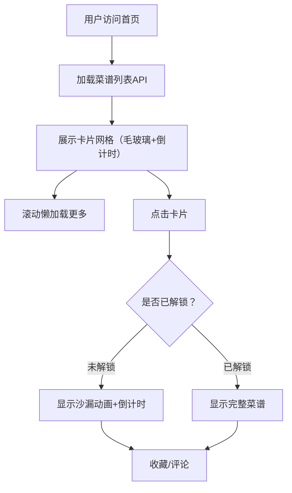

## 1. 产品概述

「菜谱时光机」是一款暖色复古风全栈Web应用，让用户上传自家菜谱并设定未来解锁日期，只有到期后才能查看完整内容，过期后自动公开。核心价值在于将菜谱分享变成一场充满仪式感的时光等待体验。

- 目标用户：喜欢烹饪、乐于分享家庭菜谱的美食爱好者
- 核心体验：时间解锁机制 + 复古沙漏视觉 + 社区互动（收藏与评论）

## 2. 核心功能

### 2.1 用户角色

| 角色 | 注册方式 | 核心权限 |
|------|----------|----------|
| 访客 | 无需注册 | 浏览公开菜谱、查看详情、收藏与评论（本地状态） |

### 2.2 功能模块

1. **首页**：菜谱列表卡片展示、倒计时沙漏动画、懒加载
2. **详情页**：解锁状态判断、沙漏倒计时/完整内容切换、收藏、评论

### 2.3 页面详情

| 页面名称 | 模块名称 | 功能描述 |
|----------|----------|----------|
| 首页 | 导航栏 | 应用标题、品牌Logo，手机端折叠为汉堡菜单 |
| 首页 | 菜谱卡片列表 | 展示所有菜谱缩略图，毛玻璃卡片，标题、标签、倒计时，未解锁卡片内容模糊+沙漏动画覆盖，悬停微上浮+阴影增强，懒加载滚动加载更多 |
| 首页 | 图片淡入 | 菜谱图片加载时带缓动淡入效果 |
| 详情页 | 状态判断 | 根据当前时间与解锁日期对比，渲染不同UI |
| 详情页 | 沙漏倒计时动画 | 未解锁时展示CSS沙漏动画（缓慢翻转、沙子徐徐落下、脉冲金边），倒计时文字 |
| 详情页 | 完整菜谱内容 | 已解锁时展示图片、食材列表、步骤文字 |
| 详情页 | 收藏按钮 | 本地状态模拟，点击后按钮变实心+弹跳动效 |
| 详情页 | 评论区 | 评论输入框（缓动焦点动画）、评论列表（新增评论淡入动画），本地数组模拟 |

## 3. 核心流程

用户打开应用 → 首页加载菜谱列表（从后端API获取） → 浏览卡片（缩略图+标题+标签+倒计时） → 点击卡片进入详情页 → 判断解锁状态：
- 未解锁：显示沙漏倒计时动画，无法查看完整内容
- 已解锁：显示完整菜谱（图片+食材+步骤）

在详情页可收藏菜谱、发表评论。

## 4. 用户界面设计

### 4.1 设计风格

- **主色调**：米黄（#FFF8E7）到浅棕（#D4B896）渐变背景
- **强调色**：琥珀金（#C8956C）、暖红棕（#A0522D）
- **卡片风格**：毛玻璃（backdrop-filter: blur）圆角方块，柔和阴影
- **标题字体**：衬线字体（Playfair Display / Noto Serif SC）
- **正文字体**：无衬线（Noto Sans SC）
- **沙漏动画**：CSS纯实现，脉冲金边光晕
- **按钮风格**：圆角暖色按钮，收藏按钮弹跳动效
- **图标风格**：Lucide图标库

### 4.2 页面设计概述

| 页面名称 | 模块名称 | UI元素 |
|----------|----------|--------|
| 首页 | 导航栏 | 衬线字体标题、半透明背景、手机端汉堡菜单 |
| 首页 | 菜谱卡片 | 毛玻璃圆角卡片、缩略图+标题+标签+倒计时、悬停上浮4px+阴影增强、未解锁内容模糊+沙漏动画覆盖 |
| 详情页 | 沙漏区域 | CSS沙漏动画（翻转+沙子+金边脉冲）、倒计时文字（天/时/分/秒） |
| 详情页 | 菜谱内容 | 大图、食材列表（图标+文字）、步骤（序号+文字）、暖色分割线 |
| 详情页 | 收藏按钮 | 心形图标，空心→实心+弹跳，琥珀金高亮 |
| 详情页 | 评论区 | 输入框缓动焦点动画（边框渐变+微扩）、评论列表淡入、头像占位圆 |

### 4.3 响应式

- 桌面端（≥1024px）：卡片三列、导航栏完整展示
- 平板（768px–1023px）：卡片两列、导航栏完整
- 手机（<768px）：卡片单列、导航栏折叠为汉堡菜单、触控优化

### 4.4 性能目标

- 沙漏动画和卡片过渡使用CSS transform + opacity，避免重排
- 目标帧率60fps
- 图片懒加载 + 缓动淡入
