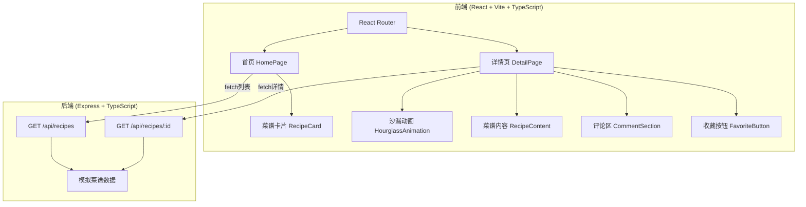
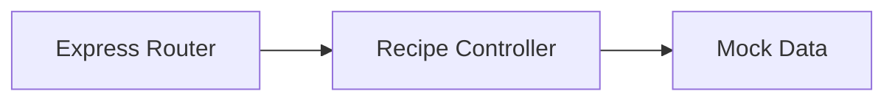

## 1. 架构设计



## 2. 技术说明

- **前端**：React@18 + TypeScript + Tailwind CSS@3 + Vite + Zustand（状态管理）
- **初始化工具**：vite-init（react-express-ts模板）
- **后端**：Express@4 + TypeScript（ESM格式）+ CORS
- **数据库**：无，使用模拟数据
- **图标**：lucide-react
- **字体**：Google Fonts（Playfair Display + Noto Serif SC + Noto Sans SC）

## 3. 路由定义

| 路由 | 用途 |
|------|------|
| `/` | 首页，展示菜谱列表卡片 |
| `/recipe/:id` | 菜谱详情页，根据解锁状态展示不同内容 |

## 4. API定义

### 4.1 获取菜谱列表

```
GET /api/recipes
Response: Recipe[]
```

### 4.2 获取菜谱详情

```
GET /api/recipes/:id
Response: Recipe
```

### 4.3 类型定义

```typescript
interface Recipe {
  id: string;
  title: string;
  tags: string[];
  thumbnail: string;
  image: string;
  ingredients: string[];
  steps: string[];
  unlockDate: string;
  isPublic: boolean;
  createdAt: string;
}

interface Comment {
  id: string;
  recipeId: string;
  author: string;
  content: string;
  createdAt: string;
}
```

## 5. 服务端架构



- Controller直接返回模拟数据，无需Service/Repository层
- CORS中间件允许前端跨域访问

## 6. 数据模型

### 6.1 模拟数据说明

使用固定数组模拟6条菜谱数据，包含：
- 2条已解锁（公开）菜谱
- 2条即将解锁（1-3天内）菜谱
- 2条未解锁（3个月后）菜谱

每条数据包含：id、title、tags、thumbnail、image、ingredients、steps、unlockDate、isPublic、createdAt
