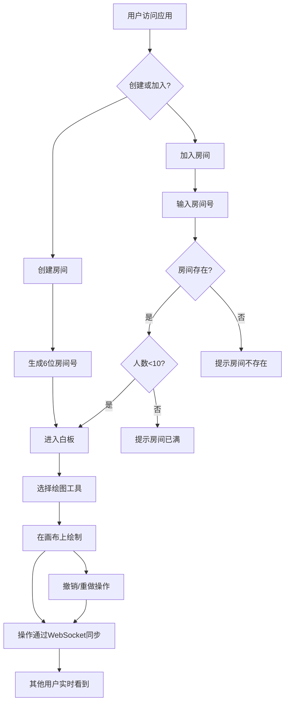

## 1. 产品概述

「灵感涂鸦板」是一个在线实时协作白板平台，支持多人同时在同一画布上涂鸦创作，提供画笔、形状、文字等丰富工具，通过 WebSocket 实现毫秒级操作同步。
- 解决远程团队头脑风暴和创意协作的实时沟通问题
- 面向设计师、产品经理、教育工作者及任何需要可视化协作的用户群体

## 2. 核心功能

### 2.1 用户角色

| 角色 | 进入方式 | 核心权限 |
|------|----------|----------|
| 房间创建者 | 创建房间自动加入 | 绘图、聊天、管理房间 |
| 协作参与者 | 输入房间号加入 | 绘图、聊天 |

### 2.2 功能模块

1. **房间管理页**: 创建房间、加入房间、房间号复制分享
2. **白板画布页**: 画笔绘制、形状绘制、文字输入、撤销/重做
3. **工具栏**: 工具选择、颜色选择、粗细调节、撤销/重做按钮
4. **聊天栏**: 文字消息、emoji 反应、消息动画

### 2.3 页面详情

| 页面名称 | 模块名称 | 功能描述 |
|----------|----------|----------|
| 房间管理页 | 创建房间 | 随机生成6位房间号，点击复制分享链接 |
| 房间管理页 | 加入房间 | 输入房间号加入已有房间，最多10人 |
| 白板画布页 | 画笔工具 | 自由绘制，可调粗细(1-20px)和颜色 |
| 白板画布页 | 矩形工具 | 拖拽绘制矩形，实时预览 |
| 白板画布页 | 圆形工具 | 拖拽绘制圆形，实时预览 |
| 白板画布页 | 直线工具 | 拖拽绘制直线，实时预览 |
| 白板画布页 | 文字工具 | 点击画布弹出输入框，输入文字后渲染 |
| 白板画布页 | 撤销/重做 | 最多50步操作历史，支持键盘快捷键 |
| 工具栏 | 工具选择 | 画笔/矩形/圆形/直线/文字切换 |
| 工具栏 | 颜色选择器 | 弧形渐变环选色 |
| 工具栏 | 粗细滑块 | 微缓动动画滑块调节 |
| 聊天栏 | 消息发送 | 文字消息输入和发送 |
| 聊天栏 | emoji反应 | 点击+号弹出emoji选择器 |
| 聊天栏 | 宽度拖拽 | 可拖拽调整聊天栏宽度 |

## 3. 核心流程

用户打开应用 → 创建/加入房间 → 进入白板 → 选择工具 → 在画布上绘制 → 操作实时同步给其他用户 → 可随时撤销/重做 → 通过聊天栏沟通

## 4. 用户界面设计

### 4.1 设计风格

- 主色调: 冷灰蓝(#1a1a2e)为底，青蓝霓虹(#00d4ff)为强调色
- 次要色: 柔白(#f0f0f5)、暖灰(#8b8b9e)
- 按钮风格: 圆角胶囊形，毛玻璃半透明背景(backdrop-filter: blur)
- 字体: 标题用 "Orbitron" 科技感字体，正文用 "Noto Sans SC" 中文友好字体
- 布局风格: 画布全屏沉浸式，工具栏浮动左侧，聊天栏隐藏式右侧
- 图标风格: 发光线条风格(lucide-react)，选中时高亮发光

### 4.2 页面设计概览

| 页面名称 | 模块名称 | UI元素 |
|----------|----------|--------|
| 房间管理页 | 中心卡片 | 毛玻璃卡片居中，背景动态渐变，创建/加入按钮 |
| 白板画布页 | 画布 | 浅灰格子纸纹理背景，全屏Canvas |
| 白板画布页 | 工具栏 | 左侧垂直毛玻璃浮动栏，发光图标，弧形颜色环 |
| 白板画布页 | 粗细滑块 | 竖向滑块，微缓动动画 |
| 白板画布页 | 撤销重做 | 工具栏底部按钮，带hover缩放动画 |
| 白板画布页 | 聊天栏 | 右侧隐藏式毛玻璃面板，可拖拽宽度，消息淡入动画 |
| 白板画布页 | 文字输入 | 点击位置弹出毛玻璃输入框，输入后文字渲染到画布 |

### 4.3 响应式适配

- 桌面端(>=768px): 左侧垂直工具栏，右侧隐藏聊天栏
- 平板端(<768px): 底部横条工具栏，聊天栏全屏覆盖弹出
- 触摸优化: 画笔工具支持触摸绘制，工具按钮增大点击区域

### 4.4 动画效果

- 工具切换: 选中图标发光脉动动画
- 颜色选择: 弧形环旋转展开动画
- 滑块: 微缓动弹性动画
- 聊天消息: 淡入上滑动画
- 房间创建: 成功动画脉冲
- 工具栏按钮: hover缩放+发光效果
