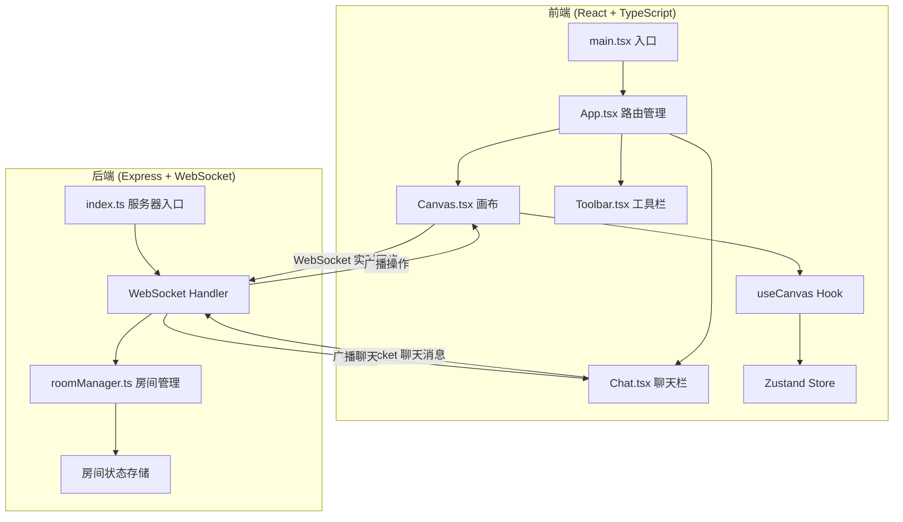
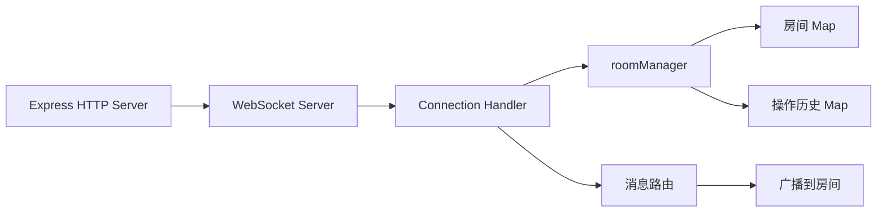
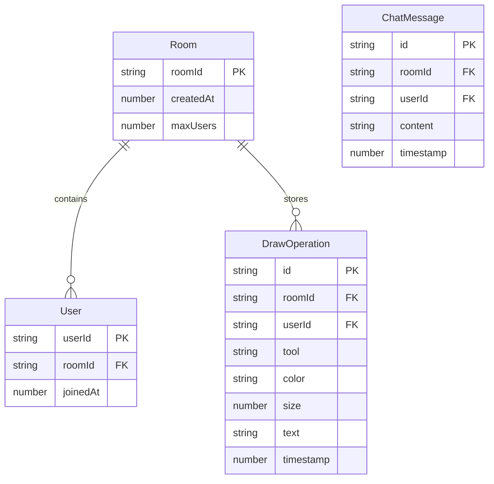

## 1. 架构设计



## 2. 技术说明

- 前端: React@18 + TypeScript + TailwindCSS@3 + Vite
- 状态管理: Zustand
- 后端: Express@4 + ws (WebSocket)
- 初始化工具: vite-init (react-express-ts 模板)
- 实时通信: WebSocket (ws库)，消息JSON格式传输
- 路由: react-router-dom

## 3. 路由定义

| 路由 | 用途 |
|------|------|
| `/` | 房间管理首页（创建/加入房间） |
| `/room/:roomId` | 白板协作页面 |

## 4. API定义

### 4.1 WebSocket 消息类型

```typescript
type MessageType =
  | { type: 'join'; roomId: string; userId: string }
  | { type: 'leave'; roomId: string; userId: string }
  | { type: 'draw'; roomId: string; operation: DrawOperation }
  | { type: 'undo'; roomId: string; userId: string }
  | { type: 'redo'; roomId: string; userId: string }
  | { type: 'chat'; roomId: string; userId: string; message: string }
  | { type: 'emoji'; roomId: string; userId: string; emoji: string; targetMsgId: string }
  | { type: 'sync'; roomId: string; operations: DrawOperation[] }
  | { type: 'user_list'; roomId: string; users: string[] }
  | { type: 'error'; message: string };

interface DrawOperation {
  id: string;
  tool: 'pen' | 'rect' | 'circle' | 'line' | 'text';
  points: { x: number; y: number }[];
  color: string;
  size: number;
  text?: string;
  userId: string;
  timestamp: number;
}
```

### 4.2 HTTP API

| 方法 | 路径 | 用途 | 请求体 | 响应 |
|------|------|------|--------|------|
| POST | `/api/rooms` | 创建房间 | - | `{ roomId: string }` |
| GET | `/api/rooms/:roomId` | 查询房间信息 | - | `{ roomId, userCount, exists }` |

## 5. 服务器架构



## 6. 数据模型

### 6.1 数据模型定义



### 6.2 内存数据结构

所有数据存储在服务端内存中（无需数据库）:

- `rooms: Map<string, Room>` — 房间信息
- `operations: Map<string, DrawOperation[]>` — 每个房间的绘图操作历史
- `undoStack: Map<string, DrawOperation[]>` — 撤销栈
- `users: Map<string, Set<string>>` — 每个房间的在线用户
- `chatMessages: Map<string, ChatMessage[]>` — 聊天消息记录
