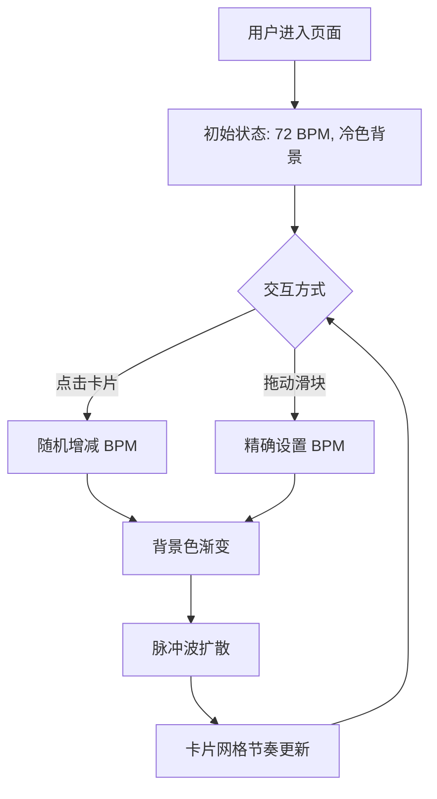

## 1. 产品概述

「心跳实验室」是一个小众交互式网站，用户通过点击半透明卡片改变整体心率节奏，触发视觉反馈（背景色渐变、脉冲波扩散），体验心跳节律与视觉艺术的融合实验。

- 面向对交互艺术、生成式视觉感兴趣的用户，提供沉浸式节奏探索体验
- 以极简生物风美学为差异化亮点，用纯粹的交互驱动视觉变化，形成独特的记忆点

## 2. 核心功能

### 2.1 功能模块

1. **主实验页面**：卡片网格阵列、节奏控制面板、背景氛围层、脉冲波动画层

### 2.2 页面详情

| 页面名称 | 模块名称 | 功能描述 |
|----------|----------|----------|
| 主实验页面 | 卡片网格 | 渲染几十张半透明毛玻璃圆角卡片组成的网格阵列，每张卡片代表一个"心跳节拍"，点击改变整体节奏（随机变快或变慢），卡片带微弱发光边框，节奏变化时有缓动过渡动画 |
| 主实验页面 | 脉冲波扩散 | 点击卡片时从该卡片位置向四周扩散脉冲波动画，节奏越快波越密集，使用 CSS 动画 + requestAnimationFrame 保证 60fps |
| 主实验页面 | 背景氛围 | 页面背景颜色根据 BPM 从冷色（蓝绿）向暖色（橙红）渐变，使用缓动过渡动画平滑变化 |
| 主实验页面 | 节奏控制面板 | 显示当前 BPM 数值，提供滑块手动调节节奏，BPM 范围 40~200，支持点击重置按钮回到默认 72 BPM |

## 3. 核心流程

用户进入页面 → 看到卡片网格阵列（默认 72 BPM）→ 点击某张卡片 → 节奏随机加速或减速 → 背景色从冷色向暖色渐变 → 脉冲波从点击位置扩散 → 可通过滑块精确调节 BPM → 体验不同节奏下的视觉变化

## 4. 用户界面设计

### 4.1 设计风格

- **主色调**：背景从 #F8FAFA（冷白）到 #FFF5F0（暖白）渐变，冷色倾向蓝绿（#E0F2F1），暖色倾向橙红（#FFE0B2）
- **卡片样式**：毛玻璃圆角方块（backdrop-filter: blur），半透明白色背景，微弱发光边框（box-shadow 发光效果），border-radius: 16px
- **字体**：使用 Space Mono 作为数据展示字体（BPM 数字），Noto Sans SC 作为中文界面字体
- **布局**：居中卡片网格 + 底部节奏控制面板，响应式网格列数自适应
- **图标**：极简线性图标风格，心跳线动画作为装饰元素

### 4.2 页面设计概览

| 页面名称 | 模块名称 | UI 元素 |
|----------|----------|---------|
| 主实验页面 | 卡片网格 | 8×5 网格（桌面）/ 自适应列数（移动端），毛玻璃卡片 80×80px，发光边框 rgba(255,255,255,0.3)，点击时缩放动画 |
| 主实验页面 | 脉冲波 | 从点击卡片中心扩散的圆环波纹，颜色随 BPM 变化，波纹半径 0→300px，opacity 1→0 |
| 主实验页面 | 背景氛围 | 纯色渐变背景，transition duration 1.5s ease，叠加微弱噪点纹理增加质感 |
| 主实验页面 | 节奏控制面板 | 底部固定栏，毛玻璃背景，BPM 数字居中大字号显示，左右滑块控件，重置按钮 |

### 4.3 响应式

- 桌面端（≥1024px）：8 列网格，卡片 80×80px，控制面板水平布局
- 平板端（768~1023px）：6 列网格，卡片 64×64px
- 移动端（<768px）：4 列网格，卡片 56×56px，控制面板垂直紧凑布局，触摸优化（增大点击区域）

### 4.4 3D 场景指导

不适用，本项目为 2D 交互视觉实验。
