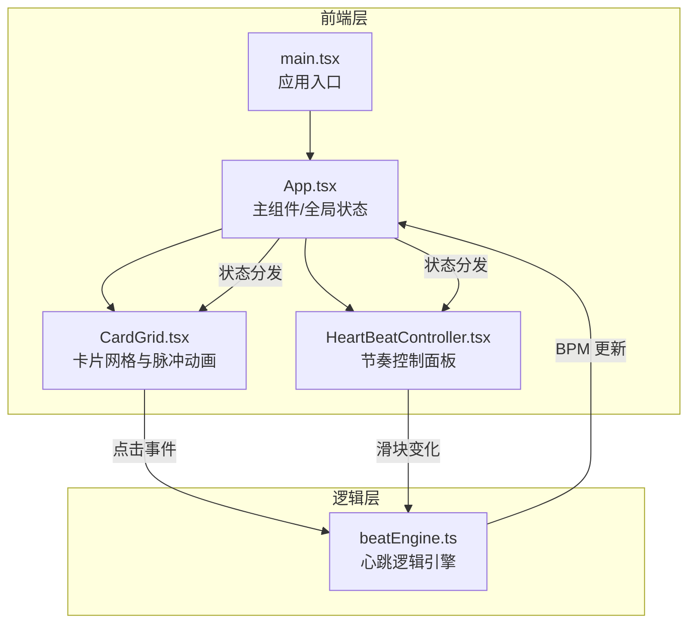

## 1. 架构设计



## 2. 技术说明

- **前端框架**：React 18 + TypeScript
- **构建工具**：Vite 5 + @vitejs/plugin-react
- **样式方案**：CSS Modules + CSS 变量（无 Tailwind，保持极简）
- **动画方案**：CSS transitions + requestAnimationFrame（保证 60fps）
- **状态管理**：React useState + useEffect（无需 Redux 等重量级方案）
- **后端**：无（纯前端应用）
- **数据库**：无

## 3. 路由定义

| 路由 | 用途 |
|------|------|
| / | 主实验页面（单页应用，唯一路由） |

## 4. API 定义

不适用，本项目无后端 API。

## 5. 服务器架构

不适用，本项目为纯前端静态应用。

## 6. 数据模型

### 6.1 核心数据结构

```typescript
interface BeatState {
  bpm: number;
  isPlaying: boolean;
  lastBeatTime: number;
  beatCount: number;
}

interface PulseWave {
  id: number;
  x: number;
  y: number;
  startTime: number;
  bpm: number;
}

interface CardState {
  id: number;
  row: number;
  col: number;
  isActive: boolean;
  scale: number;
  opacity: number;
}
```

### 6.2 状态流转

- `beatEngine` 持有核心 `BeatState`，通过回调函数通知 React 组件更新
- 点击卡片 → `beatEngine.adjustBpm(delta)` → 计算新 BPM → 触发 `onBpmChange` 回调
- 滑块调节 → `beatEngine.setBpm(value)` → 直接触发 `onBpmChange` 回调
- `App` 组件接收 BPM 变化 → 更新 state → 传递给子组件 → 驱动背景色、脉冲波、卡片状态更新
