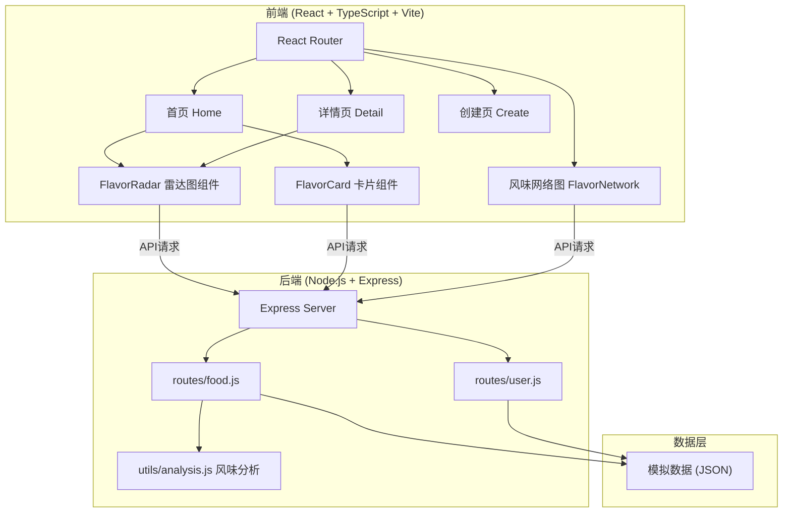
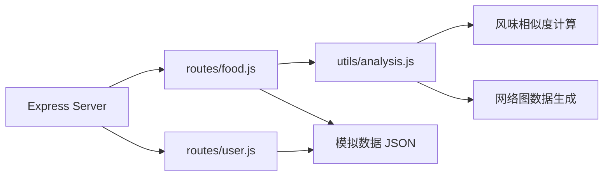
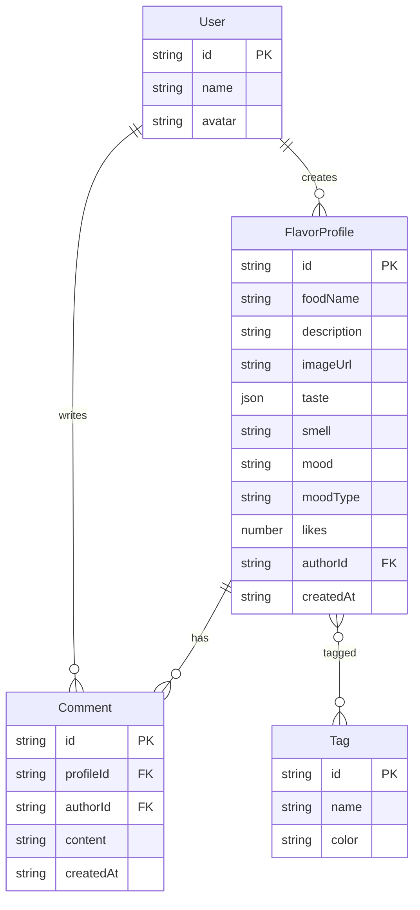

## 1. 架构设计



## 2. 技术说明

- 前端：React@18 + TypeScript + Tailwind CSS@3 + Vite
- 初始化工具：vite-init（react-express-ts 模板）
- 后端：Express@4 + JavaScript（ESM）
- 数据库：模拟数据（JSON文件），暂不使用真实数据库
- 状态管理：Zustand
- 路由：react-router-dom@6
- 图表：Canvas 2D（自绘雷达图、风味网络图）
- 动画：CSS transitions + requestAnimationFrame

## 3. 路由定义

| 路由 | 用途 |
|------|------|
| / | 首页，展示公开风味档案卡片瀑布流 |
| /detail/:id | 详情页，查看完整风味分析、雷达图、相似推荐、评论 |
| /create | 创建页，新增风味记录表单 |
| /network | 风味网络图页面 |

## 4. API 定义

### 4.1 食物相关 API

```typescript
interface FlavorProfile {
  id: string;
  foodName: string;
  description: string;
  imageUrl: string;
  taste: {
    sweet: number;    // 0-10
    salty: number;
    sour: number;
    bitter: number;
    umami: number;
    spicy: number;
  };
  smell: string;
  mood: string;       // emoji
  moodType: 'happy' | 'relaxed' | 'excited' | 'nostalgic' | 'neutral';
  likes: number;
  liked: boolean;
  saved: boolean;
  author: {
    id: string;
    name: string;
    avatar: string;
  };
  tags: string[];
  createdAt: string;
  comments: Comment[];
}

interface Comment {
  id: string;
  authorId: string;
  authorName: string;
  authorAvatar: string;
  content: string;
  createdAt: string;
}

interface SimilarFood {
  id: string;
  foodName: string;
  imageUrl: string;
  similarity: number;  // 0-100
}

// GET /api/foods - 获取公开风味档案列表
// Query: ?page=1&limit=20&tag=&mood=&search=
// Response: { data: FlavorProfile[], total: number, page: number }

// GET /api/foods/:id - 获取单个风味档案详情
// Response: FlavorProfile

// GET /api/foods/:id/similar - 获取相似食物推荐
// Response: SimilarFood[]

// POST /api/foods - 创建风味记录
// Body: Omit<FlavorProfile, 'id' | 'likes' | 'liked' | 'saved' | 'comments' | 'createdAt'>

// POST /api/foods/:id/like - 点赞
// Response: { likes: number, liked: boolean }

// POST /api/foods/:id/save - 收藏
// Response: { saved: boolean }

// POST /api/foods/:id/comments - 添加评论
// Body: { content: string }

// GET /api/foods/network - 获取风味网络图数据
// Response: { nodes: NetworkNode[], edges: NetworkEdge[] }

interface NetworkNode {
  id: string;
  foodName: string;
  size: number;       // 喜好程度
  color: string;      // 情感倾向
  x: number;
  y: number;
}

interface NetworkEdge {
  source: string;
  target: string;
  weight: number;     // 相似度 0-1
}
```

## 5. 服务器架构图



## 6. 数据模型

### 6.1 数据模型定义



### 6.2 模拟数据

使用 JSON 文件存储初始数据，包含 12+ 条风味档案记录，涵盖中餐、日料、甜点、饮品等多种类型，确保首页展示和风味网络图有足够的数据支撑。
