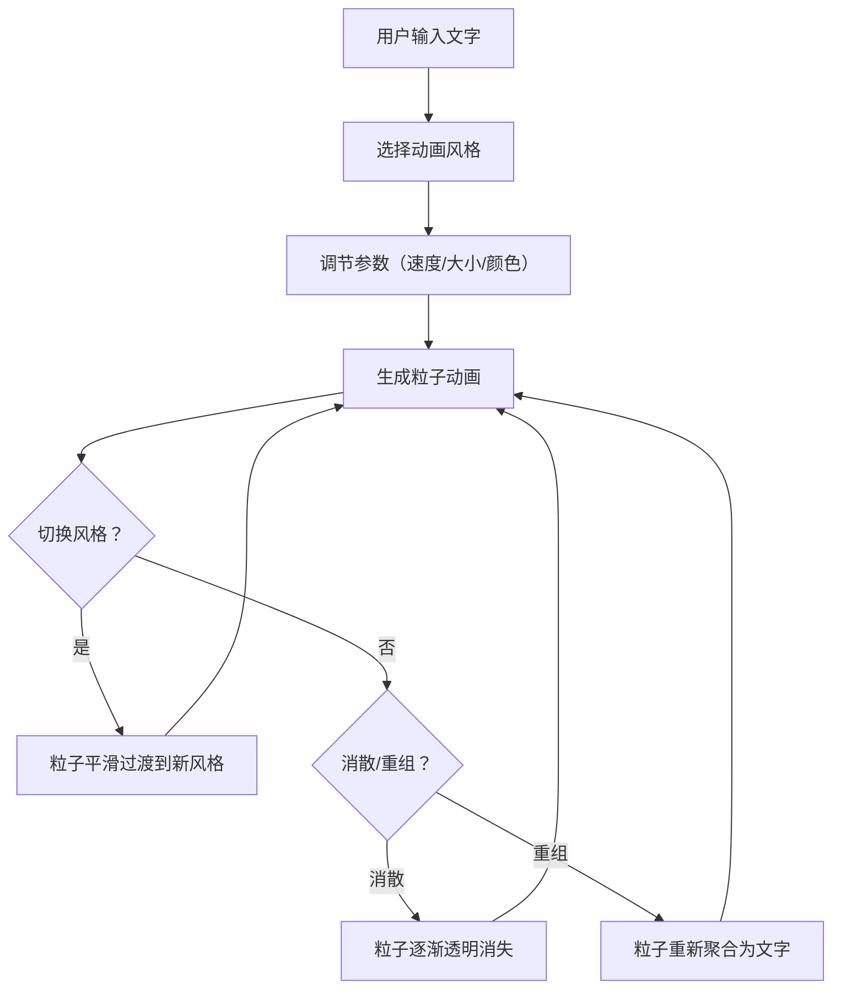

## 1. 产品概述

「浮光絮语」是一款交互式文字动画生成器，用户输入文字后选择动画风格，每个字或词化为独立粒子在画布上运动，随时间缓慢消散或重组。目标用户为创意写作者、视觉设计师和社交媒体内容创作者，旨在让静态文字变成富有诗意的动态视觉体验。

## 2. 核心功能

### 2.1 用户角色

| 角色 | 注册方式 | 核心权限 |
|------|----------|----------|
| 访客 | 无需注册 | 使用全部功能 |

### 2.2 功能模块

1. **主画布页面**：全屏粒子动画画布、文字输入区、风格选择器、参数调节面板

### 2.3 页面详情

| 页面名称 | 模块名称 | 功能描述 |
|----------|----------|----------|
| 主画布页面 | 文字输入区 | 用户输入文字，支持中英文，实时解析为粒子 |
| 主画布页面 | 风格选择器 | 四种风格：飘落、涟漪、爆炸、螺旋，带图标和动画预览 |
| 主画布页面 | 参数调节面板 | 动画速度滑块、粒子大小滑块、颜色选择器 |
| 主画布页面 | 全屏动画画布 | Canvas 渲染粒子系统，60fps，支持风格间平滑过渡 |
| 主画布页面 | 消散/重组切换 | 粒子随时间消散或重新聚合的控制按钮 |

## 3. 核心流程

用户打开页面 → 在输入框中输入文字 → 选择动画风格（飘落/涟漪/爆炸/螺旋）→ 调节速度、大小、颜色参数 → 点击生成 → 文字粒子在画布上按选定风格运动 → 可切换风格，粒子平滑过渡 → 可调节参数实时影响动画 → 粒子随时间消散或点击重组

## 4. 用户界面设计

### 4.1 设计风格

- **主色调**：米白（#FAF8F5）到淡灰（#E8E6E3）渐变背景
- **辅助色**：粒子默认暖金（#D4A574），可自定义
- **按钮风格**：圆角胶囊按钮，半透明毛玻璃背景，柔和阴影，hover 微缓动放大
- **字体**：显示字体「LXGW WenKai」（霞鹜文楷），UI 字体「Noto Sans SC」
- **布局风格**：画布全屏，控制面板浮于画布左下角，毛玻璃圆角面板
- **图标风格**：Lucide Icons 线性图标
- **特效**：毛玻璃（backdrop-filter: blur）、柔和投影、按钮 hover 缓动（cubic-bezier）

### 4.2 页面设计概览

| 页面名称 | 模块名称 | UI 元素 |
|----------|----------|---------|
| 主画布页面 | 全屏画布 | 全屏 Canvas，米白-淡灰渐变背景，粒子运动 |
| 主画布页面 | 文字输入区 | 毛玻璃面板内 textarea，圆角，淡边框，霞鹜文楷字体 |
| 主画布页面 | 风格选择器 | 四个胶囊按钮，带 Lucide 图标，选中态高亮发光 |
| 主画布页面 | 参数面板 | 毛玻璃面板，自定义 range 滑块，颜色选择器 |
| 主画布页面 | 消散/重组按钮 | 胶囊按钮，切换态动画，图标 + 文字 |

### 4.3 响应式适配

- **桌面端（≥1024px）**：画布全屏，控制面板浮于左下角，水平排列滑块
- **平板端（768-1023px）**：画布全屏，控制面板底部抽屉式展开
- **移动端（<768px）**：画布全屏，控制面板底部全宽卡片，垂直堆叠控件，触摸优化

### 4.4 性能目标

- Canvas 动画帧率稳定 60fps
- 粒子数量控制在 500 以内，超出时自动合并相邻字符
- 风格切换过渡动画时长 800ms，缓动函数 ease-in-out
