## 1. 架构设计

```mermaid
flowchart TB
    subgraph "前端层"
        A["App.tsx 状态管理 & 布局"] --> B["Canvas.tsx 画布渲染"]
        A --> C["Controls.tsx 控制面板"]
        B --> D["particles.ts 粒子引擎"]
    end
    subgraph "数据流"
        E["用户输入文字"] --> A
        F["风格/参数选择"] --> A
        A -->|"状态分发"| B
        A -->|"状态分发"| C
        C -->|"参数变更"| A
        D -->|"粒子数据"| B
    end
```



## 2. 技术说明

- **前端框架**：React 18 + TypeScript
- **构建工具**：Vite
- **样式方案**：Tailwind CSS 3
- **状态管理**：Zustand
- **图标库**：lucide-react
- **字体**：LXGW WenKai（霞鹜文楷）、Noto Sans SC
- **后端**：无
- **数据库**：无

## 3. 路由定义

| 路由 | 用途 |
|------|------|
| / | 主画布页面，包含全部交互功能 |

## 4. 文件结构

```
src/
├── main.tsx          # 入口文件，挂载 React 应用
├── App.tsx           # 主组件，管理全局状态和布局
├── components/
│   ├── Canvas.tsx    # 核心画布，处理粒子系统动画渲染
│   └── Controls.tsx  # 控制面板：风格选择、滑块、颜色
├── utils/
│   └── particles.ts  # 粒子引擎：粒子类、运动逻辑、风格算法
└── store/
    └── useStore.ts   # Zustand 全局状态
```

## 5. 粒子引擎设计

### 5.1 粒子数据结构

```typescript
interface Particle {
  id: number
  char: string
  x: number
  y: number
  targetX: number
  targetY: number
  vx: number
  vy: number
  size: number
  opacity: number
  color: string
  rotation: number
  rotationSpeed: number
  life: number
  maxLife: number
}
```

### 5.2 风格算法

| 风格 | 运动逻辑 |
|------|----------|
| 飘落 | 粒子从画布顶部随机位置缓慢下落，带水平摆动（正弦波），透明度随下落递减 |
| 涟漪 | 粒子从中心向外扩散，同心圆运动，半径逐渐增大，透明度递减 |
| 爆炸 | 粒子从中心高速径向飞散，速度逐渐衰减，透明度随时间递减 |
| 螺旋 | 粒子沿螺旋路径运动，角度和半径同步增长，形成旋涡效果 |

### 5.3 平滑过渡

风格切换时使用 lerp 插值，800ms 内将粒子当前位置/速度平滑过渡到新风格的目标位置/速度，缓动函数 ease-in-out。

### 5.4 性能优化

- requestAnimationFrame 驱动动画循环
- 粒子数量上限 500，超出时合并相邻字符
- 使用对象池复用粒子对象，避免 GC
- Canvas 2D 绘制，避免 WebGL 复杂度

## 6. 状态管理

```typescript
interface AppState {
  text: string
  style: 'fall' | 'ripple' | 'explode' | 'spiral'
  speed: number
  particleSize: number
  color: string
  isDissolving: boolean
  setText: (text: string) => void
  setStyle: (style: AppState['style']) => void
  setSpeed: (speed: number) => void
  setParticleSize: (size: number) => void
  setColor: (color: string) => void
  toggleDissolve: () => void
}
```
