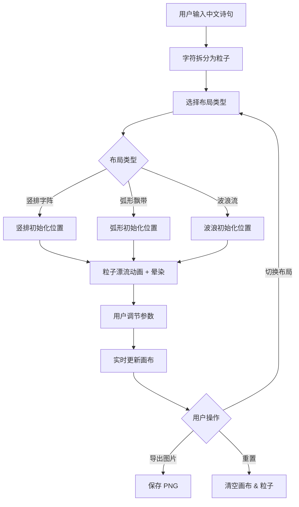

## 1. 产品概述

「墨韵流光」是一款交互式水墨风格文字生成页面，用户输入中文诗句后，每个字转化为水墨粒子，在宣纸质感的画布上按所选布局漂流、晕染，最终定格为动态书法作品。
- 目标用户：书法爱好者、古风文化爱好者、创意设计从业者
- 核心价值：将传统水墨美学与数字交互融合，提供沉浸式的中文书法创作体验

## 2. 核心功能

### 2.1 功能模块
1. **主画布页面**：文字输入、布局选择、粒子动画渲染、参数调节、导出图片

### 2.2 页面详情
| 页面名称 | 模块名称 | 功能描述 |
|----------|----------|----------|
| 主画布页面 | 文字输入区 | 用户输入中文文本（最多50字），实时拆分为粒子 |
| 主画布页面 | 画布渲染区 | Canvas 渲染水墨粒子动画，宣纸背景，粒子漂移与晕染 |
| 主画布页面 | 控制面板 | 墨色浓淡、字距、动画速度滑块；布局选择下拉；重置按钮 |
| 主画布页面 | 导出按钮 | 右上角导出当前画布为 PNG 图片 |

## 3. 核心流程

1. 用户在输入区键入中文诗句
2. 系统将每个字符拆分为独立水墨粒子
3. 粒子按所选布局（竖排字阵 / 弧形飘带 / 波浪流）初始化位置
4. 粒子开始漂流动画，带有缓动与随机扰动，模拟墨迹晕染
5. 用户可通过控制面板实时调节墨色浓淡、字距、动画速度
6. 用户切换布局时，粒子从当前位置平滑缓动过渡至新位置
7. 用户点击导出，画布内容保存为 PNG 图片

## 4. 用户界面设计

### 4.1 设计风格
- **主色调**：浅灰到米白渐变背景，模拟古风卷轴；墨色粒子从浓黑到淡灰渐变
- **辅助色**：浅黄（宣纸）、暖棕（卷轴边缘）
- **按钮/滑块风格**：半透明毛玻璃，圆角，柔和阴影，微缓动悬停效果
- **字体**：中文使用「霞鹜文楷」或「LXGW WenKai」楷体风格字体，英文/数字使用衬线体
- **布局风格**：画布居中占主体，控制面板侧边浮动（桌面端右侧，移动端底部）
- **图标风格**：线性图标，与毛玻璃面板风格统一

### 4.2 页面设计概览
| 页面名称 | 模块名称 | UI 元素 |
|----------|----------|---------|
| 主画布页面 | 画布渲染区 | 全屏 Canvas，米白径向渐变背景 + 噪点纹理，粒子径向渐变 + 模糊边缘 |
| 主画布页面 | 文字输入区 | 画布上方半透明输入框，楷体文字，占位提示「请输入诗句…」 |
| 主画布页面 | 控制面板 | 右侧毛玻璃面板，三个滑块（墨色浓淡/字距/速度）+ 布局下拉 + 重置按钮 |
| 主画布页面 | 导出按钮 | 右上角圆形毛玻璃按钮，下载图标，悬停放大效果 |

### 4.3 响应式设计
- **桌面端（≥768px）**：画布居中，控制面板右侧浮动
- **移动端（<768px）**：画布全屏，控制面板底部抽屉式展开，触摸滑块优化
- 触摸事件支持良好，帧率稳定 60fps

### 4.4 动效规格
- 粒子漂移：缓动 + 随机扰动，模拟墨迹自然晕染
- 布局切换：粒子从当前位置到新位置 ease-in-out 过渡，时长 800ms
- 控制面板：悬停微缓动（scale 1.02），滑块拖动实时更新画布
- 拖尾效果：半透明拖尾随时间淡出
