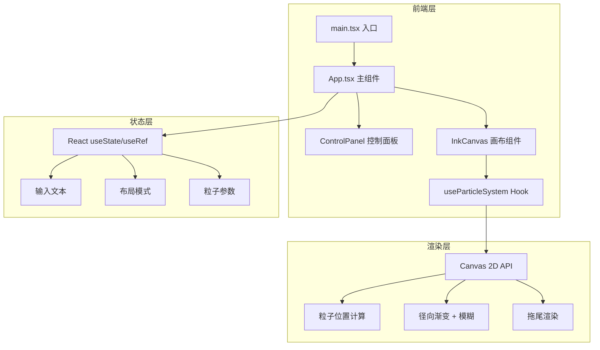

## 1. 架构设计



## 2. 技术选型

- **前端框架**：React 18 + TypeScript
- **构建工具**：Vite（@vitejs/plugin-react）
- **样式方案**：CSS Modules + 内联样式（Canvas 相关）+ 全局 CSS 变量
- **状态管理**：React useState/useRef（项目规模较小，无需 Zustand）
- **动画引擎**：Canvas 2D API + requestAnimationFrame
- **无后端**：纯前端应用，导出功能通过 Canvas toDataURL 实现

## 3. 路由定义

| 路由 | 用途 |
|------|------|
| / | 单页面应用，所有功能在一个页面内 |

## 4. 核心数据结构

### 4.1 粒子数据结构

```typescript
interface Particle {
  char: string;
  x: number;
  y: number;
  targetX: number;
  targetY: number;
  size: number;
  opacity: number;
  velocity: { x: number; y: number };
  drift: { x: number; y: number };
}
```

### 4.2 布局参数

```typescript
type LayoutMode = 'vertical' | 'arc' | 'wave';

interface ParticleParams {
  inkDensity: number;
  spacing: number;
  speed: number;
  layout: LayoutMode;
}
```

## 5. 模块职责

| 模块 | 职责 |
|------|------|
| `main.tsx` | React 入口，挂载 App 到 DOM |
| `App.tsx` | 管理全局状态（输入文本、布局模式、粒子参数），组合子组件 |
| `ControlPanel.tsx` | 渲染控制面板 UI（滑块、下拉、按钮），回调通知父组件参数变化 |
| `InkCanvas.tsx` | 管理 Canvas 元素，调用 useParticleSystem 驱动渲染循环 |
| `useParticleSystem.ts` | 粒子系统核心逻辑：创建、更新位置、绘制粒子、处理布局切换过渡 |

## 6. 性能优化策略

- **requestAnimationFrame**：驱动 60fps 渲染循环
- **离屏 Canvas 缓存拖尾**：用半透明矩形覆盖实现淡出效果，避免全量重绘
- **粒子数量限制**：最多 50 个粒子（对应 50 字上限），确保渲染性能
- **防抖参数更新**：滑块拖动时使用 requestAnimationFrame 合并更新，避免频繁重计算
- **设备像素比适配**：Canvas 物理尺寸 = 逻辑尺寸 × devicePixelRatio，导出时自动适配

## 7. 文件结构

```
├── index.html
├── package.json
├── tsconfig.json
├── vite.config.ts
├── src/
│   ├── main.tsx
│   ├── App.tsx
│   ├── App.css
│   ├── index.css
│   ├── components/
│   │   ├── ControlPanel.tsx
│   │   ├── ControlPanel.css
│   │   ├── InkCanvas.tsx
│   │   └── InkCanvas.css
│   └── hooks/
│       └── useParticleSystem.ts
```
