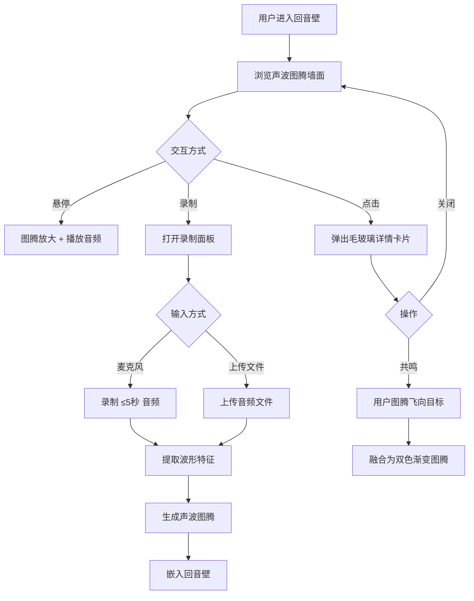

## 1. 产品概述

「回声拼图」是一个匿名音频片段拼接平台，用户可在虚拟音频实验室中录制或上传声音，系统自动提取波形特征生成独特的「声波图腾」可视化图案，并嵌入到动态「回音壁」墙面中。用户可以浏览、聆听他人的声波图腾，并通过「共鸣」机制实现声音的视觉融合，创造双色渐变图腾。

- 目标用户：喜欢声音实验和视觉艺术的创意人群
- 核心价值：将声音转化为独特的视觉符号，建立以声音为媒介的匿名社交体验

## 2. 核心功能

### 2.1 用户角色

| 角色 | 注册方式 | 核心权限 |
|------|----------|----------|
| 匿名用户 | 无需注册，浏览器本地标识 | 录制/上传声音、浏览回音壁、共鸣融合、管理自己的图腾 |

### 2.2 功能模块

1. **回音壁页面**：声波图腾动态墙面、悬停播放、点击查看详情、共鸣融合
2. **我的图腾页面**：个人图腾网格/列表展示、筛选、删除
3. **录制面板**：麦克风录制（≤5秒）、文件上传、波形预览

### 2.3 页面详情

| 页面名称 | 模块名称 | 功能描述 |
|----------|----------|----------|
| 回音壁 | 声波图腾墙 | 动态展示所有图腾，每个图腾有缓动旋转和浮动动画 |
| 回音壁 | 悬停交互 | 鼠标悬停图腾微微放大，播放对应音频（淡入淡出） |
| 回音壁 | 详情卡片 | 点击图腾弹出毛玻璃卡片，展示波形图、录制时间、播放次数 |
| 回音壁 | 共鸣融合 | 卡片下方「共鸣」按钮，用户图腾飞向目标图腾融合为双色渐变图腾 |
| 回音壁 | 录制面板 | 底部浮动面板，支持麦克风录制（≤5秒）和文件上传 |
| 我的图腾 | 图腾列表 | 网格或列表形式展示用户所有图腾 |
| 我的图腾 | 筛选功能 | 按时间、颜色等条件筛选 |
| 我的图腾 | 删除功能 | 删除指定图腾 |

## 3. 核心流程

1. 用户打开回音壁，浏览动态墙面上的声波图腾
2. 悬停某个图腾，听到的音频片段带淡入淡出效果
3. 点击图腾，查看毛玻璃详情卡片
4. 用户点击底部录制按钮，通过麦克风录制5秒内声音或上传音频文件
5. 系统提取波形特征，生成声波图腾并嵌入回音壁
6. 用户在详情卡片中点击「共鸣」，自己的图腾飞向目标图腾并融合

## 4. 用户界面设计

### 4.1 设计风格

- **主色调**：深色背景（#0a0a1a），霓虹粉（#ff2d95）、霓虹蓝（#00d4ff）、霓虹紫（#9d4edd）渐变
- **按钮风格**：圆角霓虹边框，悬停时发光效果
- **字体**：Orbitron（标题）+ Rajdhani（正文），科技感字体
- **布局风格**：全屏沉浸式 Canvas 墙面 + 浮动面板
- **图标风格**：线性霓虹风格图标
- **动画**：缓动旋转浮动（图腾）、霓虹光晕脉冲、粒子拖尾

### 4.2 页面设计概述

| 页面名称 | 模块名称 | UI 元素 |
|----------|----------|---------|
| 回音壁 | 声波图腾墙 | 全屏 Canvas、深色渐变背景、图腾浮动旋转、颜色随频率渐变 |
| 回音壁 | 悬停交互 | 图腾放大1.2倍、霓虹光晕、音频淡入淡出 |
| 回音壁 | 详情卡片 | 毛玻璃半透明卡片、波形图、时间/次数信息、共鸣按钮 |
| 回音壁 | 录制面板 | 底部浮动毛玻璃面板、麦克风按钮、上传按钮、波形预览、5秒倒计时 |
| 我的图腾 | 图腾网格 | 网格卡片布局、每卡片含缩略图腾、时间、播放按钮 |
| 我的图腾 | 筛选栏 | 顶部筛选条件（时间排序、颜色筛选） |

### 4.3 响应式设计

- 桌面优先设计，Canvas 墙面自适应全屏
- 图腾数量和密度根据视口大小动态调整
- 录制面板在小屏幕下变为全屏模态

### 4.4 动画与交互细节

- 图腾缓动动画：每帧 requestAnimationFrame 驱动，60fps
- 颜色映射：高频偏蓝紫（#00d4ff → #9d4edd），低频偏红黄（#ff2d95 → #ffbe0b）
- 共鸣融合动画：用户图腾飞向目标，中间有粒子拖尾，融合时产生闪光
- 毛玻璃效果：backdrop-filter: blur(20px)，半透明白色边框
